# 阿里云服务器

公网IP : 47.109.24.238

域名：

密码：Zhangchuang0013


**Mac下ssh连接远程服务器时自动断开问题**

http://t.zoukankan.com/gantoday-p-9526914.html

# iTerm2 快捷命令

```java
command + enter 进入与返回全屏模式
command + t 新建标签
command + w 关闭标签
command + 数字 command + 左右方向键    切换标签
command + enter 切换全屏
command + f 查找
command + d 水平分屏
command + shift + d 垂直分屏
command + option + 方向键 command + [ 或 command + ]    切换屏幕
command + ; 查看历史命令
command + shift + h 查看剪贴板历史
ctrl + u    清除当前行
ctrl + l    清屏
ctrl + a    到行首
ctrl + e    到行尾
ctrl + f/b  前进后退
ctrl + p    上一条命令
ctrl + r    搜索命令历史
```

iTerm2配置教程

https://www.jianshu.com/p/ba08713c2b19

# Linux 指令

## 1. 传送文件指令

```cmake
# Mac 传送给 服务器
scp soapui-settings.xml root@47.109.24.238:~

# 服务器 到 本地 Mac
scp root@10.211.55.5:~/soapui-settings.xml soapui-settings.xml1
# 就是将10.211.55.5这台机器上root用户下~目录下soapui-settings.xml文件下载到当前目录下,并保存为soapui-settings.xml1
```

## 2. 查询命令

### 1. linux命令查询一个文件的行数

使用wc命令 统计指定文件中的字节数、字数、行数, 并将统计结果显示输出。

语法：wc [选项] 文件…

　　说明：该命令统计给定文件中的字节数、字数、行数。如果没有给出文件名，则从标准输入读取。wc同时也给出所有指定文件的总统计数。字是由空格字符区分开的最大字符串。

　　该命令各选项含义如下： 

  - c 统计字节数。

  - l 统计行数。

  - w 统计字数。

如：wc -l filename 就是查看文件里有多少行

​    wc -w filename 看文件里有多少个word。

​    wc -L filename 文件里最长的那一行是多少个字。

wc命令

　　wc命令的功能为

### 2. linux命令查询一个文件内出现重复最多的数字的

#### uniq命令

Linux uniq 命令用于检查及删除文本文件中重复出现的行列，一般与 sort 命令结合使用。

uniq 可检查文本文件中重复出现的行列。

参数：

- -c或--count 在每列旁边显示该行重复出现的次数。
- -d或--repeated 仅显示重复出现的行列。
- -f<栏位>或--skip-fields=<栏位> 忽略比较指定的栏位。
- -s<字符位置>或--skip-chars=<字符位置> 忽略比较指定的字符。
- -u或--unique 仅显示出一次的行列。
- -w<字符位置>或--check-chars=<字符位置> 指定要比较的字符。
- --help 显示帮助。
- --version 显示版本信息。

#### sort 命令

- -n 按数值大小排序
- -t 指定分隔符,没有指定时,以空白作为分隔符
- -k 排序字段 如: -k1 (按第1个字段排序)   -k 1.2, 3.4 (按从第1个字段的第2个字符起，到第3个字段第4个字符止，进行排序)
- -b 忽略每行开始的空格
- -o 结果输出文件
- -r 以相反顺序排序
- -m 合并已经有序的文件,不排序
- -f 忽略大小写
- -d 排序时只按字母、数字或空格,忽略其它字符
- -u 去除重复的行

```cmake
#!/usr/bin/env bash
 
file="tmp/s.txt"
r1="tmp/r1.txt"
 
#正常排序
sort ${file}
 
#按数值大小排序
sort -n ${file}
 
#按数值大小,以第二个字段排序
sort -n -k2 ${file}
 
#按数值大小,以空格为分隔符,以第二个字段排序
sort -n -t ' ' -k2 ${file}
 
#按数值大小,以空格为分隔符,以第二个字段, 倒序排序
sort -n -t ' ' -k2 -r ${file}
 
#按数值大小,以空格为分隔符,以第二个字段, 倒序排序,输出到文件
sort -n -t ' ' -k2 -r -m ${file} -o ${r1}
```

**当重复的行并不相邻时，uniq 命令是不起作用的，所以此时要配合 sort 指令，先排序然后再去重。**

```cmake
# 统计 testfile1 中出现的重复字段的次数
sort testfile1 | uniq -c
-> 3 Hello 95  
-> 3 Linux 85 
-> 3 test 30
```

文件words存放英文单词，格式为每行一个英文单词（单词可以重复），统计这个文件中出现次数最多的前10个单词。

```
cat words.txt | sort | uniq -c | sort -k1,1nr | head -10
```

sort: 对单词进行排序

uniq -c: 显示唯一的行，并在每行行首加上本行在文件中出现的次数

sort -k1,1nr: 按照第一个字段，数值排序，且为逆序

head -10: 取前10行数据

## 3. wegt命令

在 linux 下 下载文件的命令

```cmake
将文件下载到当前文件夹
wget https://www.php.net/distributions/php-8.1.1.tar.gz
```

## 4. 解压命令


```
tar -zxvf nginx-1.20.2.tar.gz
```


# nginx

nginx 的安装目录：`/usr/local/nginx`

nginx 的压缩包及源码目录：`/opt/softApp`

在nginx的工作目录有四个文件夹

- conf -----配置文件
- html -----网页文件
- logs -----日志文件
- sbin -----主要二进制程序

```cmake
nginx 启动和关闭命令：
./sbin/nginx
./sbin/nginx -s stop
查看 nginx 状态命令
netstat -antp
```

nginx下载官网：https://nginx.org/en/download.html

nginx官方主页：https://nginx.org/en/

参考：https://blog.csdn.net/u011781521/article/details/75675019

https://www.cnblogs.com/boonya/p/7907999.html


# php

安装依赖：

```
yum install gcc \
gcc-c++ \
libxml2-devel \
openssl-devel \
libcurl-devel \
freetype-devel \
libjpeg-devel \
libpng-devel \
libxslt-devel \
systemd-devel \
libicu-devel
libedit-devel
```

php下载官网：https://www.php.net/downloads


# CentOS  7.7 64位  wordpress搭建

Apache是世界使用排名第一的Web服务器软件。它可以运行在几乎所有广泛使用的计算机平台上，由于其跨平台和安全性被广泛使用，是最流行的Web服务器端软件之一。


\1. 执行如下命令，安装Apache服务及其扩展包。

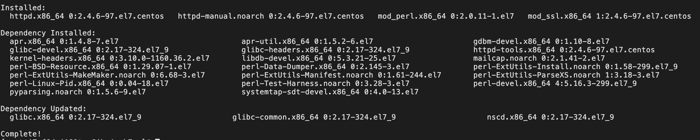

```
yum -y install httpd mod_ssl mod_perl mod_auth_mysql
```

\2. 执行如下命令，启动Apache服务。

```
systemctl start httpd.service
```

\3. 测试Apache服务是否安装并启动成功。

Apache默认监听80端口，所以只需在浏览器访问ECS分配的IP地址http://<ECS公网地址>，如下图：

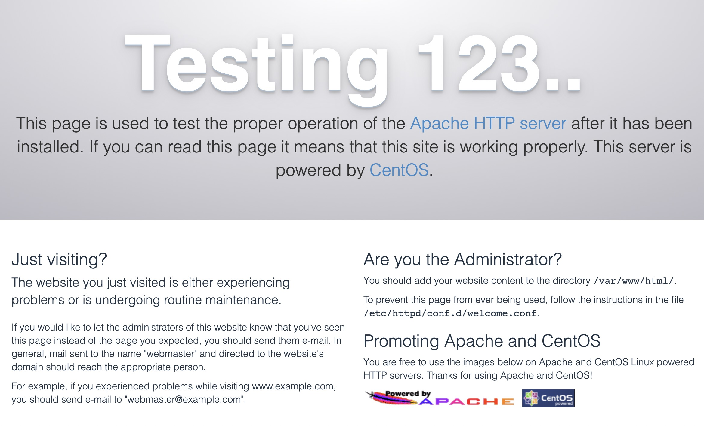

\4. 安装 MariaDB 数据库

由于使用Wordpress搭建云上博客，需要使用MySQL数据库存储数据，这一小节我们将安装MySQL的开源替代品MariaDB（MariaDB完全兼容MySQL），并创建博客数据库。

**1. 安装MariaDB Server，执行如下命令：**

```
yum install -y mariadb-server
```

安装成功会出现如下结果

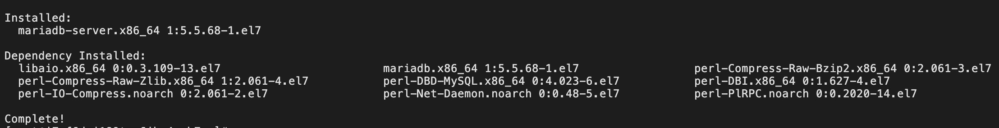

**2. 启动MariaDB Server，执行如下命令：**

```
systemctl start mariadb
```

*注：可执行如下命令查看MariaDB Server运行状态*

```
systemctl status mariadb
```

*如果出现如图中的绿色active (running)表示服务启动成功*

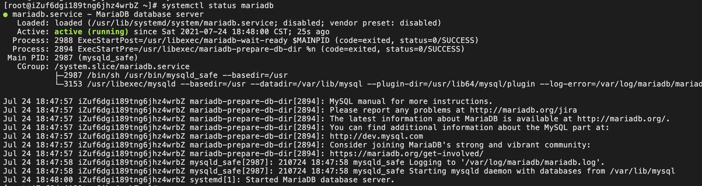

**3. 设置数据库初始密码，执行如下命令：**

```
mysqladmin -u root -p password
```

*由于是第一次设置密码，因此在出现Enter Password的时候直接回车即可，然后输入您要设置的密码（本示例我们设置的密码为***123456789***），并两次确认即可，***请记住您设置的这个密码***，用于数据库登陆和链接操作。*

**说明：***密码不显示。*

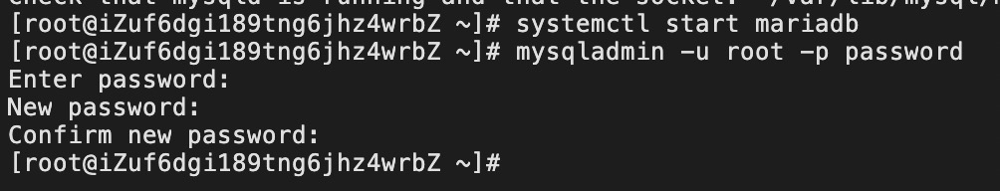

**4. 链接数据库，执行如下命令：**

```
mysql -uroot -p
```

*在出现Enter password提示符的时候，输入上面您设置的密码，即可登录数据。*

**5. 创建数据库**

接着上面登陆数据库后，我们要为博客创建一个数据库，这里数据库名设置为wordpress（您也可以采用其他喜欢的名字），执行如下命令创建wordpress数据库：

```
create database wordpress;
```

*如果要查看创建的数据库，可以数据如下命令：*

```
show databases;
```

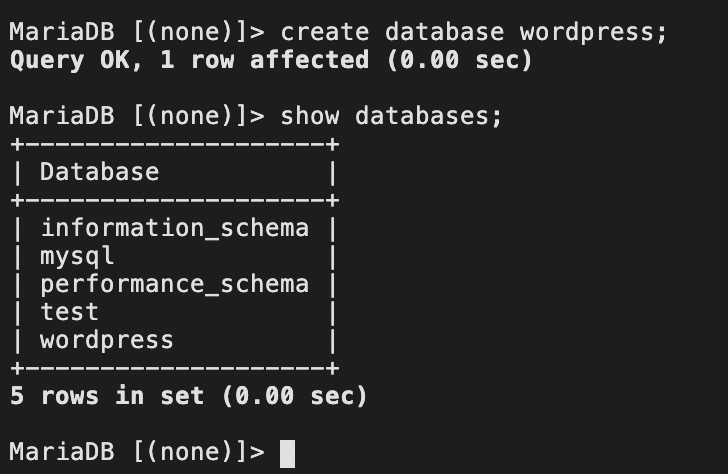

**6. 退出数据库连接操作**

我们暂时退出数据库连接操作，进入下一节安装PHP语言环境

```
exit;
```

\5. 安装 PHP 语言环境

WordPress是使用PHP语言开发的博客平台，用户可以在支持PHP和MySQL数据库的服务器上架设属于自己的网站。也可以把WordPress当作一个内容管理系统（CMS）来使用。

**1. 安装PHP环境，执行如下命令：**

```
yum -y install php php-mysql gd php-gd gd-devel php-xml php-common php-mbstring php-ldap php-pear php-xmlrpc php-imap
```

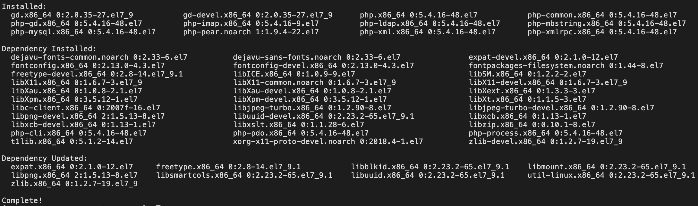

 **2. 创建PHP测试页面，执行如下命令：**

```
echo "<?php phpinfo(); ?>" > /var/www/html/phpinfo.php
```

**3. 重启Apache服务，执行如下命令：**

```
systemctl restart httpd
```

\4. 测试PHP页面

访问`http://<ECS公网地址>/phpinfo.php`，显示如下页面表示PHP语言环境安装成功

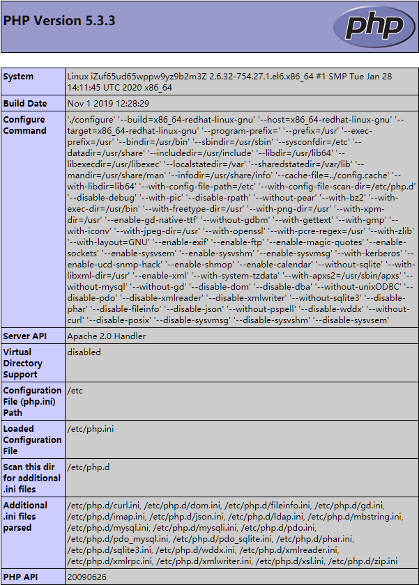

\1. Wordpress安装和配置

接上节，我们已经搭建好了LAMP（Linux、Apache、MariaDB、PHP）环境，本小节我们开始WordPress程序包。


**1. 安装wordpress，执行如下命令：**

```
yum -y install wordpress
```

*显示如下信息表示安装成功*

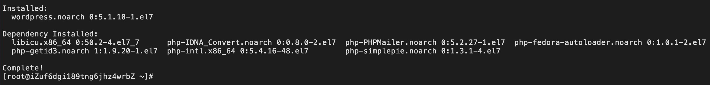

**2. 修改WordPress配置文件**

1）执行如下命令，修改wp-config.php指向路径为绝对路径

```
# 进入/usr/share/wordpress目录。
cd /usr/share/wordpress
# 修改路径。
ln -snf /etc/wordpress/wp-config.php wp-config.php
# 查看修改后的目录结构。
ll
```

2）执行如下命令，移动wordpress到Apache根目录

```
# 在Apache的根目录/var/www/html下，创建一个wp-blog文件夹。
mkdir /var/www/html/wp-blog
mv * /var/www/html/wp-blog/
```

3）执行以下命令修改wp-config.php配置文件。 在执行命令前，请注意替换命令中的以下三个参数值。 ** database_name_here：为之前步骤中创建的数据库名称，本示例为***wordpress** ** username_here：为数据库的用户名，本示例为***root** ** password_here：为数据库的登录密码，即为安装MariaDB时我们设置的密码（本示例设置的密码为***422302***）*

```
sed -i 's/database_name_here/wordpress/' /var/www/html/wp-blog/wp-config.php
sed -i 's/username_here/root/' /var/www/html/wp-blog/wp-config.php
sed -i 's/password_here/422302/' /var/www/html/wp-blog/wp-config.php
```

4）执行以下命令，查看配置文件信息是否修改成功

```
cat -n /var/www/html/wp-blog/wp-config.php
```

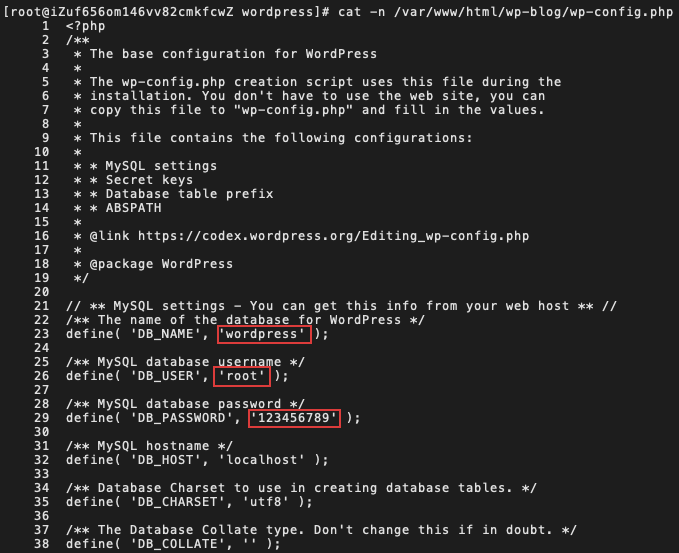

**3. 重启Apache服务，执行如下命令：**

```
systemctl restart httpd
```


\2. 测试Wordpress

完成以上所有步骤后，就可以测试我们基于ECS所搭建的云上博客了。

**1. 打开浏览器并访问** http://<ECS公网IP>/wp-blog/wp-admin/install.php

ECS公网IP的获取位置参见下图

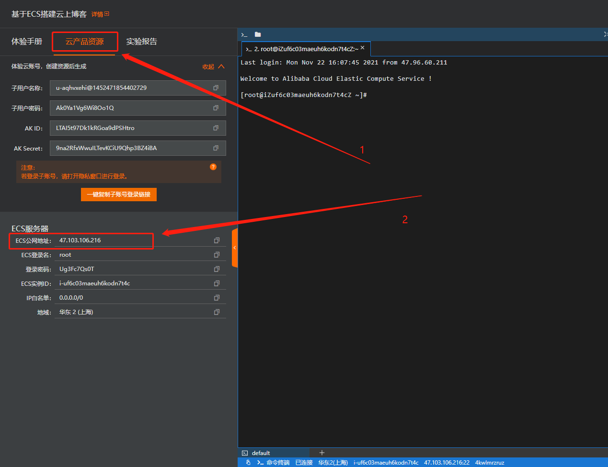


**2. 根据以下信息完成wordpress初始化配置，然后点击Install WordPress按钮完成Wordpress初始化**

*Site Title：站点名称，例如：Hello ADC Username：管理员用户名，例如：admin Password：访问密码，例如：cIxWg9t@a8MJBAnf%j Your Email：email地址，建议为真实有效的地址。若没有，可以填写虚拟email地址，但将无法接收信息，例如：admin@admin.com*


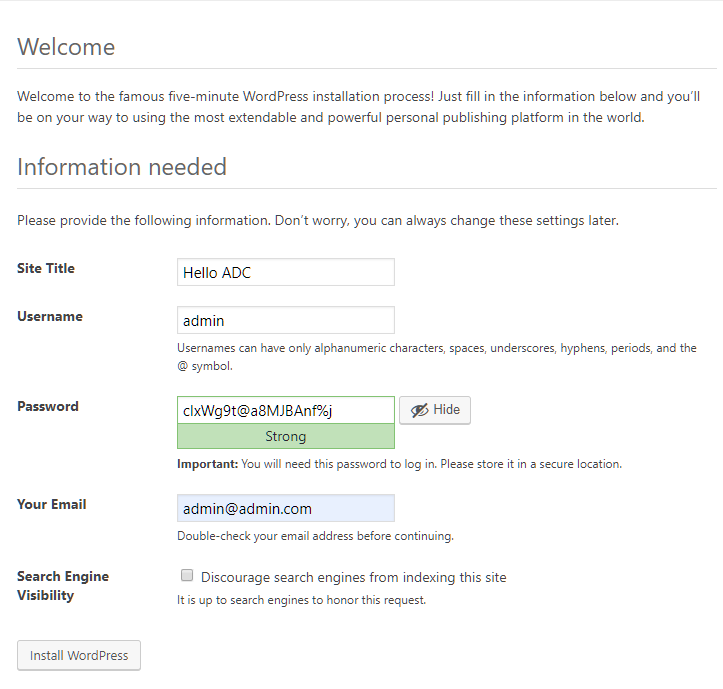


**3. 单击Log In进行登录，输入上一步设置的用户名和密码**

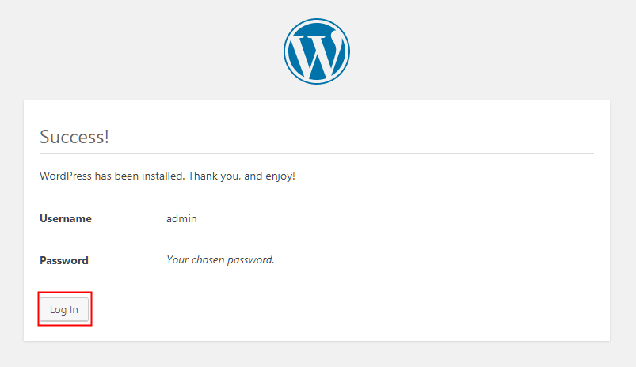


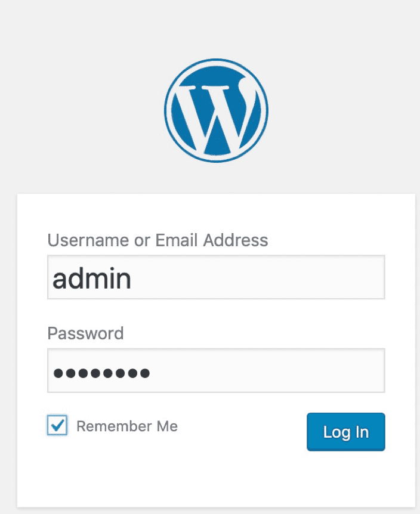


**4. 登陆成功，登录后，您就可以添加博客进行发布了**

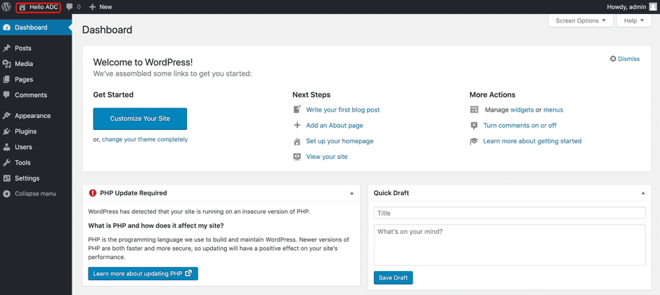
