# 图解系统

# 硬件结构

## 1. 冯诺依曼模型

计算机基本的五大部分：中央处理器（CPU）、内存、输⼊设备、输出设备、总线。


### CPU

CPU的组成：寄存器，控制单元，逻辑运算单元

常见的寄存器种类：

通用寄存器：存放需要进行运算的数据

程序计数器：存储CPU要执行的下一条指令所在的内存地址（此时下一条指令还在内存中，存储的仅仅是指令的内存地址）

指令寄存器：用来存放指令本身，指令被执行完成之前都会存储在这里

### 总线

CPU和内存以及其他设备之间通讯的媒介，当CPU需要读写内存数据时，一般需要两个总线：

通过地址总线来指定内存的地址，然后再通过数据总线来传输数据。

## 2. CPU的执行流程


## 3. 指令的执行速度

程序的CPU执行时间 =  指令数 * CPI * 时钟周期时间

CPI - Cycles Per Instruction - 每条指令的平均时钟周期数


64位相比于32位CPU的优势：

64位CPU有更大的寻址空间；

## 4. 存储金字塔

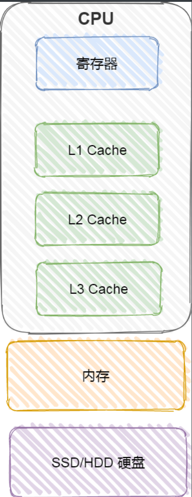

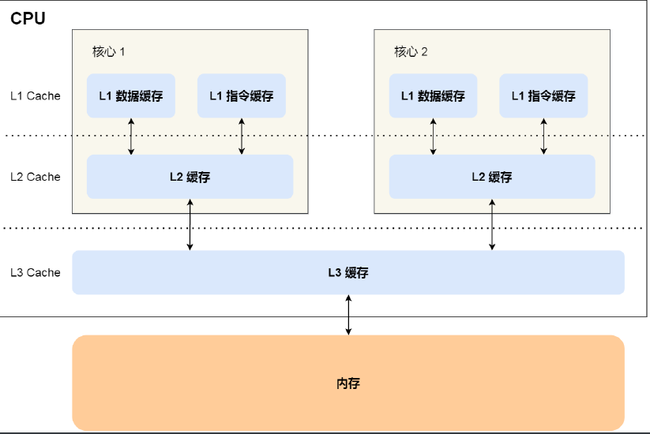

### 寄存器

寄存器的数量通常是几十到几百之间，32位CPU大部分可以存储4个字节，64位大部分存储8个字节。

### L1高速缓存

每个CPU核心都有一个，L1高速缓存的访问速度几乎和寄存器一样快，只有2-4个时钟周期，而大小在几十KB到几百KB不等，而且L1高速缓存指令和数据都是分开存放的。

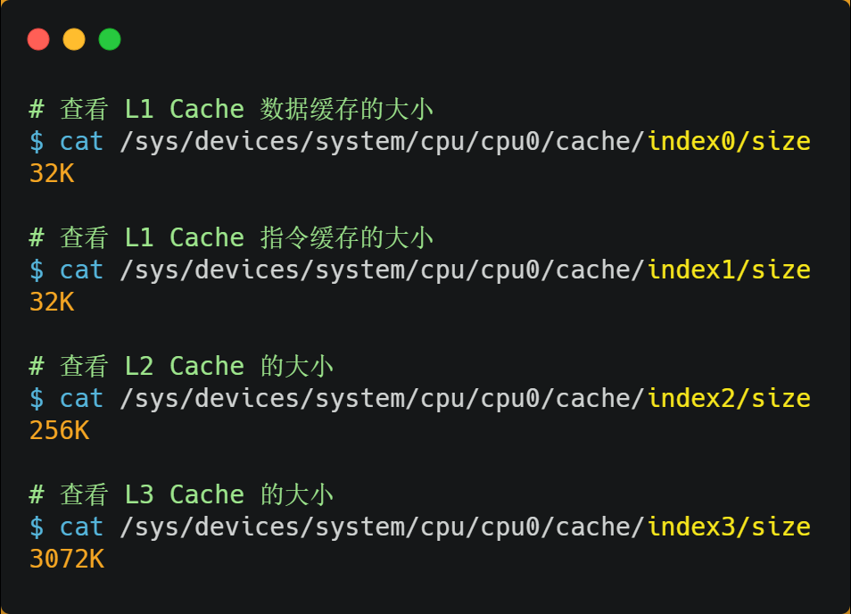

所以当CPU需要访问内存中的某个数据时，如果寄存器没有这个数据，CPU就直接从寄存器取数据，如果寄存器没有则去看L1高速缓存....，直到所有的三级缓存都没有时，才会去内存中取数据。

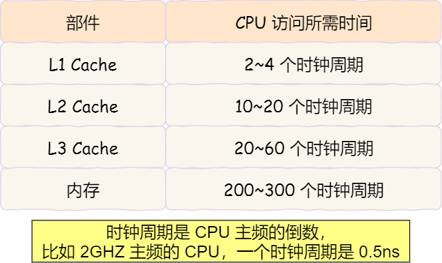

每次CPU Cache 从内存中读数据时，不是按照单个数组元素来读取的，而是一小块一小块的读取，称为Cache Line（缓存块）。

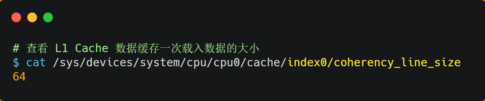

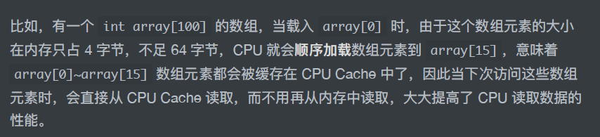

## 5. 充分利用CPU提升代码运行效率

### 1. CPU是怎么知道我们需要访问的内存数据，是否在Cache里？

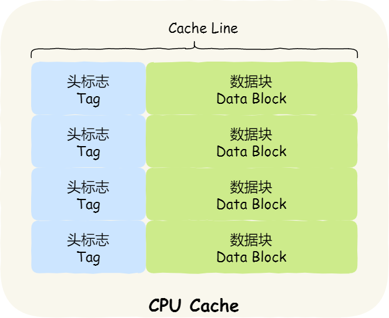

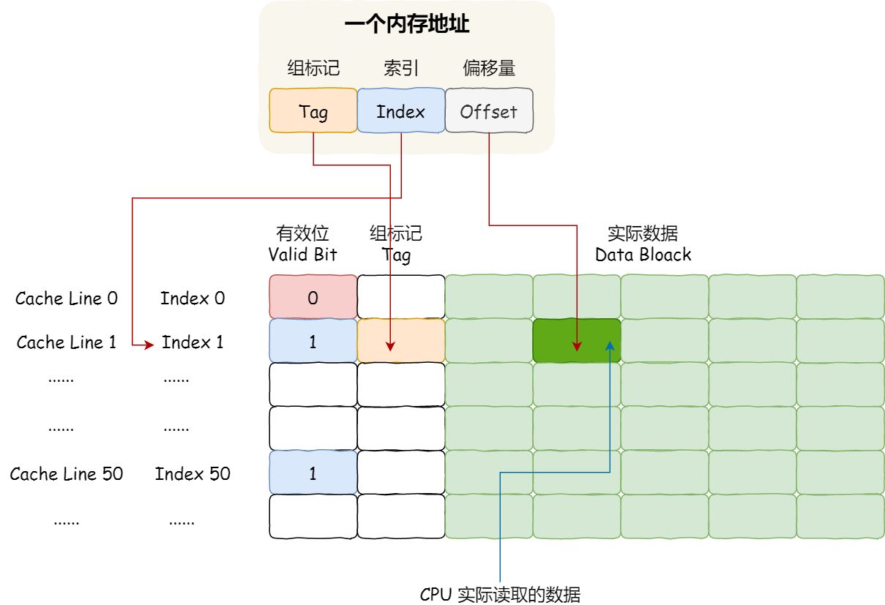

### 2. 提高代码的运行速度

1. 尽可能的提高缓存命中率，即对于数组访问时，尽量的按照内存布局顺序的形式访问，就可以最大程度的利用CPU Cache带来的好处，极大地提高我们代码的命中率。

2. 尽可能的提高CPU分支预测的准确度

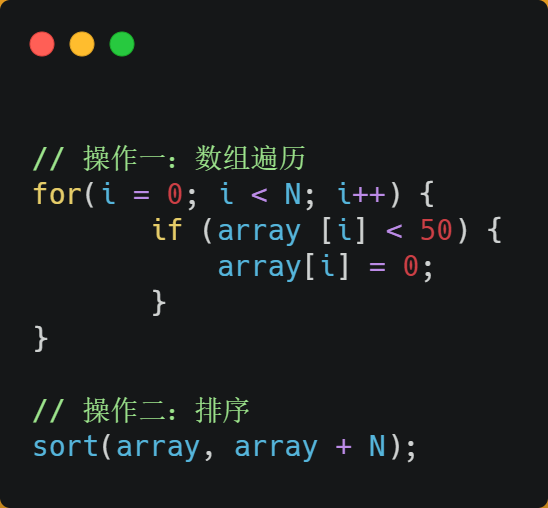


所以对于上面的两个操作，首先对数组排序，然后在进行数组遍历就会提高分支预测的命中率

### 3. 如何提高多核CPU的缓存命中率

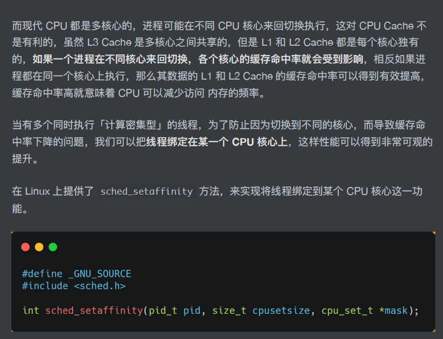

## 6. CPU的缓存一致性问题

#### 1. CPU Cache  数据写入

##### 写直达

把数据同时写入内存和Cache中

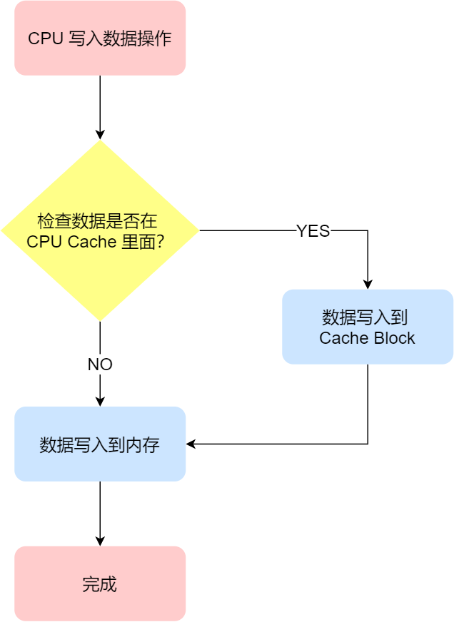

写直达的问题：无论数据在不在CPU Cache中，每次写操作都会将数据写回到内存

##### 写回

当发生写操作是，新的数据仅仅被写入Cache Block里，只有当修改过的Cache Block被替换时才需要写到内存中，减少数据写回内存的频率，提高系统性能。

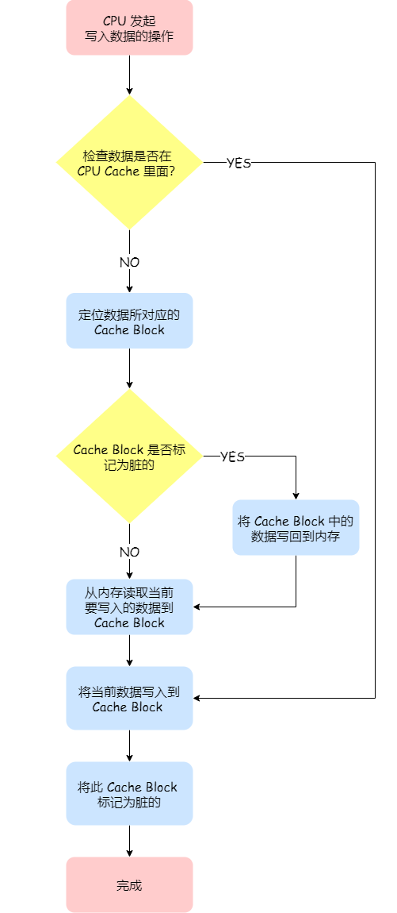

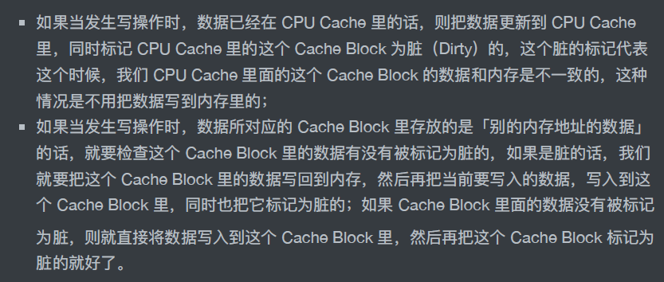

#### 2. 缓存一致性问题

## 7. CPU是如何执行任务的

### 1. 伪共享问题

因为多个线程同时读写一个Cache Line 的不同变量时，而导致 CPU Cache 失效的现象称为 伪共享。

伪共享的避免方法：（空间换时间）

对于多个线程共享的热点数据，应该避免这些数据刚好在同一个Cache Line中，否则会出现伪共享的问题。

在Linux内核中可以使用 __cacheline_aligned_in_smp 的宏定义来是的变量在 Cache Line 中对齐

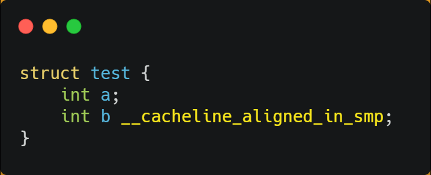

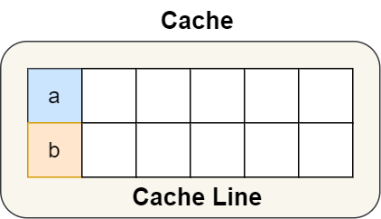

在Java的并发框架Disruptor中就使用 **字节填充 + 继承** 的方式，来避免伪共享

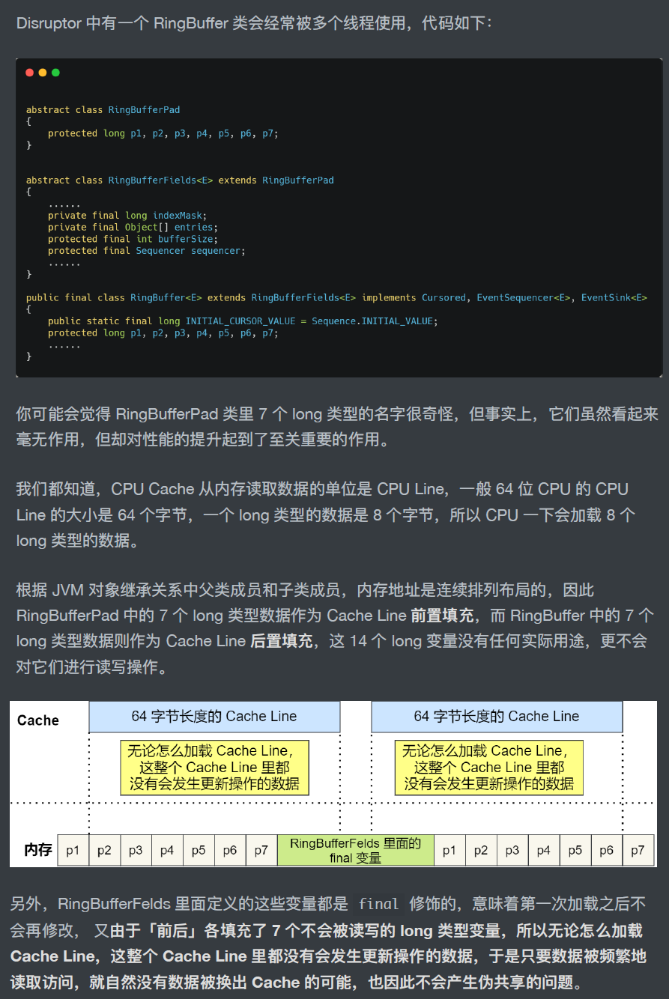

## 8. CPU如何选择线程

在Linux内核中，进程和线程都是使用 tark_struct 结构体表示，区别在于线程的 tark_struct 内部分资源是共享了进程已创建的资源（比如：内存地址空间、代码段、文件描述符等）

所以Linux内核里的调度器，调度的对象是 tark_struct ，我们也可以把它统称为任务。

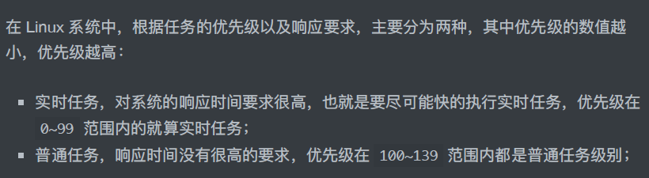

### Linux系统中的任务调度类

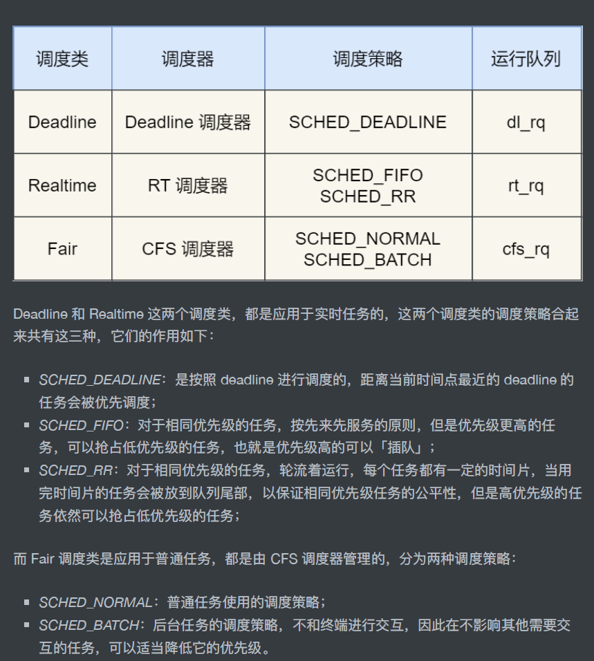

Linux中的一个基于 CFS 的调度算法，也就是完全公平调度（Completely Fair Scheduling）

优先选择 vruntime 少的任务执行，以保证每个任务的公平性。


所以当一个任务运行的越久时，它的 vruntime 就会越大，当然 CFS 还考虑到了不同任务的优先级问题，优先级大的任务，权重也会越大，最终计算出的 vruntime 会越小，越容易被 CFS 算法调度。

### CPU运行队列

每个CPU 都有自己的 运行队列（Run Queue, rq），用于描述在此CPU上所运行的所有进程，每个队列都包含三个运行队列，Deadline 运行队列 dl_rq、实时任务运行队列 rt_rq和 CFS 运行队列 cfs_rq，其中 cfs_rq 是用红黑树描述，按 vruntime 大小排序，最左侧的叶子结点，就是下次被调度的任务

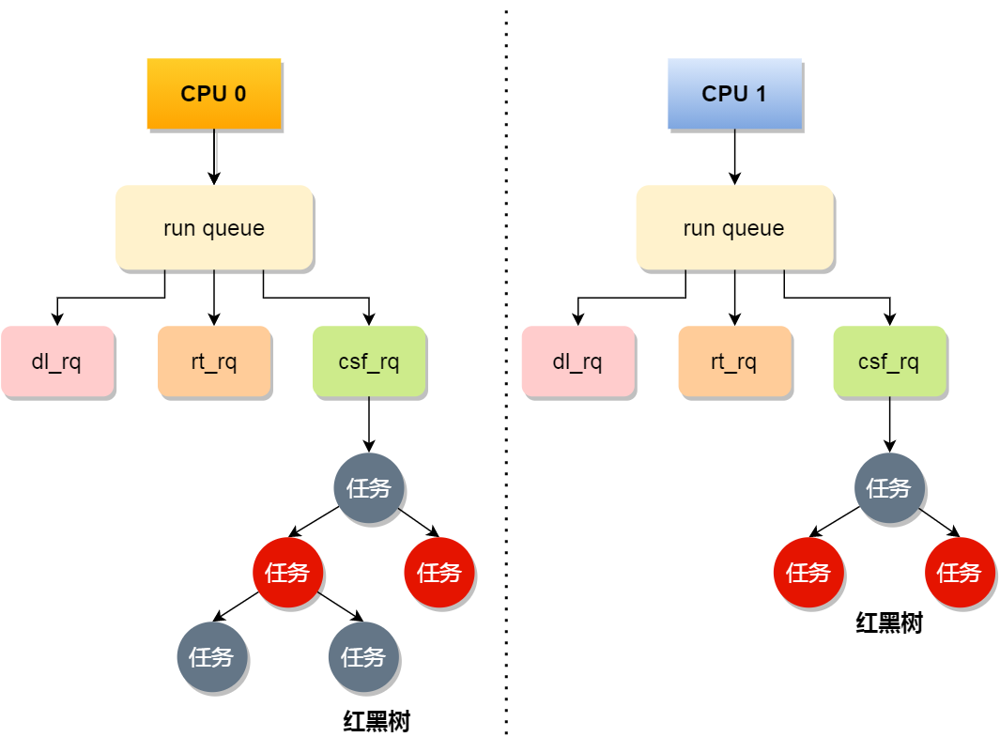


#### 调整优先级

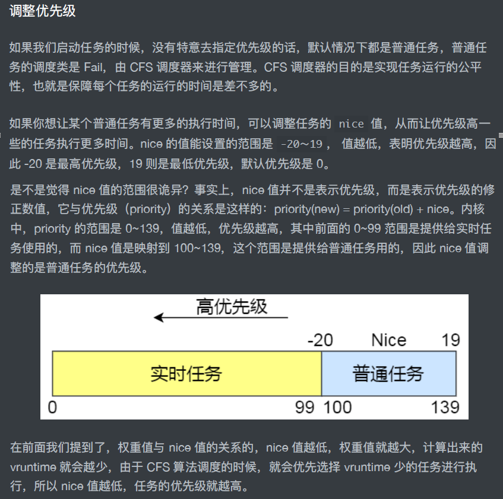

## 9. 中断

### 1. 什么是中断？

计算机中，系统用来响应硬件设备请求的一种机制，操作系统受到硬件的中断请求，会打断正在执行中的中断，然后调用内核的中断处理程序来响应请求。

操作系统受到中断请求之后，会打断其他进程的运行。所以中断请求的响应程序，也就是中断处理程序，要尽可能快的执⾏完，这样可以减少对正常进程运⾏调度地影响。

### 2. 软中断

Linux为了避免中断处理程序执行时间过长和导致的中断丢失问题，采用了将中断过程分为两部分：
上半部：快速处理中断，暂时关闭中断请求，主要负责处理跟硬件紧密相关或时间敏感的事情。

下半部：延迟处理上半部未完成的工作，以内核线程的方式运行。

以网卡接收网络包为例：

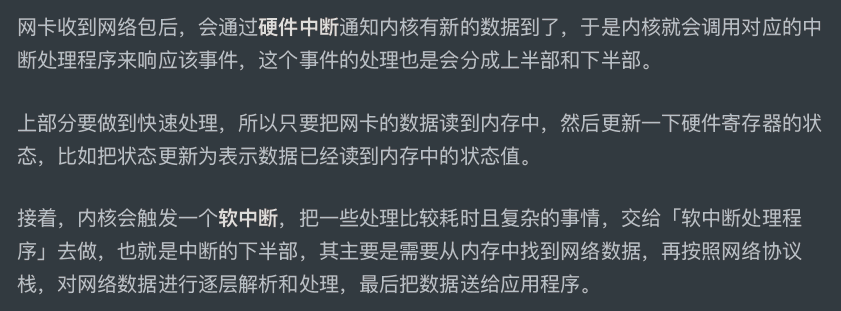

对于中断处理程序的两部分的理解：

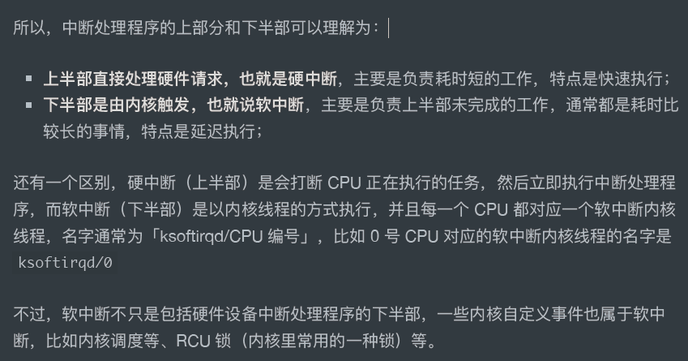

## 10 计算机数字的存储

### 为什么要采用补码的方式表示负数？

保证负数和正数可以正常的参与加法运算。

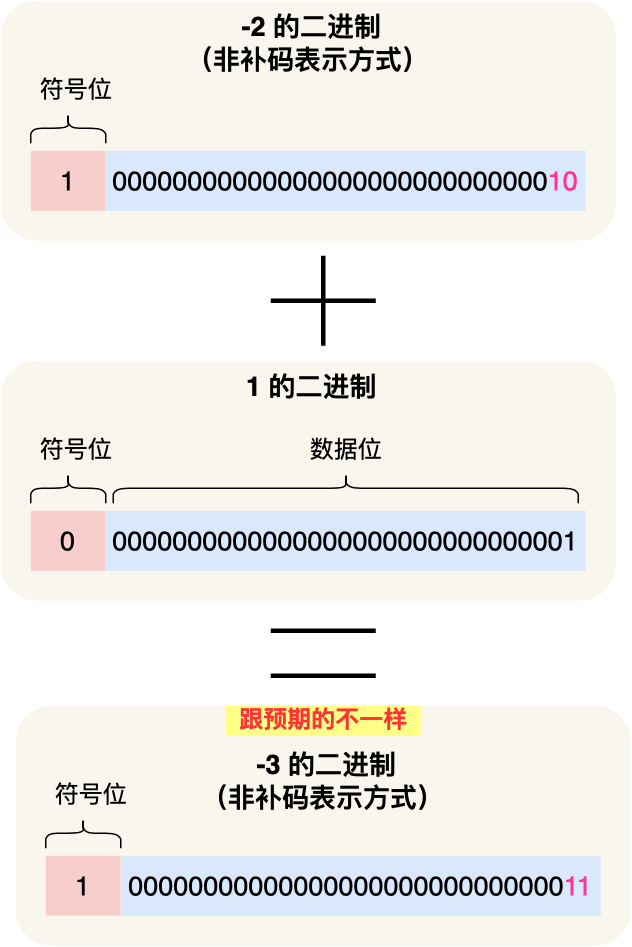

### 常见的进制转换

10^3 = 1000 ≈ 1024 = 2^10

1024 Byte = 1KB = 2 ^ 10 Byte

1024 KB = 1 MB = 2 ^ 20 Byte

1024 MB = 1GB = 2 ^ 30 Byte

10亿Byte = 1*10^9 Byte =  2^30Byte = 1GB

### 浮点数的存储

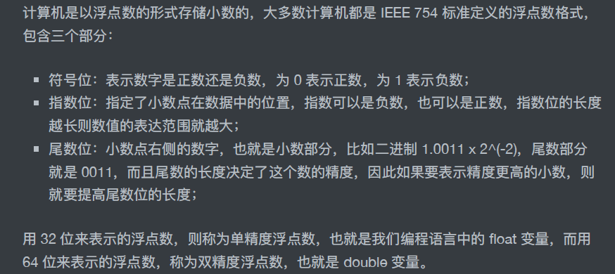

# 操作系统结构

## 1. 什么是内核

内核是作为应用连接硬件设备的桥梁

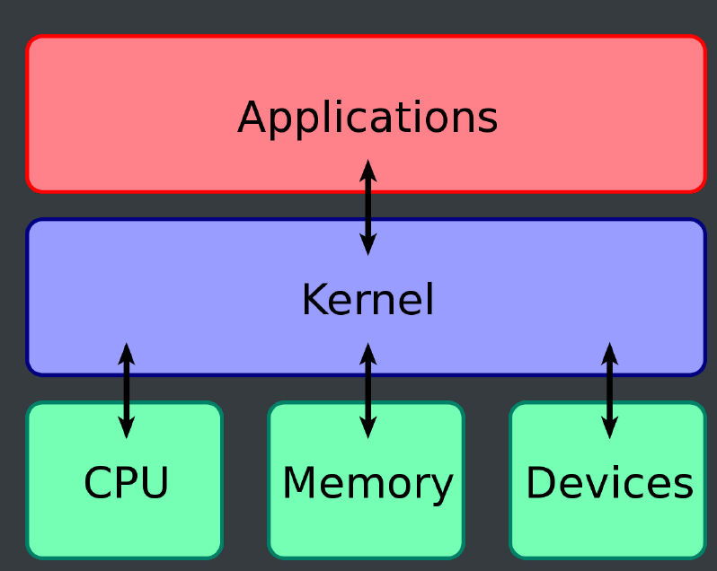

## 2. 内核的能力

进程调度、内存管理、硬件通信和系统调用的四大基本能力。

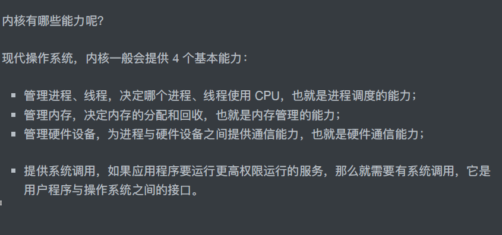

## 3. 内核的工作方式

用户态和内核态

系统调用的方式

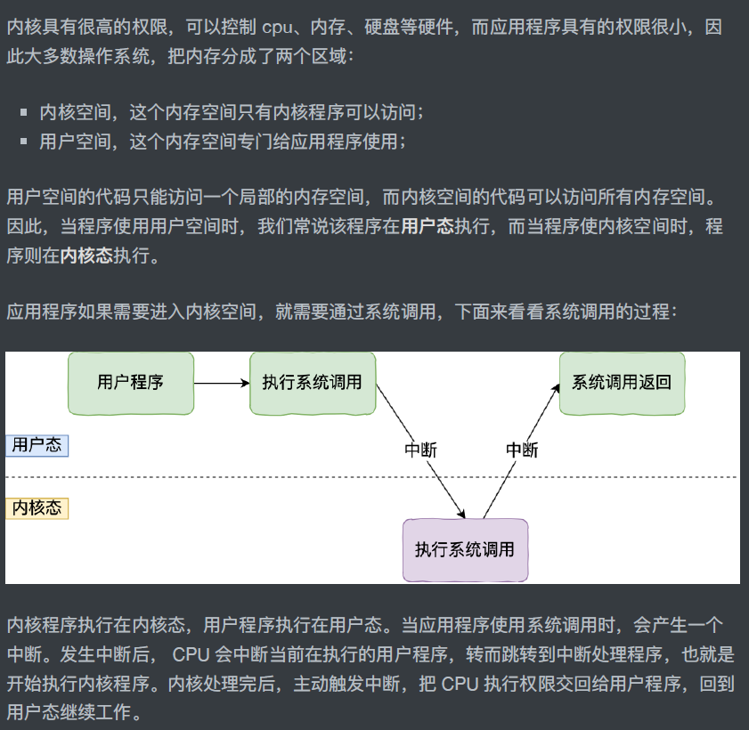

## 4. Linux内核

Linux内核的特点：

1. 多任务						  ——MutiTask
2. 对称多处理                  ——SMP
3. 可执行文件链接格式   ——ELF
4. 宏内核                          ——Monolithic Kernel

### 1. MutiTask

### 2. SMP

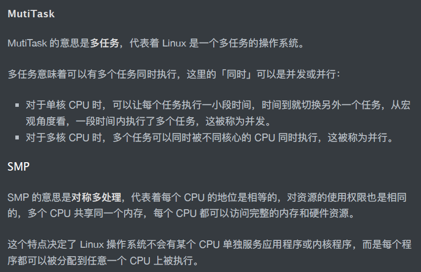

### 3. ELF

ELF表示 可执行文件链接格式，它是Linux操作系统中可执行文件的存储格式，结构如下：

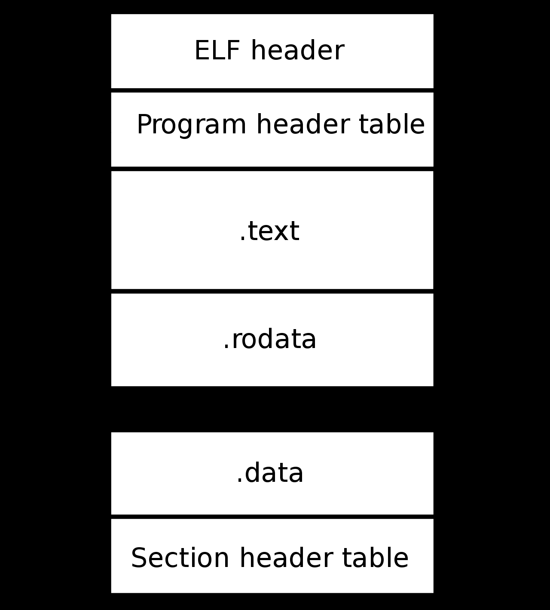

#### ELF文件的生成和执行

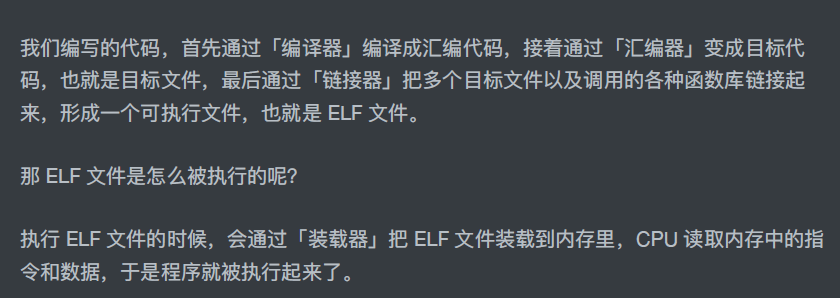

### 4. Monolithic Kernel

Linux内核架构就是宏内核，意味着Linux内核是一个完整的可执行程序，且拥有最高的权限。

宏内核的特征就是系统内核的所有模块：进程调度、内存管理、文件系统、设备驱动等都运行在内核态

与宏内核架构对应的是微内核架构，内核只保留最基本的能力，比如进程调度、虚拟机内存、中断等，把驱动程序、文件系统等应用放到了用户空间。

微内核的优点：

1. 服务与服务之间是隔离的，单个服务的故障不会导致整个操作系统的挂掉，提高了操作系统的稳定性和可靠性
2. 内核功能少，可移植性高

缺点：

1. 驱动程序不在内核中，驱动程序与硬件设备的交互就需要频繁的切换到内核态中，带来性能消耗。

## 5. Windows内核

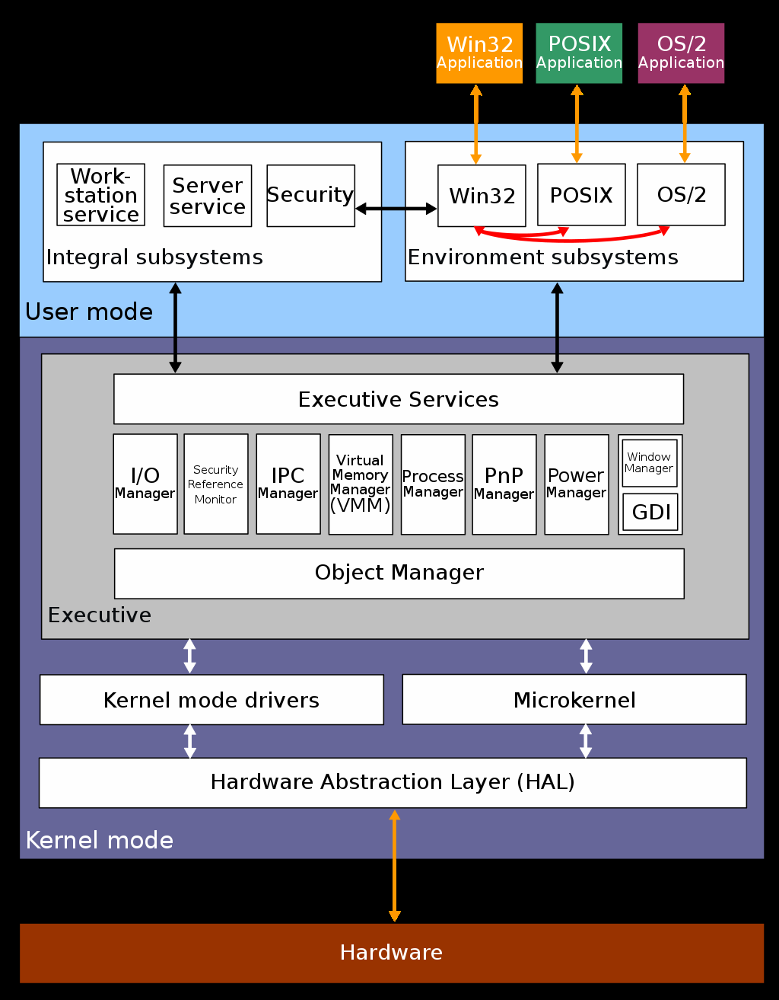

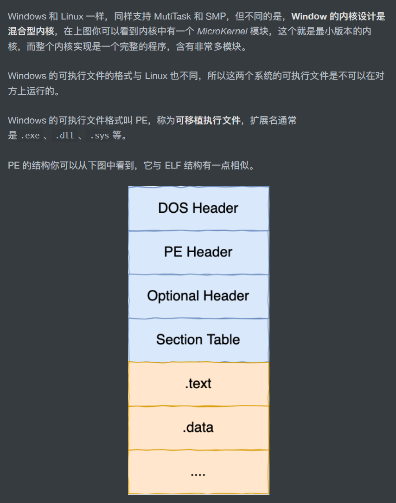


# 内存管理

## Linux 内存管理

以 32 位系统为例的用户空间分布情况

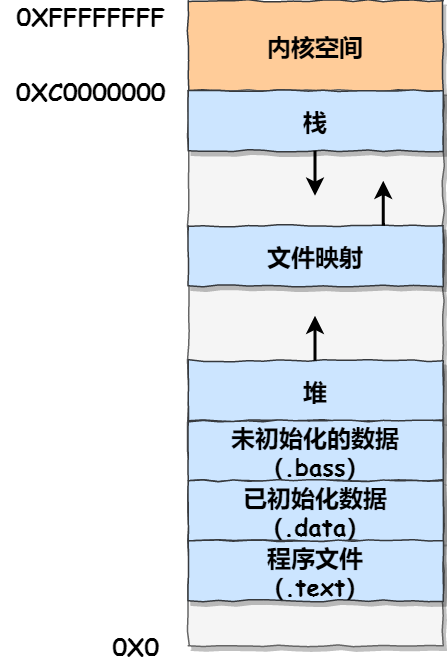

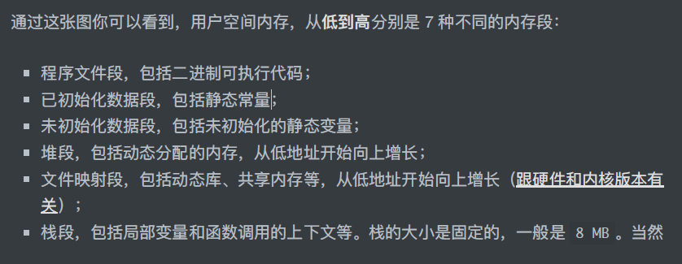

# 进程与线程

## 1. 进程和线程的基本概念

### 1. 进程的状态

创建状态 new ：进程正在被创建时的状态 

运行状态 Runing ：该进程正在占用 CPU；

就绪状态 Ready ：可运行，由于其他进程正在处于运行状态二暂时停止运行。

阻塞状态 Blocked ：该进程正在等待某一时间（如等待输入/输出操作的完成）而暂时停止运行；

结束状态 Exit ：进程正在从系统中消失的状态；


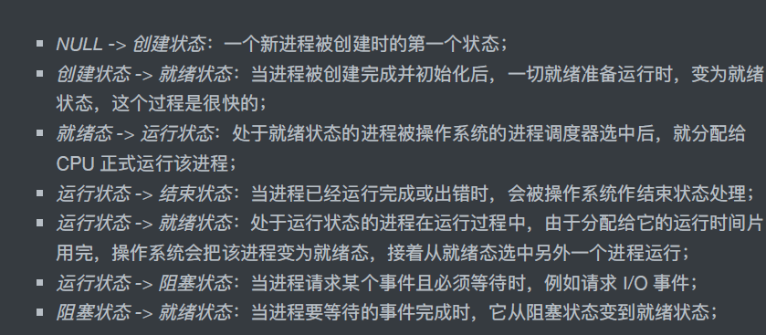

因为大量的处于阻塞状态的进程，还会占用物理内存，所以一般虚拟内存管理的操作系统，通常会把阻塞状态的进程的物理内存空间换出到硬盘，等到需要再次运行时，再从硬盘换入到物理内存。

所以在进程的状态中又加入了 **阻塞状态**

阻塞挂起：进程在外存（硬盘）并等待某个事件的出现；

就绪挂起：进程在外存（硬盘），但只要进了内存，即可开始运行

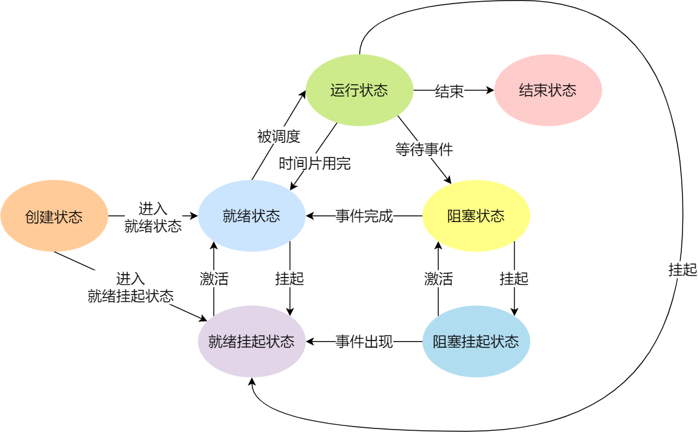

导致进程挂起 的原因：

1. 进程所使用的内存空间不再物理内存；
2. 通过 sleep 让进程间歇性挂起，其工作原理是设置一个定时器，到期后唤醒进程。
3. 挂起一个程序的执行，比如在 Liunx 中用 Ctrl + Z 挂起进程

### 2. PCB

process control block, PCB 进程控制块。是进程存在的唯一标识。

PCB 包含的信息主要有：进程描述信息、进程控制和管理信息、资源分配清单、CPU相关信息。

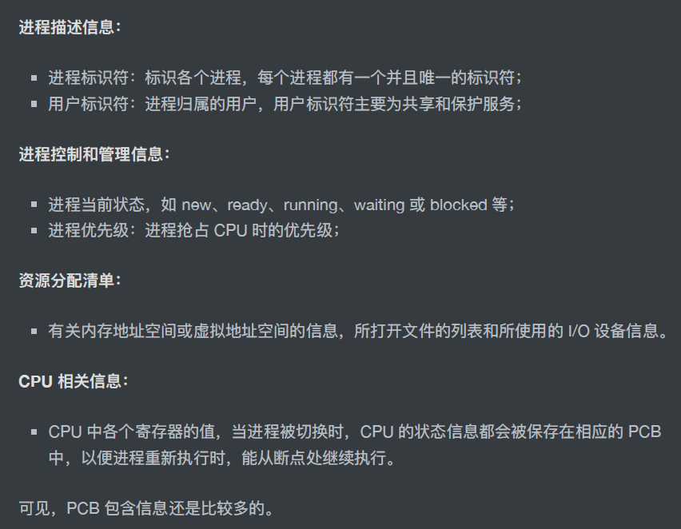

PCB 是通过链表的方式进行组织的，将具有相同状态的进程连在一起，组成各种队列。（就绪队列、阻塞队列）

### 3. 进程的控制

创建进程、终止进程、阻塞进程、唤醒进程

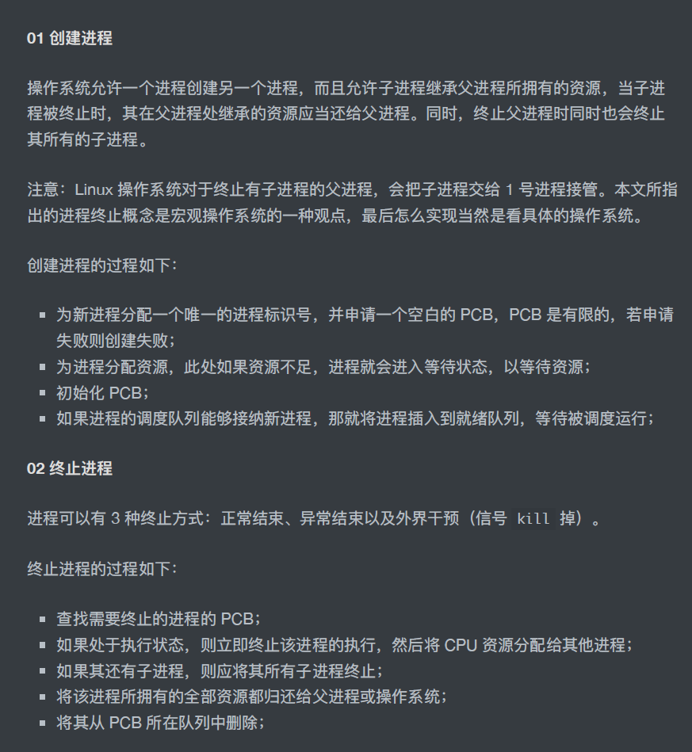

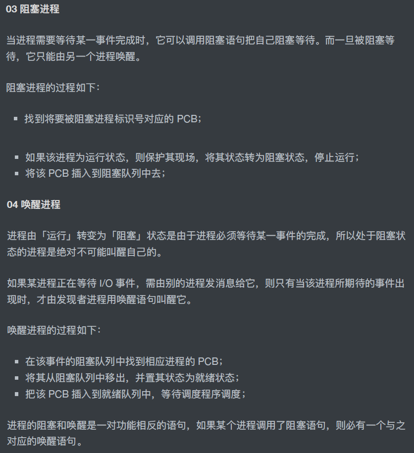

### 4. 进程的上下文切换

CPU上下文：CPU寄存器和程序计数器

进程的上下文：虚拟内存、栈、全局变量等用户空间资源，还包括内核堆栈、寄存器等内核空间的资源。

线程上下文切换（同一进程内）：线程私有数据、寄存器等不共享的资源。

进程上下文切换的场景：

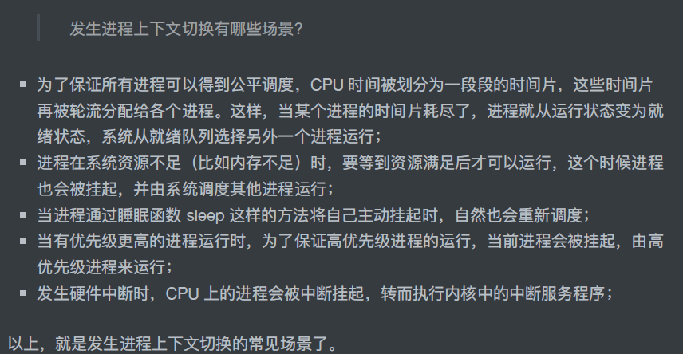

## 2. 进程间通信

### 1. 管道

```
$ ps auxf | grep mysql
```

上式中的 【 | 】 就是一个管道，它的作用就是将前一个命令的输出（ps auxf ）的输出，作为后一个命令的输入。

而且这个管道没有名字，称为 匿名管道，数据传输方向为单向的。

### 2. 消息队列

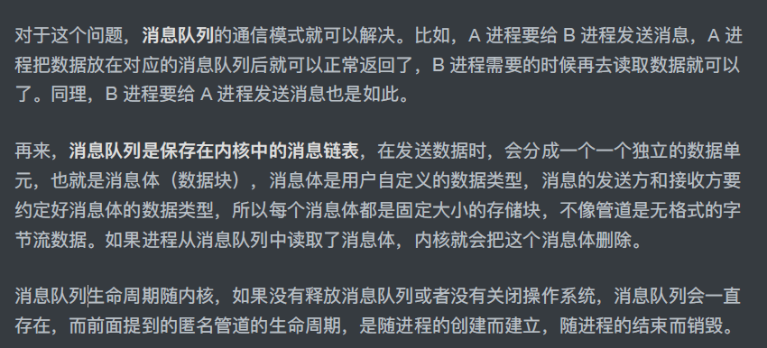


消息队列的缺点：

1. 不适合传送大数据，因为每个消息体都有一个最大长度的限制；
2. 消息队列通信过程中，存在用户态与内核态之间的数据拷贝的开销；因为进程写入数据到内核中的消息队列时，会发生从用户态拷贝数据到内核态的过程，同样另一进程在读取内核中的消息数据时，也会从内核态拷贝数据到用户态。

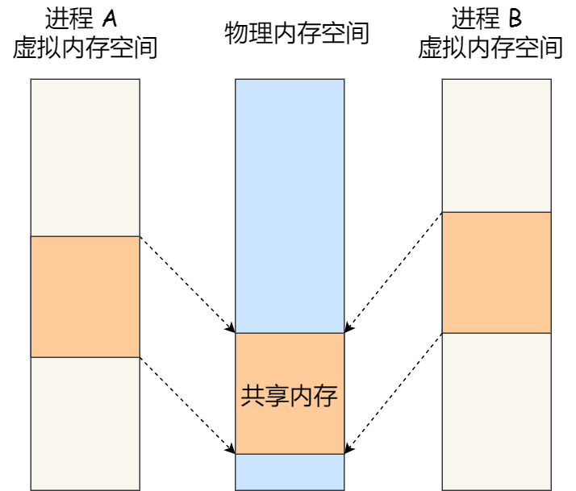

# 调度算法

# 文件系统

# 设备管理

# 网络系统

# Linux命令

