# 后端存储实践

# MySQL应对高并发问题

MySQL 能承担的并发读写的量是有上限的，当系统的在线用户超过几万到几十万这个量级的时候，单台 MySQL 就很难应付了。

## 一：使用缓存保护MySQL

这种方法对于像电商中的**商品系统、搜索系统**这类与**用户关联不大**的系统，效果特别的好。

因为在这些系统中，每个人看到的内容都是一样的，也就是说，对后端服务来说，每个人的查询请求和返回的数据都是一样的。这种情况下，Redis **缓存的命中率非常高**，近乎于全部的请求都可以命中缓存，相对的，几乎没有多少请求能穿透到 MySQL。

绝大多数互联网系统，都使用 MySQL 加上 Redis 这对儿经典的组合来解决这个问题。Redis 作为 MySQL 的前置缓存，可以替 MySQL 挡住绝大部分查询请求，很大程度上缓解了 MySQL 并发请求的压力。

### Reids简介

Redis 是一个使用内存保存数据的高性能 KV 数据库，它的高性能主要来自于：

1. 简单的数据结构；
2. 使用内存存储数据。

数据库可以分为执行器和存储引擎两部分，Redis 的执行器这一层非常的薄，所以 Redis 只能支持有限的几个 API，几乎没有聚合查询的能力，也不支持 SQL。它的存储引擎也非常简单，直接在内存中用最简单的数据结构来保存数据（Redis 有五种基本数据结构，String, Hash, list, set, zset。

内存是一种易失性存储，所以使用内存保存数据的 Redis 不能保证数据可靠存储。从设计上来说，Redis 牺牲了大部分功能，牺牲了数据可靠性，换取了高性能。但也正是这些特性，使得 Redis 特别适合用来做 MySQL 的前置缓存。

虽然说，Redis 支持将数据持久化到磁盘中，并且还支持主从复制，但你需要知道，Redis 仍然是一个不可靠的存储，它在设计上天然就不保证数据的可靠性，所以一般我们都使用 Redis 做缓存，很少使用它作为唯一的数据存储。(Redis的两种持久化方式：RDB快照 和 AOF日志)

在缓存 MySQL 的一张表的时候，通常直接选用主键来作为 Redis 中的 Key，比如缓存订单表，那就直接用订单表的主键订单号来作为 Redis 中的 key。如果说，Redis 的实例不是给订单表专用的，还需要给订单的 Key 加一个统一的前缀，比如“orders:888888”。Value 用来保存序列化后的整条订单记录，你可以选择可读性比较好的 JSON 作为序列化方式，也可以选择性能更好并且更节省内存的二进制序列化方式，都是可以的。

### MySQL 和 Redis 双写一致性问题

#### 1. Cache Aside模式


Cache Aside 模式在更新数据的时候，并不去尝试更新缓存，而是去删除缓存。

订单服务收到更新数据请求之后，先更新数据库，如果更新成功了，再尝试去删除缓存中订单，如果缓存中存在这条订单就删除它，如果不存在就什么都不做，然后返回更新成功。这条更新后的订单数据将在下次被访问的时候加载到缓存中。使用 Cache Aside 模式来更新缓存，可以非常有效地避免并发读写导致的脏数据问题。

#### 2. 缓存延时双删策略

流程：

写请求 -> 删除缓存 -> 更新数据库 -> 休眠一会(1s)，再删除缓存 -> 删除缓存

休眠时间 = 读业务逻辑数据的耗时 + 几百毫秒，目的是为了确保读请求结束，写请求可以删除读请求可能带来的缓存脏数据。

#### 3. Canal 中间件

阿里提供的 canal中间件将 binlog日志采集发送到MQ消息队列中，然后通过ACK 机制确认处理这条更新数据，删除缓存，保证数据一致性。

使用说明：需要开启 mysql 的binlog写入功能。

**上述三种模式的核心点都是要确保删除缓存，因为在并发写的同时，会有别的进程读了还未修改的数据库数据，带来了缓存脏数据。**

### 缓存穿透和缓存雪崩问题

如果我们的缓存命中率比较低，就会出现大量“缓存穿透”的情况。缓存穿透指的是，在读数据的时候，没有命中缓存，请求“穿透”了缓存，直接访问后端数据库的情况。

少量的缓存穿透是正常的，我们需要预防的是，短时间内大量的请求无法命中缓存，请求穿透到数据库，导致数据库繁忙，请求超时。大量的请求超时还会引发更多的重试请求，更多的重试请求让数据库更加繁忙，这样恶性循环导致系统雪崩。

#### 解决系统初上线时缓存穿透问题

**1. 灰度发布**

当系统初始化的时候，比如说系统升级重启或者是缓存刚上线，这个时候缓存是空的，如果大量的请求直接打过来，很容易引发大量缓存穿透导致雪崩。为了避免这种情况，可以采用灰度发布的方式，先接入少量请求，再逐步增加系统的请求数量，直到全部请求都切换完成。

**2 .缓存预热**

如果系统不能采用灰度发布的方式，那就需要在系统启动的时候对缓存进行预热。所谓的缓存预热就是在系统初始化阶段，接收外部请求之前，先把最经常访问的数据填充到缓存里面，这样大量请求打过来的时候，就不会出现大量的缓存穿透了。

## 二：读写分离

### 为什么不采用缓存系统

对于和用户相关的系统，使用缓存的效果就没那么好了，比如说，**订单系统、账户系统、购物车系统**等等。在这些系统里面，每个用户需要查询的信息都是和用户相关的，即使是同一个功能界面，那每个人看到的数据都是不一样的。

这种情况下，缓存的命中率就没有那么高，还是有相当一部分查询请求因为命中不了缓存，打到 MySQL 上。那随着系统用户数量越来越多，打到 MySQL 上的读写请求也越来越多，当单台 MySQL 支撑不了这么多的并发请求时，就需要采用MySQL读写分离。

在部署集群的时候，需要做很多额外的工作，而且很难做到对应用透明，那你的应用程序也要为此做较大的架构调整。所以，除非系统规模真的大到只有这一条路可以走，不建议你对数据进行分片，自行构建 MySQL 集群，代价非常大。

**一个简单而且非常有效的方案是，我们不对数据分片，而是使用多个具有相同数据的 MySQL 实例来分担大量的查询请求，这种方法通常称为“读写分离”。（主要针对 读多写少的场景）**

把使用单机 MySQL 的系统升级为读写分离的多实例架构非常容易，一般不需要修改系统的业务逻辑，只需要简单修改 DAO 代码，把对数据库的读写请求分开，请求不同的 MySQL 实例就可以了。

典型的读写分离架构（一主多从）

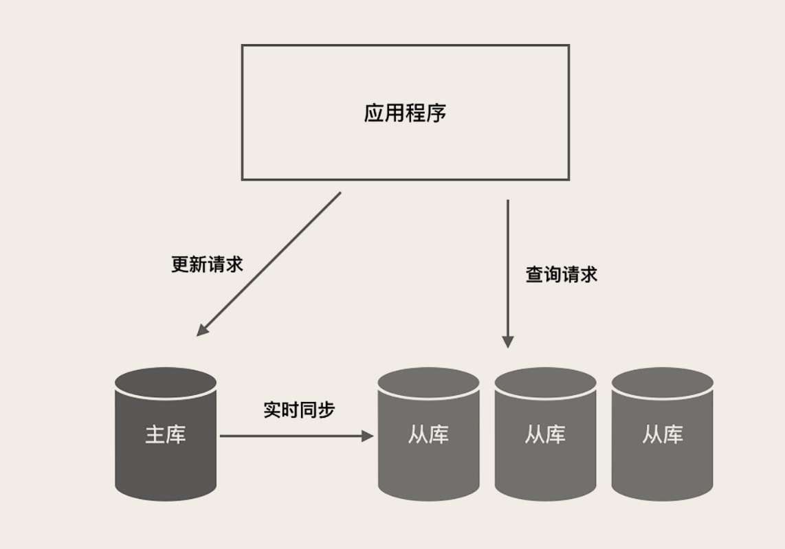

主库负责执行应用程序发来的所有数据更新请求，然后异步将数据变更实时同步到所有的从库中去，这样，主库和所有从库中的数据是完全一样的。多个从库共同分担应用的查询请求。

### 分离应用程序的读写请求

1. 纯手工方式：修改应用程序的 DAO 层代码，定义读写两个数据源，指定每一个数据库请求的数据源。
2. 组件方式：也可以使用像 Sharding-JDBC 这种集成在应用中的第三方组件来实现，这些组件集成在你的应用程序内，代理应用程序的所有数据库请求，自动把请求路由到对应数据库实例上。
3. 代理方式：在应用程序和数据库实例之间部署一组数据库代理实例，比如说 Atlas 或者 MaxScale。对应用程序来说，数据库代理把自己伪装成一个单节点的 MySQL 实例，应用程序的所有数据库请求被发送给代理，代理分离读写请求，然后转发给对应的数据库实例。

最推荐的是第二种，使用读写分离组件。这种方式代码侵入非常少，并且兼顾了性能和稳定性。

### 高可用负载均衡方案

另外，如果你配置了多个从库，推荐你使用“HAProxy+Keepalived”这对儿经典的组合，来给所有的从节点做一个高可用负载均衡方案，既可以避免某个从节点宕机导致业务可用率降低，也方便你后续随时扩容从库的实例数量。因为 HAProxy 可以做 L4 层代理，也就是说它转发的是 TCP 请求，所以用“HAProxy+Keepalived”代理 MySQL 请求，在部署和配置上也没什么特殊的地方，正常配置和部署就可以了。

### 读写分离带来的数据不一致问题

读写分离的一个副作用是，可能会存在数据不一致的情况。原因是，数据库中的数据在主库完成更新后，是异步同步到每个从库上的，这个过程有一个微小的时间差，这个时间差叫主从同步延迟。

**从业务流程设计上，规避一些分布式数据一致性问题。**

这种问题其实没什么好的技术手段来解决，所以你看大的电商，它支付完成后是不会自动跳回到订单页的，它增加了一个无关紧要的“支付完成”页面，其实这个页面没有任何有效的信息，就是告诉你支付成功，然后再放一些广告什么的。你如果想再看刚刚支付完成的订单，需要手动点一下，这样就很好地规避了主从同步延迟的问题。

# MySQL存储海量数据

## 分库分表

解决海量数据的问题，必须要用到分布式的存储集群，因为 MySQL 本质上是一个单机数据库，所以很多场景下不是太适合存 TB 级别以上的数据。

但是，绝大部分的电商大厂，它的在线交易这部分的业务，比如说，订单、支付相关的系统，还是舍弃不了 MySQL，原因是，**只有 MySQL 这类关系型数据库，才能提供金融级的事务保证。**我们之前也讲过分布式事务，那些新的分布式数据库提供的所谓的分布式事务，多少都有点儿残血，目前还达不到这些交易类系统对数据一致性的要求。

在考虑到底是分库还是分表之前，我们需要先明确一个原则，**那就是能不拆就不拆，能少拆不多拆**。原因也很简单，你把数据拆分得越散，开发和维护起来就越麻烦，系统出问题的概率就越大。**分库分表一定是，数据量和并发大到所有招数都不好使了，我们才拿出来的最后一招。**因为一旦做了分库分表，就会极大地限制数据库的查询能力，之前很简单的查询，分库分表之后，可能就没法实现了。

简单地说，**数据量大，就分表；并发高，就分库。**

分多少个库需要用并发量来预估，分多少表需要用数据量来预估。

### 分表

第一，是数据量太大查询慢的问题。这里面我们讲的“查询”其实主要是事务中的查询和更新操作，因为只读的查询可以通过缓存和主从分离来解决，这个我们在之前的“MySQL 如何应对高并发”的两节课中都讲过。那我们上节课也讲到过，解决查询慢，只要减少每次查询的数据总量就可以了，也就是说，分表就可以解决问题。

### 分库

第二，是为了应对高并发的问题。应对高并发的思想我们之前也说过，一个数据库实例撑不住，就把并发请求分散到多个实例中去，所以，解决高并发的问题是需要分库的。

优点：

- 减少增量数据写入时的锁对查询的影响

### 如何选择 Sharding Key？

分库分表还有一个重要的问题是，选择一个合适的列或者说是属性，作为分表的依据，这个属性一般称为 Sharding Key。

像我们上节课讲到的归档历史订单的方法，它的 Sharding Key 就是订单完成时间。每次查询的时候，查询条件中必须带上这个时间，我们的程序就知道，三个月以前的数据查订单历史表，三个月内的数据查订单表，这就是一个简单的按照时间范围来分片的算法。

选择合适 Sharding Key 和分片算法非常重要，直接影响了分库分表的效果。我们首先来说如何选择 Sharding Key 的问题。

**分片算法的原则希望并发请求和数据能均匀地分布到每一个分片上，尽量避免出现热点。**

#### 1. 基于范围分片

优点：那就是对查询非常友好，基本上只要加上一个时间范围的查询条件，原来该怎么查，分片之后还可以怎么查。

缺点：容易产生热点问题，不适合作为订单的分片方法。（比如现在是 3 月份，那基本上所有的查询都集中在 3 月份这个分片上，其他 11 个分片都闲着）

适用场景：范围分片特别适合那种数据量非常大，但并发访问量不大的 ToB 系统。比如说，电信运营商的监控系统，它可能要采集所有人手机的信号质量，然后做一些分析，这个数据量非常大，但是这个系统的使用者是运营商的工作人员，并发量很少。这种情况下就很适合范围分片。

#### 2. 基于Hash分片

相比方法一来说更加的均匀

比如说，我们要分 24 个分片，选定了 Sharding Key 是用户 ID，那我们决定某个用户的订单应该落到那个分片上的算法是，拿用户 ID 除以 24，得到的余数就是分片号。

Hash生成算法要尽量的均匀，否则也会出现热点问题。例如，用户 ID 后几位数字必须是均匀分布的。

适用场景：订单表

#### 3. 基于分片表的分片

查表法。查表法其实就是没有分片算法，决定某个 Sharding Key 落在哪个分片上，全靠人为来分配，分配的结果记录在一张表里面。每次执行查询的时候，先去表里查一下要找的数据在哪个分片中。

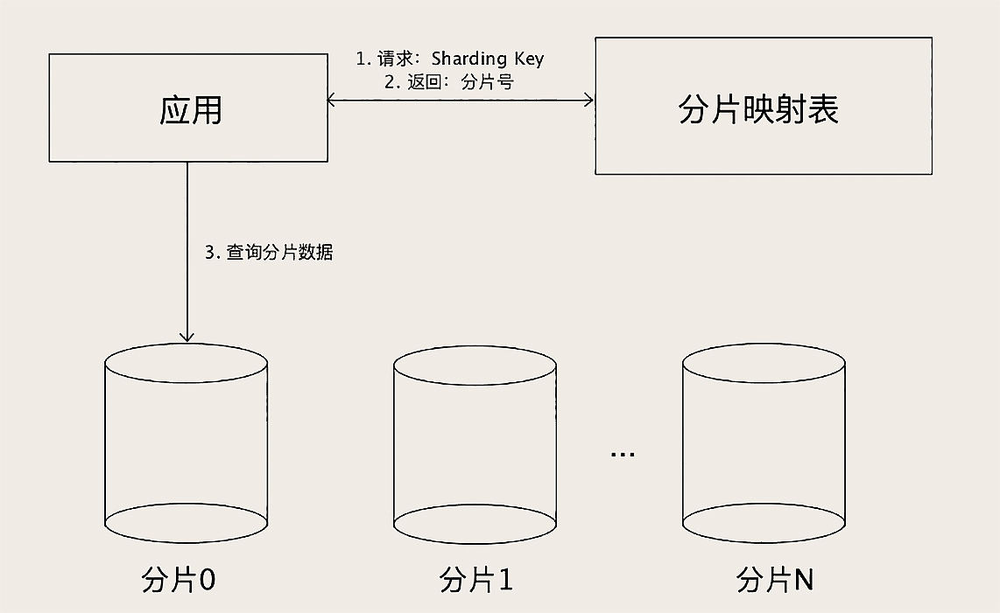

**数据量太大查询慢怎么办？存档历史数据或者分库分表，这是数据分片。**

**并发太高扛不住怎么办？读写分离，这是增加实例数。**

**数据库宕机怎么办？增加从节点，主节点宕机的时候用从节点顶上，这是主从复制。但是这里面要特别注意数据一致性的问题。**

# Redis集群

## Redis Cluser

### 保存海量数据

**分片的方式，实现水平扩展**

Redis 从 3.0 版本开始，提供了官方的集群支持，也就是 **Redis Cluser**。Redis Cluster 相比于单个节点的 Redis，能保存更多的数据，支持更多的并发，并且可以做到高可用，在单个节点故障的情况下，继续提供服务。

Redis Cluster 也是通过分片的方式，把数据分布到集群的多个节点上。

Redis Cluster 的分片方式，引入了一个“槽（Slot）”的概念，每个集群的槽数是固定的 16384（16 * 1024）个，然后采用哈希分片算法和查表法结合的方式进行分片。

实现通过哈希算法计算出每个 Key 落在哪个槽中，然后通过查表的方式找到这个槽在哪个具体的节点上。

```
HASH_SLOT = CRC16(key) mod 16384
```

解决分片问题之后，Redis Cluster 就可以通过水平扩容来增加集群的存储容量，分片可以解决 Redis 保存海量数据的问题，并且客观上提升了 Redis 的并发能力和查询性能。但是并不能解决高可用的问题，每个节点都保存了整个集群数据的一个子集，任何一个节点宕机，都会导致这个宕机节点上的那部分数据无法访问。

### 保证高可用

**增加从节点，实现主从复制**

Redis Cluster 支持给每个分片增加一个或多个从节点，每个从节点在连接到主节点上之后，会先给主节点发送一个 SYNC 命令，请求一次全量复制，也就是把主节点上全部的数据都复制到从节点上。全量复制完成之后，进入同步阶段，主节点会把刚刚全量复制期间收到的命令，以及后续收到的命令持续地转发给从节点。

因为 Redis 不支持事务，所以它的复制相比 MySQL 更简单，连 Binlog 都省了，直接就是转发客户端发来的更新数据命令来实现主从同步。如果某个分片的主节点宕机了，集群中的其他节点会在这个分片的从节点中选出一个新的节点作为主节点继续提供服务。新的主节点选举出来后，集群中的所有节点都会感知到，这样，如果客户端的请求 Key 落在故障分片上，就会被重定向到新的主节点上。

一般来说，Redis Cluster 进行了分片之后，每个分片都会承接一部分并发的请求，加上 Redis 本身单节点的性能就非常高，所以大部分情况下不需要再像 MySQL 那样做读写分离来解决高并发的问题。默认情况下，集群的读写请求都是由主节点负责的，从节点只是起一个热备的作用。当然了，Redis Cluster 也支持读写分离，在从节点上读取数据。

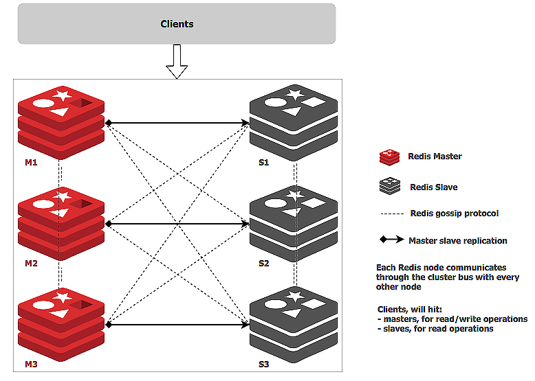

### 为什么 Redis Cluster 不适合超大规模集群？

Redis Cluster 的优点是**易于使用**。**分片、主从复制、弹性扩容这些功能都可以做到自动化**，通过简单的部署就可以获得一个大容量、高可靠、高可用的 Redis 集群，并且对于应用来说，近乎于是透明的。

所以，Redis Cluster 是非常适合构建中小规模 Redis 集群，这里的中小规模指的是，大概几个到几十个节点这样规模的 Redis 集群。

但是 Redis Cluster 不太适合构建超大规模集群，主要原因是，**它采用了去中心化的设计**。刚刚我们讲了，**Redis 的每个节点上，都保存了所有槽和节点的映射关系表**，Redis Cluster 采用了一种**去中心化的流言 (Gossip) 协议**来传播集群配置的变化，比如说，集群加入了新节点，或者某个主节点宕机了，新的主节点被选举出来，这些情况下，都需要更新集群每一个节点上的映射关系表。

但是这种去中心化的流言协议的传播较慢，在集群规模太大的情况下，数据不同步的问题会被明显放大。

## 如何用 Redis 构建超大规模集群？

### 1. 基于代理中间层

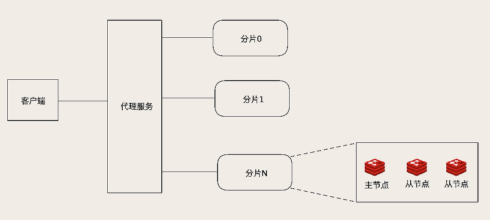

一种是基于代理的方式，在客户端和 Redis 节点之间，还需要增加一层代理服务。这个代理服务有三个作用。

第一个作用是，负责在客户端和 Redis 节点之间转发请求和响应。客户端只和代理服务打交道，代理收到客户端的请求之后，再转发到对应的 Redis 节点上，节点返回的响应再经由代理转发返回给客户端。

第二个作用是，负责监控集群中所有 Redis 节点状态，如果发现有问题节点，及时进行主从切换。

第三个作用就是维护集群的元数据，这个元数据主要就是集群所有节点的主从信息，以及槽和节点关系映射表。这个架构与用 HAProxy+Keepalived 来代理 MySQL 请求的架构是类似的，只是多了一个自动路由分片的功能而已。

**优点：**

这个架构最大的优点是对客户端透明，在客户端视角来看，整个集群和一个超大容量的单节点 Redis 是一样的。并且，由于分片算法是代理服务控制的，扩容也比较方便，新节点加入集群后，直接修改代理服务中的元数据就可以完成扩容。

**缺点：**

不过，这个架构的缺点也很突出，增加了一层代理转发，每次数据访问的链路更长了，必然会带来一定的性能损失。而且，代理服务本身又是集群的一个单点，当然，我们可以把代理服务也做成一个集群来解决单点问题，那样集群就更复杂了。

### 2. 定制客户端

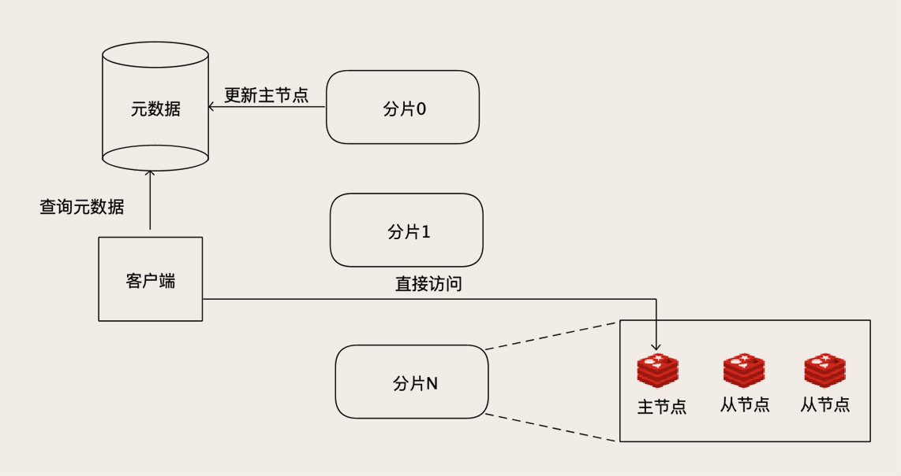

把代理服务的寻址功能前移到客户端中去。客户端在发起请求之前，先去查询元数据，就可以知道要访问的是哪个分片和哪个节点，然后直连对应的 Redis 节点访问数据。

当然，客户端不用每次都去查询元数据，因为这个元数据是不怎么变化的，客户端可以自己缓存元数据，这样访问性能基本上和单机版的 Redis 是一样的。如果某个分片的主节点宕机了，新的主节点被选举出来之后，更新元数据里面的信息。对集群的扩容操作也比较简单，除了迁移数据的工作必须要做以外，更新一下元数据就可以了。

虽然说，这个元数据服务仍然是一个单点，但是它的数据量不大，访问量也不大，相对就比较容易实现。我们可以用 ZooKeeper、etcd 甚至 MySQL 都能满足要求。这个方案应该是最适合超大规模 Redis 集群的方案了，在**性能、弹性、高可用几方面表现都非常好**，**缺点是整个架构比较复杂，客户端不能通用**，需要**开发定制化的 Redis 客户端**，只有规模足够大的企业才负担得起。

# 索引

## Hash索引

主要就是通过Hash算法（常见的Hash算法有直接定址法、平方取中法、折叠法、除数取余法、随机数法），将数据库字段数据转换成定长的Hash值，与这条数据的行指针一并存入Hash表的对应位置；如果发生Hash碰撞（两个不同关键字的Hash值相同），则在对应Hash键下以链表形式存储。

检索算法：在检索查询时，就再次对待查关键字再次执行相同的Hash算法，得到Hash值，到对应Hash表对应位置取出数据即可，如果发生Hash碰撞，则需要在取值时进行筛选。目前使用Hash索引的数据库并不多，主要有Memory等。

MySQL目前有Memory引擎和NDB引擎支持Hash索引。

## full-text全文索引

## R-Tree空间索引

# 索引应用场景

## 哪些情况需要创建索引

1. 主键自动建立唯一索引
2. 频繁作为查询条件的字段
3. 查询中与其他表关联的字段，外键关系建立索引
4. 单键/组合索引的选择问题，高并发下倾向创建组合索引
5. 查询中排序的字段，排序字段通过索引访问大幅提高排序速度
6. 查询中统计或分组字段

## 哪些情况不要创建索引

1. 表记录太少
2. 经常增删改的表
3. 数据重复且分布均匀的表字段，只应该为最经常查询和最经常排序的数据列建立索引（如果某个数据类包含太多的重复数据，建立索引没有太大意义）
4. 频繁更新的字段不适合创建索引（会加重IO负担）
5. where条件里用不到的字段不创建索引


# 面试准备问题：

## MVCC

## 事务日志

## MySQL常见瓶颈

- CPU：CPU在饱和的时候一般发生在数据装入内存或从磁盘上读取数据时候
- IO：磁盘I/O瓶颈发生在装入数据远大于内存容量的时候
- 服务器硬件的性能瓶颈：top，free，iostat 和 vmstat来查看系统的性能状态

## 性能下降SQL慢 执行时间长 等待时间长 原因分析

- 查询语句写的烂
- 索引失效（单值、复合）
- 关联查询太多join（设计缺陷或不得已的需求）
- 服务器调优及各个参数设置（缓冲、线程数等）
- 并发场景下的 锁 和 并发连接线程数量问题
- 磁盘IO问题

## MySQL常见性能分析手段

在优化MySQL时，通常需要对数据库进行分析，常见的分析手段有**慢查询日志**，**EXPLAIN 分析查询**，**profiling分析**以及**show命令查询系统状态及系统变量**，通过定位分析性能的瓶颈，才能更好的优化数据库系统的性能。

```mysql
explain select * from t; -- 分析当前查询语句
show processlist ——查看当前SQL执行，包括执行状态、是否锁表等
```

### EXPLAIN 分析查询

**Extra**（包含不适合在其他列中显示但十分重要的额外信息）

1. using filesort: 说明mysql会对数据使用一个外部的索引排序，不是按照表内的索引顺序进行读取。mysql中无法利用索引完成的排序操作称为“文件排序”。常见于order by和group by语句中
2. Using temporary：使用了临时表保存中间结果，mysql在对查询结果排序时使用临时表。常见于排序order by和分组查询group by。
3. using index：表示相应的select操作中使用了覆盖索引，避免访问了表的数据行，效率不错，如果同时出现using where，表明索引被用来执行索引键值的查找；否则索引被用来读取数据而非执行查找操作
4. Using index condition：即代表本次查询会利用到索引，且会利用到索引下推。
5. using where：使用了where过滤
6. using join buffer：使用了连接缓存
7. impossible where：where子句的值总是false，不能用来获取任何元祖
8. select tables optimized away：在没有group by子句的情况下，基于索引优化操作或对于MyISAM存储引擎优化COUNT(*)操作，不必等到执行阶段再进行计算，查询执行计划生成的阶段即完成优化
9. distinct：优化distinct操作，在找到第一匹配的元祖后即停止找同样值的动作

### 慢查询日志

MySQL 的慢查询日志是 MySQL 提供的一种日志记录，它用来记录在 MySQL 中响应时间超过阈值的语句，具体指运行时间超过 `long_query_time` 值的 SQL，则会被记录到慢查询日志中。

- `long_query_time` 的默认值为10，意思是运行10秒以上的语句
- 默认情况下，MySQL数据库没有开启慢查询日志，需要手动设置参数开启

```mysql
# 慢日志相关参数
SHOW VARIABLES LIKE '%slow_query_log%'	-- 查看事故开启
SHOW VARIABLES LIKE 'log-slow-queries'  -- 查看慢日志存放位置

# 修改 my.cnf 用久配置 慢开启日志
slow_query_log = ON
slow_query_log_file = /var/lib/mysql/hostname-slow.log		-- 慢日志存放位置
long_query_time = 3

```

所以MySQL提供了日志分析工具**mysqldumpslow**

得到返回记录集最多的10个SQL

```mysql
mysqldumpslow -s r -t 10 /var/lib/mysql/hostname-slow.log
```

得到访问次数最多的10个SQL

```mysql
mysqldumpslow -s c -t 10 /var/lib/mysql/hostname-slow.log
```

得到按照时间排序的前10条里面含有左连接的查询语句

```mysql
mysqldumpslow -s t -t 10 -g "left join" /var/lib/mysql/hostname-slow.log
```

也可以和管道配合使用

```mysql
mysqldumpslow -s r -t 10 /var/lib/mysql/hostname-slow.log | more
```

## 性能优化

**永远小标驱动大表（小的数据集驱动大的数据集）**

**order by关键字优化**

order by子句，尽量使用 Index 方式排序

## MySQL分库分表

### 1. MySQL分表

分表有两种分割方式，一种垂直拆分，另一种水平拆分。主要用于解决单表数据量过大的问题

**垂直拆分**

垂直分表，通常是按照业务功能的使用频次，把主要的、热门的字段放在一起做为主要表。然后把不常用的，按照各自的业务属性进行聚集，拆分到不同的次要表中；主要表和次要表的关系一般都是一对一的。

**水平拆分(数据分片)**

单表的容量不超过500W，否则建议水平拆分。是把一个表复制成同样表结构的不同表，然后把数据按照一定的规则划分，分别存储到这些表中，从而保证单表的容量不会太大，提升性能；当然这些结构一样的表，可以放在一个或多个数据库中。

水平分割的几种方法：

- 使用MD5哈希，做法是对UID进行md5加密，然后取前几位（我们这里取前两位），然后就可以将不同的UID哈希到不同的用户表（user_xx）中了。
- 还可根据时间放入不同的表，比如：article_201601，article_201602。
- 按热度拆分，高点击率的词条生成各自的一张表，低热度的词条都放在一张大表里，待低热度的词条达到一定的贴数后，再把低热度的表单独拆分成一张表。
- 根据ID的值放入对应的表，第一个表user_0000，第二个100万的用户数据放在第二 个表user_0001中，随用户增加，直接添加用户表就行了。

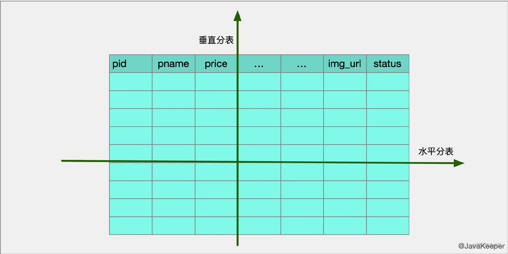

#### 分表的实际场景

以交友平台用户中心的user表为例，单表数据规模达到千万级别时，你可能会发现使用用户筛选功能查询用户变得非常非常慢，明明查询命中了索引，但是，部分查询还是很慢，这时候，我们就需要考虑拆分这张user表了。

我以最典型的应用场景：用户筛选功能，以查询年龄在18到24岁的100位女性用户为例：

在单表的情况下，我们的SQL是这么写的：

```mysql
SELECT * FROM user WHERE age >= 18 AND age <= 24 AND sex = 0 LIMIT 100
```

但是，拆分user表后，用户记录分散到了多张表，比如，分散到`user_1`，`user_2`，`user_3`这三张表，此时，要查询满足上面条件的用户，我们的查询过程就变成这样：

1. 遍历`user_1`到`user_3`这三张表
2. 分别从三张表找出满足条件的用户，即执行上面的SQL
3. 合并这些用户记录
4. 从合并结果中过滤出前100名用户记录

通过对比，我们会发现**分表后的查询过程跟单表相比，变化是比较大的，这势必导致我们不得不修改代码，如果系统内类似的情况很多，那么，可能引发系统较大规模的业务逻辑改动**，所以，在系统真正出现数据库性能瓶颈前，必须提前规划分表方案，预留时间去做系统改造。

#### 分表的时机

一般的影响数据库查询的因素：

在并发场景下：锁被占用，并发连接线程过多

一般场景：磁盘IO的性能瓶颈

所以优化数据查询的首要问题是，尽量减少数据查询的磁盘IO。

**MySQL为了避免查询时都从磁盘读取查询结果，所以，在磁盘和应用之间加了一层内存，尽可能将磁盘数据加载到内存，那么，下次查询请求访问MySQL时，可以从内存中获取查询结果，避免了过多的磁盘IO的读取**。

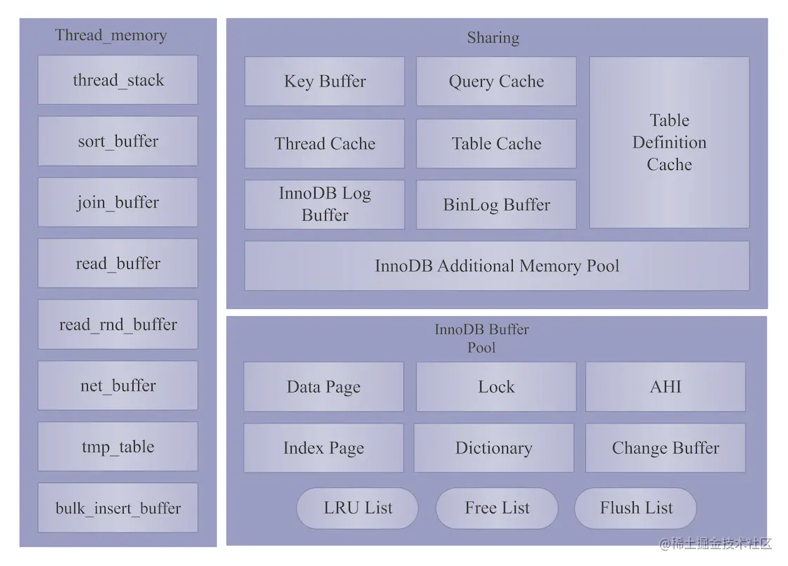

所以尽量保证表单的数据规模不要超过 InnoDB Buffer Pool （包括索引、记录、AHI、数据字典）的大小，超过时就要进行分表。

### 2. MySQL分库

用于解决大规模的并发输入问题

一个库里表太多了，导致了海量数据，系统性能下降，把原本存储于一个库的表拆分存储到多个库上， 通常是将表按照功能模块、关系密切程度划分出来，部署到不同库上。

优点：

- 减少增量数据写入时的锁对查询的影响
- 由于单表数量下降，常见的查询操作由于减少了需要扫描的记录，使得单表单次查询所需的检索行数变少，减少了磁盘IO，时延变短

但是它无法解决单表数据量太大的问题


### 字节跳动基础架构宣讲，以及字节数据库架构体系

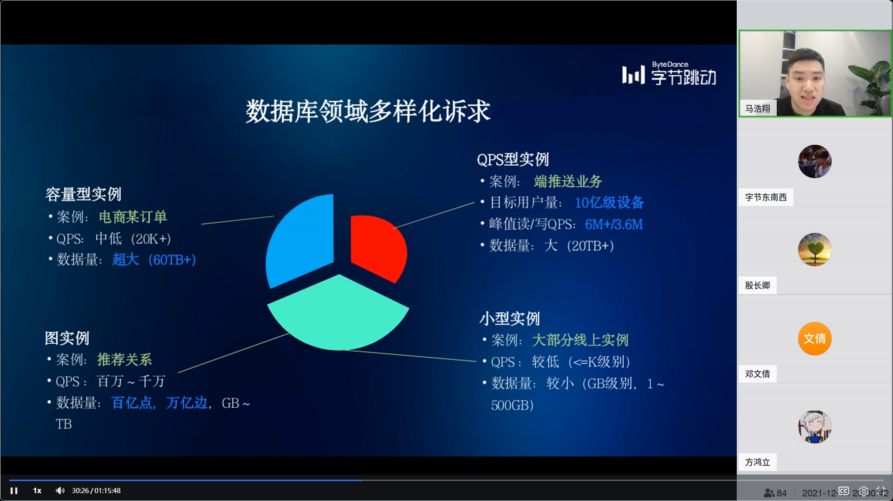


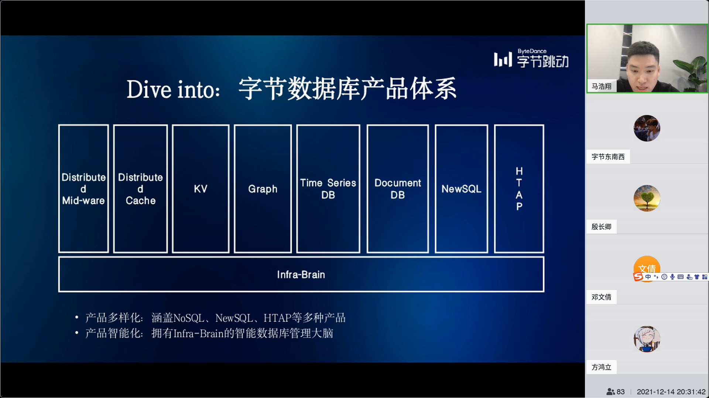


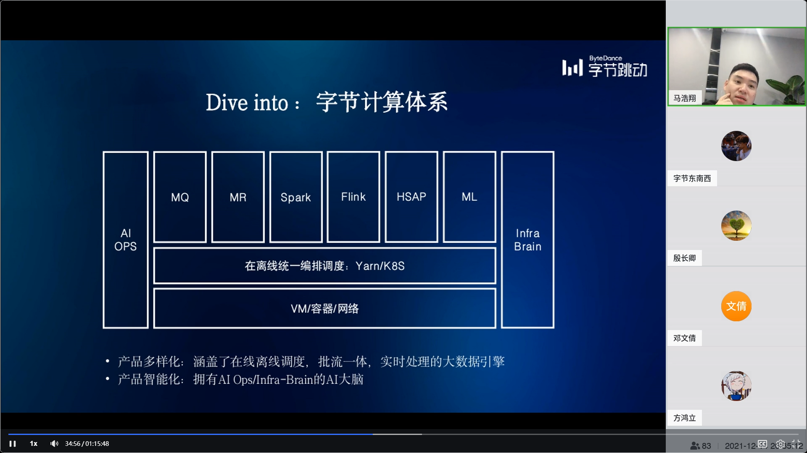

云上三板斧：计算、存储、网络

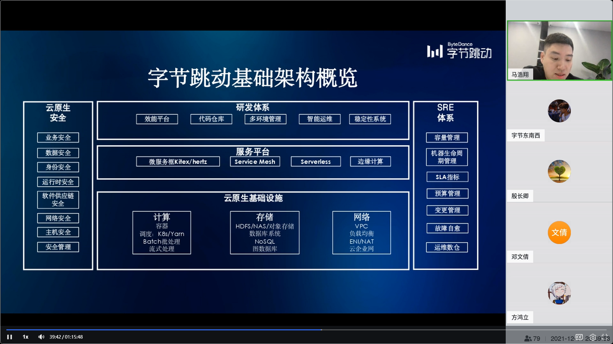


