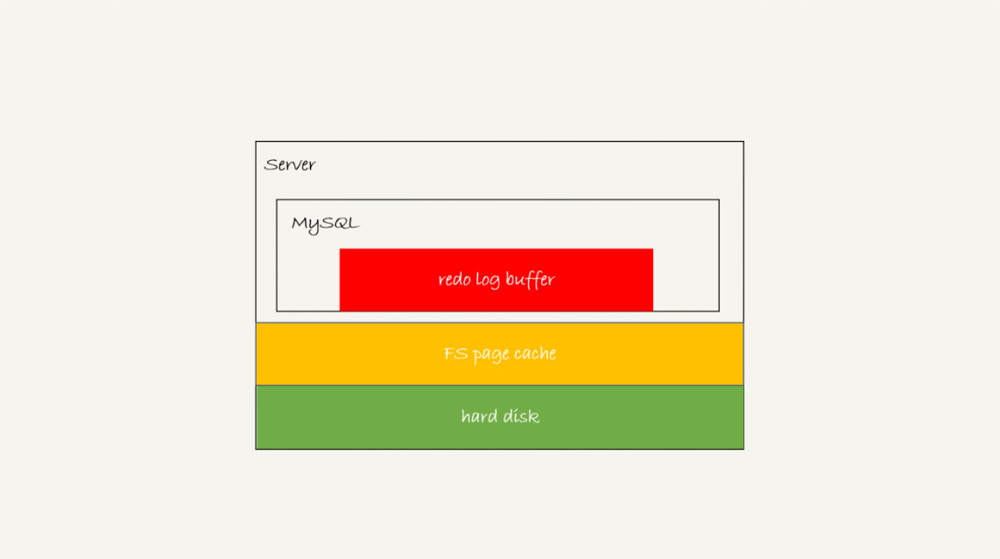
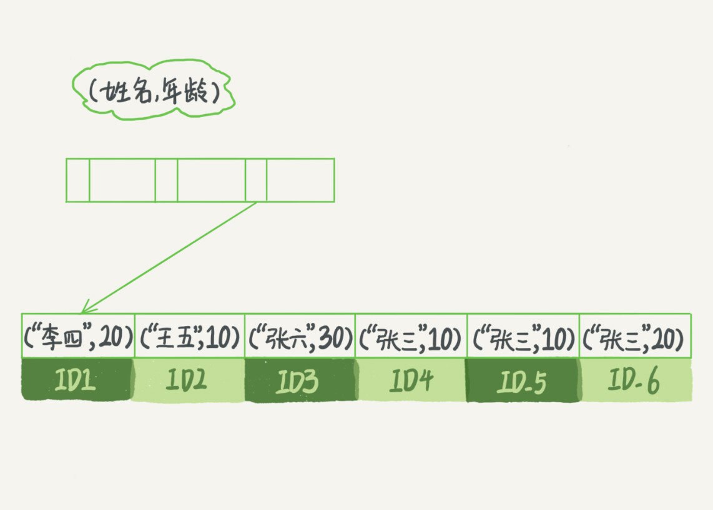
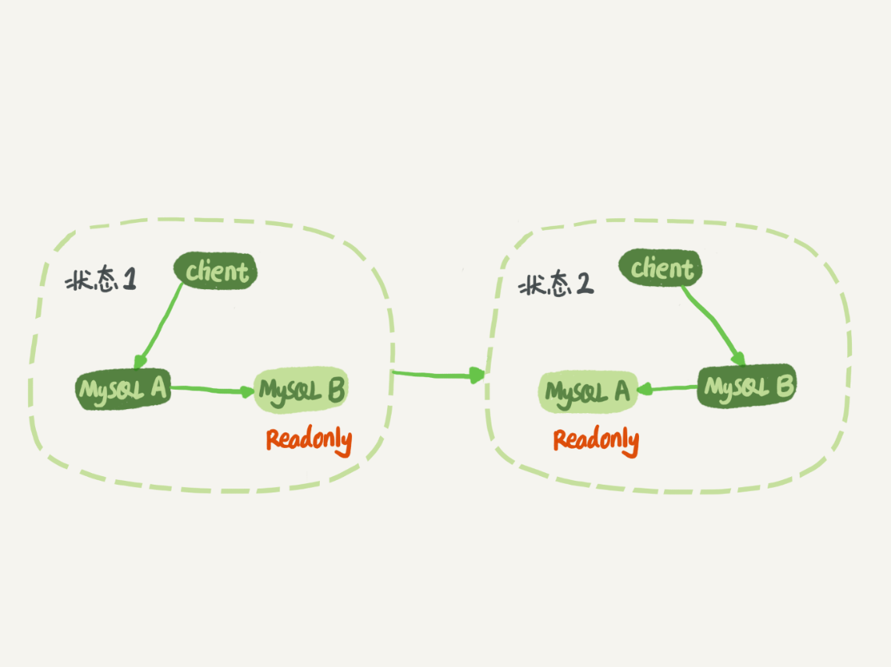
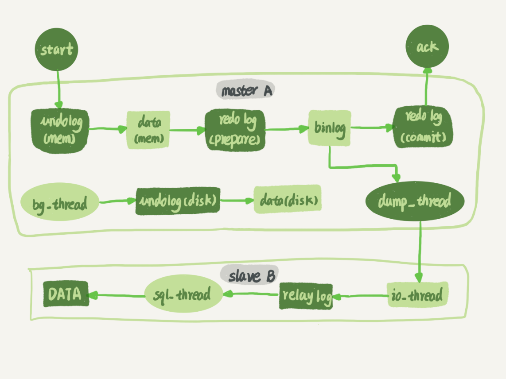
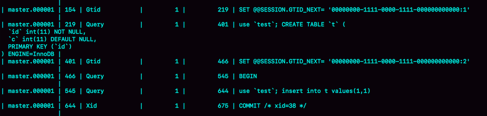
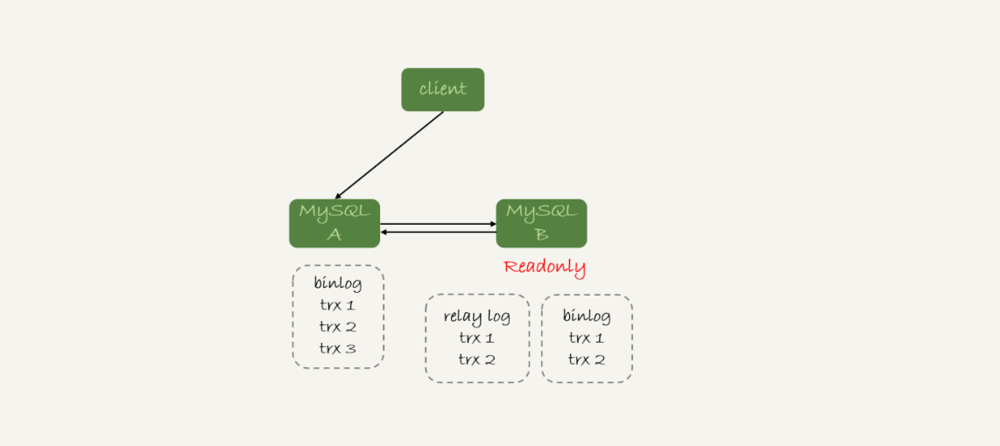

# MySQL实战45讲

# MySQL基础知识

## 1. DML、DDL和DCL

DML（data manipulation language）数据库操作语言：
它们是SELECT、UPDATE、INSERT、DELETE，就象它的名字一样，这4条命令是用来对数据库里的数据进行操作的语言
DDL（data definition language）数据库定义语言：
DDL比DML要多，主要的命令有CREATE、ALTER、DROP等，DDL主要是用在定义或改变表（TABLE）的结构，数据类型，表之间的链接和约束等初始化工作上，他们大多在建立表时使用
DCL（Data Control Language）数据库控制语言：
是数据库控制功能。是用来设置或更改数据库用户或角色权限的语句，包括（grant,deny,revoke等）语句。在默认状态下，只有sysadmin,dbcreator,db_owner或db_securityadmin等人员才有权力执行DCL

# Mysql操作

```mysql
#连接
mysql -hlocalhost -uroot -p
# 查看并发连接中各个连接的状态
show processlist
```

# explain指令

explain指令主要用于我们查看某条查询语句的具体执行计划

```mysql
explain select 1;
```


EXPLAIN指令中的各列的含义：

1. table ：每条 explain 语句输出代表了某个单表的访问方法，table 表示对应的表名
2. id ： 查询语句中每出现一个 select 就会为他分配一个唯一的 id 值
3. possible_keys：表示对某个表执行单表查询时可能用到的索引有哪些
4. key：实际用到的索引
5. Extra ：额外信息
   1. Using index ：表示使用了索引覆盖
   1. Using index condition：即代表本次查询会利用到索引，且会利用到索引下推。


# 第1讲：一条查询语句的执行

```mysql
mysql> select * from T where ID=10；
```


MySQL 可以分为 Server 层和存储引擎层两部分：

Server 层包括**连接器、查询缓存、分析器、优化器、执行器**等，涵盖 MySQL 的大多数核心服务功能，以及所有的内置函数（如日期、时间、数学和加密函数等），所有跨存储引擎的功能都在这一层实现，比如存储过程、触发器、视图等。

存储引擎层负责数据的存储和提取。其架构模式是插件式的，支持 InnoDB、MyISAM、Memory 等多个存储引擎。现在最常用的存储引擎是 InnoDB，它从 MySQL 5.5.5 版本开始成为了默认存储引擎。

## 1. 连接器

数据库里面，长连接是指连接成功后，如果客户端持续有请求，则一直使用同一个连接。短连接则是指每次执行完很少的几次查询就断开连接，下次查询再重新建立一个。

客户端如果太长时间没动静，连接器就会自动将它断开。这个时间是由参数 wait_timeout 控制的，默认值是 8 小时。

建立连接的过程通常是比较复杂的，所以我建议你在使用中要尽量减少建立连接的动作，也就是尽量使用长连接。

但是全部使用长连接后，你可能会发现，有些时候 MySQL 占用内存涨得特别快，这是因为 MySQL 在执行过程中临时使用的内存是管理在连接对象里面的。这些资源会在连接断开的时候才释放。所以如果长连接累积下来，可能导致内存占用太大，被系统强行杀掉（OOM），从现象看就是 MySQL 异常重启了。

### 1. 长短连接的选择

1. 定期断开长连接。使用一段时间，或者程序里面判断执行过一个占用内存的大查询后，断开连接，之后要查询再重连。
2. 如果你用的是 MySQL 5.7 或更新版本，可以在每次执行一个比较大的操作后，通过执行 mysql_reset_connection 来重新初始化连接资源。这个过程不需要重连和重新做权限验证，但是会将连接恢复到刚刚创建完时的状态。

## 2. 查询缓存

MySQL 拿到一个查询请求后，会先到查询缓存看看，之前是不是执行过这条语句。之前执行过的语句及其结果可能会以 key-value 对的形式，被直接缓存在内存中。key 是查询的语句，value 是查询的结果。如果你的查询能够直接在这个缓存中找到 key，那么这个 value 就会被直接返回给客户端。如果语句不在查询缓存中，就会继续后面的执行阶段。执行完成后，执行结果会被存入查询缓存中。你可以看到，如果查询命中缓存，MySQL 不需要执行后面的复杂操作，就可以直接返回结果，这个效率会很高。

**但是一般不建议启用查询缓存，MySQL 8.0 版本直接将查询缓存的整块功能删掉了。**

主要是因为查询缓存的失效非常频繁，只要对一个表有更新，就会将表上的所有查询缓存清空。

## 3. 分析器

首先，MySQL 需要知道你要做什么，因此需要对 SQL 语句做解析。

词法分析和语法分析

分析器先会做“词法分析”。你输入的是由多个字符串和空格组成的一条 SQL 语句，MySQL 需要识别出里面的字符串分别是什么，代表什么。MySQL 从你输入的"select"这个关键字识别出来，这是一个查询语句。它也要把字符串“T”识别成“表名 T”，把字符串“ID”识别成“列 ID”。做完了这些识别以后，就要做“语法分析”。根据词法分析的结果，语法分析器会根据语法规则，判断你输入的这个 SQL 语句是否满足 MySQL 语法。

如果你的语句不对，就会收到“You have an error in your SQL syntax”的错误提醒

## 4. 优化器

优化器是在表里面有多个索引的时候，决定使用哪个索引；或者在一个语句有多表关联（join）的时候，决定各个表的连接顺序。

优化器阶段完成后，这个语句的执行方案就确定下来了，然后进入执行器阶段。

## 5. 执行器

开始执行的时候，要先判断一下你对这个表 T 有没有执行查询的权限，如果没有，就会返回没有权限的错误。

如果有权限，就打开表继续执行。打开表的时候，执行器就会根据表的引擎定义，去使用这个引擎提供的接口。

```mysql
mysql> select * from T where ID=10;
```

比如我们这个例子中的表 T 中，ID 字段没有索引，那么执行器的执行流程是这样的：

1. 调用 InnoDB 引擎接口取这个表的第一行，判断 ID 值是不是 10，如果不是则跳过，如果是则将这行存在结果集中；
2. 调用引擎接口取“下一行”，重复相同的判断逻辑，直到取到这个表的最后一行。
3. 执行器将上述遍历过程中所有满足条件的行组成的记录集作为结果集返回给客户端。

## 小结

介绍了MySQL的逻辑架构，以及一条 SQL 语句在 MySQL 中的执行过程，以及经过的 MySQL的各个部分。

## Question

Q：如果表 T 中没有字段 k，而你执行了这个语句 select * from T where k=1, 那肯定是会报“不存在这个列”的错误： “Unknown column ‘k’ in ‘where clause’”。你觉得这个错误是在我们上面提到的哪个阶段报出来的呢？

A：分析器。分析阶段判断语句是否正确，表是否存在，列是否存在等。

# 第2讲 一条更新语句的执行

```mysql
# 表的创建
mysql> create table T(ID int primary key, c int);
# 更新语句
```

redo log(重做日志) 和 binlog(归档日志)

如果MySQL在每次的更新操作都需要写进磁盘，然后磁盘找到对应的那条记录，然后再更新，整个过程的IO成本、查找成本都会很高。

所以MySQL采用的是 WAL 技术(Write-Ahead-Logging)，关键点就是先写日志，再写磁盘。具体来说就是当有一条记录需要更新时，InnoDB引擎会首先把记录写到redo log里，并更新内存，这个时候更新就算完成了。同时，InnoDB 引擎会在适当的时候，将这个操作记录更新到磁盘里面，而这个更新往往是在系统比较空闲的时候做。

## 1. redo log日志

**redo log日志 是 InnoDB 引擎特有的日志**

InnoDB 的 redo log 是固定大小的，比如可以配置为一组 4 个文件，每个文件的大小是 1GB，从头开始写，写到末尾就又回到开头循环写，如下面这个图所示：


write pos 是当前记录的位置，一边写一边后移，写到第 3 号文件末尾后就回到 0 号文件开头。

checkpoint 是当前要擦除的位置，也是往后推移并且循环的，擦除记录前要把记录更新到数据文件。write pos 和 checkpoint 之间的是“粉板”上还空着的部分，可以用来记录新的操作。如果 write pos 追上 checkpoint，表示“粉板”满了，这时候不能再执行新的更新，得停下来先擦掉一些记录，把 checkpoint 推进一下。有了 redo log，InnoDB 就可以保证即使数据库发生异常重启，之前提交的记录都不会丢失，这个能力称为 crash-safe。

## 2. binlog 日志

Server 层也有自己的日志，称为 binlog（归档日志）。

binlog 会记录所有的逻辑操作，并且是采用“追加写”的形式。

如果你的 DBA 承诺说半个月内可以恢复，那么备份系统中一定会保存最近半个月的所有 binlog，同时系统会定期做整库备份。这里的“定期”取决于系统的重要性，可以是一天一备，也可以是一周一备。

### binlog的三种格式

```mysql
mysql> CREATE TABLE `t24` (
  `id` int(11) NOT NULL,
  `a` int(11) DEFAULT NULL,
  `t_modified` timestamp NOT NULL DEFAULT CURRENT_TIMESTAMP,
  PRIMARY KEY (`id`),
  KEY `a` (`a`),
  KEY `t_modified`(`t_modified`)
) ENGINE=InnoDB;

insert into t24 values(1,1,'2018-11-13');
insert into t24 values(2,2,'2018-11-12');
insert into t24 values(3,3,'2018-11-11');
insert into t24 values(4,4,'2018-11-10');
insert into t24 values(5,5,'2018-11-09');
```

statement：会记录下来执行的SQL语句原文，但是有些情况下会导致主备不一致


row：很占空间。比如你用一个 delete 语句删掉 10 万行数据，用 statement 的话就是一个 SQL 语句被记录到 binlog 中，占用几十个字节的空间。但如果用 row 格式的 binlog，就要把这 10 万条记录都写到 binlog 中。这样做，不仅会占用更大的空间，同时写 binlog 也要耗费 IO 资源，影响执行速度。但是不会存在主备不一致的情况。


mixed：MySQL 自己会判断这条 SQL 语句是否可能引起主备不一致，如果有可能，就用 row 格式，否则就用 statement 格式。

但是 ROW 格式也大量使用在各种场景中，因为 他可以支持 **恢复数据**

binlog三种格式: 

1. statement。执行sql语句原文，缺点是可能语义在主备有不同的解析方式，引起数据不一致。
2. row。将修改前后的信息都记录下来，优点是不会出错，且有完整数据备份，即使不考虑同步的情况，在误操作恢复数据时也能提供原始数据。缺点就是日志较大，现在越多越推崇row格式 
3. mixed。由MySQL决定，语义无歧意时，使用statement节约空间，其他情况则用row。


接下来，我们就分别从 delete、insert 和 update 这三种 SQL 语句的角度，来看看数据恢复的问题。

通过图 6 你可以看出来，即使我执行的是 delete 语句，row 格式的 binlog 也会把被删掉的行的整行信息保存起来。

如果你在执行完一条 delete 语句以后，发现删错数据了，可以直接把 binlog 中记录的 delete 语句转成 insert，把被错删的数据插入回去就可以恢复了。

如果你是执行错了 insert 语句呢？那就更直接了。row 格式下，insert 语句的 binlog 里会记录所有的字段信息，这些信息可以用来精确定位刚刚被插入的那一行。这时，你直接把 insert 语句转成 delete 语句，删除掉这被误插入的一行数据就可以了。

如果执行的是 update 语句的话，binlog 里面会记录修改前整行的数据和修改后的整行数据。所以，如果你误执行了 update 语句的话，只需要把这个 event 前后的两行信息对调一下，再去数据库里面执行，就能恢复这个更新操作了。

```mysql
# 有关 binlog 的 SQL 语句操作
# mysqlbinlog 位置 	/usr/bin/mysqlbinlog
# binlog 位置 		/var/lib/mysql/binlog.000001

# 1. 用 binlog 来恢复数据 借助 mysqlbinlog
mysqlbinlog master.000001  --start-position=2738 --stop-position=2973 | mysql -h127.0.0.1 -P13000 -u$user -p$pwd;
# 2. 用 mysqlbinlog 解析 binlog 文件
mysqlbinlog /var/lib/mysql/binlog.000001 --base64-output=decode-rows -v | more
mysqlbinlog  -vv data/master.000001 --start-position=8900;
```


## 3. redo log VS binlog

1. redo log 是 InnoDB 引擎特有的；binlog 是 MySQL 的 Server 层实现的，所有引擎都可以使用。
2. redo log 是物理日志，记录的是“在某个数据页上做了什么修改”；binlog 是逻辑日志，记录的是这个语句的原始逻辑，比如“给 ID=2 这一行的 c 字段加 1 ”。
3. redo log 是循环写的，空间固定会用完；binlog 是可以追加写入的。“追加写”是指 binlog 文件写到一定大小后会切换到下一个，并不会覆盖以前的日志。

update语句在InnoDB引擎下的执行流程

1. 执行器先找引擎取 ID=2 这一行。ID 是主键，引擎直接用树搜索找到这一行。如果 ID=2 这一行所在的数据页本来就在内存中，就直接返回给执行器；否则，需要先从磁盘读入内存，然后再返回。
2. 执行器拿到引擎给的行数据，把这个值加上 1，比如原来是 N，现在就是 N+1，得到新的一行数据，再调用引擎接口写入这行新数据。
3. 引擎将这行新数据更新到内存中，同时将这个更新操作记录到 redo log 里面，此时 redo log 处于 prepare 状态。然后告知执行器执行完成了，随时可以提交事务。
4. 执行器生成这个操作的 binlog，并把 binlog 写入磁盘。
5. 执行器调用引擎的提交事务接口，引擎把刚刚写入的 redo log 改成提交（commit）状态，更新完成。


最后的写日志的部分将 redo log 拆分成了两部分：prepare 和 commit 也就是“两阶段提交”

redo log 用于保证 crash-safe 能力。innodb_flush_log_at_trx_commit 这个参数设置成 1 的时候，表示每次事务的 redo log 都直接持久化到磁盘。这个参数我建议你设置成 1，这样可以保证 MySQL 异常重启之后数据不丢失。

innodb_flush_log_at_trx_commit  = 1 表示：每事务提交都将"log buffer"同步到"os buffer"且从"os buffer"刷到磁盘日志文件中

sync_binlog 这个参数设置成 1 的时候，表示每次事务的 binlog 都持久化到磁盘。这个参数我也建议你设置成 1，这样可以保证 MySQL 异常重启之后 binlog 不丢失。

由此可以得出 redo log 和 bin log 都是先写入内存buffer 再落到磁盘中的。

### 两阶段提交的理解

#### 奔溃恢复时的判断：

如果 redo log 里面的事务是完整的，也就是已经有了 commit 标识，则直接提交；

如果 redo log 里面的事务只有完整的 prepare，则判断对应的事务 binlog 是否存在并完整：

​		a. 如果是，则提交事务；

​		b. 否则，回滚事务。

## 小结

1. 介绍了 MySQL 里面最重要的两个日志，即物理日志 redo log 和逻辑日志 binlog。
2. 介绍了与 MySQL 日志系统密切相关的“两阶段提交”。两阶段提交是跨系统维持数据逻辑一致性时常用的一个方案

## Question

那么在什么场景下，一天一备会比一周一备更有优势呢？或者说，它影响了这个数据库系统的哪个指标？

好处是“最长恢复时间”更短。在一天一备的模式里，最坏情况下需要应用一天的 binlog。比如，你每天 0 点做一次全量备份，而要恢复出一个到昨天晚上 23 点的备份。一周一备最坏情况就要应用一周的 binlog 了。

对应的系统指标为：RTO（恢复目标时间）

### Q1：MySQL如何判断 binlog 是完整的？

一个事务的 binlog 是有完整格式的：

​		statement 格式的 binlog，最后会有 COMMIT；

​		row 格式的 binlog，最后会有一个 XID event。

​		在 MySQL 5.6.2 版本以后，还引入了 binlog-checksum 参数，用来验证 binlog 内容的正确性。

### Q2：redo log 和 binlog 是怎么关联起来的?

首先 redo log 和 binlog 它们有一个共同的数据字段，叫 XID

崩溃恢复的时候，会按顺序扫描 redo log：（因为 redo log 相比 binlog 要跟小，扫描开销较小）

1. 如果碰到既有 prepare、又有 commit 的 redo log，就直接提交；
2. 如果碰到只有 parepare、而没有 commit 的 redo log，就拿着 XID 去 binlog 找对应的事务。

### Q3：处于 prepare 阶段的 redo log 加上完整 binlog，重启就能恢复，MySQL 为什么要这么设计?

在时刻 B，也就是 binlog 写完以后 MySQL 发生崩溃，这时候 binlog 已经写入了，之后就会被从库（或者用这个 binlog 恢复出来的库）使用。所以，在主库上也要提交这个事务。采用这个策略，主库和备库的数据就保证了一致性。

### Q4：为什么需要两阶段提交

两阶段提交是经典的分布式系统问题，并不是 MySQL 独有的。（ 其实把Mysql的两阶段提交也可以看成两个分布式服务处理两个不同事情，redo log在Innodb引擎内操作的，binlog是在server层操作的，我们就可以把引擎层和server层看成两个分布式服务，那他们要分别进行两个相关联的操作，就意味着要实现分布式事务，而两阶段提交，就是其中的一种解决方案）

对于 InnoDB 引擎来说，如果 redo log 提交完成了，事务就不能回滚（如果这还允许回滚，就可能覆盖掉别的事务的更新）。而如果 redo log 直接提交，然后 binlog 写入的时候失败，InnoDB 又回滚不了，数据和 binlog 日志又不一致了。

### Q5：能不能只保留 redo log 或 binlog 中的一个？

一：只用 binlog 来做崩溃恢复 和 归档：

binlog 是不能够支持崩溃恢复的

二：只用 redo log

如果只从崩溃恢复的角度来讲是可以的。你可以把 binlog 关掉，这样就没有两阶段提交了，但系统依然是 crash-safe 的。

但是在各个公司的使用场景上，binlog都是开着的，因为 binlog 有着redo log 无法代替的功能：

1. redo log 是循环写，写到末尾是要回到开头继续写的。这样历史日志没法保留，redo log 也就起不到归档的作用。
2. MySQL的主从，主主，主备，数据转储到数仓等功能都依赖于binlog，它是整个MySQL系统高可用的基础，就是 binlog 复制。

### Q7：redo log 一般设置多大？

redo log 太小的话，会导致很快就被写满，然后不得不强行刷 redo log，这样 WAL 机制的能力就发挥不出来了。

如果是现在常见的几个 TB 的磁盘的话，就不要太小气了，直接将 redo log 设置为 4 个文件、每个文件 1GB 吧。

### Q8：数据写盘的过程

redo_log记录"在某个数据页上做了什么修改"，而不是"这个数据修改后最新值为什么"。因此是需要先把磁盘的数据读入内存再执行redo_log中的内容的。

1. 如果是正常运行的实例的话，数据页被修改以后，跟磁盘的数据页不一致，称为脏页。最终数据落盘，就是把内存中的数据页写盘。这个过程，甚至与 redo log 毫无关系。
2. 在崩溃恢复场景中，InnoDB 如果判断到一个数据页可能在崩溃恢复的时候丢失了更新，就会将它读到内存，然后让 redo log 更新内存内容。更新完成后，内存页变成脏页，就回到了第一种情况的状态。

### Q9：redo log buffer

```mysql
# 在一个事务更新的过程中，日志是需要写多次的，比如下面的事务
begin;
insert into t1 ...
insert into t2 ...
commit;
```

这个事务要往两个表中插入记录，插入数据的过程中，生成的日志都得先保存起来，但又不能在还没 commit 的时候就直接写到 redo log 文件里。

所以，redo log buffer 就是一块内存，用来先存 redo 日志的。也就是说，在执行第一个 insert 的时候，数据的内存被修改了，redo log buffer 也写入了日志。但是，真正把日志写到 redo log 文件（文件名是 ib_logfile+ 数字），是在执行 commit 语句的时候做的。

但是可能会出现“被动写入磁盘”，比如内存不够、其他事务提交等情况。


三个过程： 1. prepare阶段；2. 写binlog；3. commit 

当在2之前崩溃时 重启恢复（查看redo log）：后发现没有commit，回滚。备份恢复（查看bin log）：没有binlog 。 一致 

当在3之前崩溃 重启恢复：虽没有commit，但满足prepare和binlog完整，所以重启后会自动commit。

Q1：如果要检查binlog，那prepare存在的意义是什么，我直接检验binlog的完整性就可以了？

binlog 只记录逻辑操作，并无操作状态，即无法确定该操作是否完成。redo log是有状态的，所以没办法直接检查binlog。

只有在redo log状态为prepare时，才会去检查binlog是否存在，否则只校验redo log是否是 commit就可以啦。 

怎么检查binlog: 一个完整事物binlog结尾有固定的格式。

整理评论：

1.首先客户端通过tcp/ip发送一条sql语句到server层的SQL interface
2.SQL interface接到该请求后，先对该条语句进行解析，验证权限是否匹配
3.验证通过以后，分析器会对该语句分析，是否语法有错误等
4.接下来是优化器器生成相应的执行计划，选择最优的执行计划
5.之后会是执行器根据执行计划执行这条语句。在这一步会去open table,如果该table上有MDL，则等待。
如果没有，则加在该表上加短暂的MDL(S)
(如果opend_table太大,表明open_table_cache太小。需要不停的去打开frm文件)
6.进入到引擎层，首先会去innodb_buffer_pool里的data dictionary(元数据信息)得到表信息
7.通过元数据信息,去lock info里查出是否会有相关的锁信息，并把这条update语句需要的
锁信息写入到lock info里(锁这里还有待补充)
8.然后涉及到的老数据通过快照的方式存储到innodb_buffer_pool里的undo page里,并且记录undo log修改的redo
(如果data page里有就直接载入到undo page里，如果没有，则需要去磁盘里取出相应page的数据，载入到undo page里)
9.在innodb_buffer_pool的data page做update操作。并把操作的物理数据页修改记录到redo log buffer里
由于update这个事务会涉及到多个页面的修改，所以redo log buffer里会记录多条页面的修改信息。
因为group commit的原因，这次事务所产生的redo log buffer可能会跟随其它事务一同flush并且sync到磁盘上
10.同时修改的信息，会按照event的格式,记录到binlog_cache中。(这里注意binlog_cache_size是transaction级别的,不是session级别的参数,
一旦commit之后，dump线程会从binlog_cache里把event主动发送给slave的I/O线程)
11.之后把这条sql,需要在二级索引上做的修改，写入到change buffer page，等到下次有其他sql需要读取该二级索引时，再去与二级索引做merge
(随机I/O变为顺序I/O,但是由于现在的磁盘都是SSD,所以对于寻址来说,随机I/O和顺序I/O差距不大)
12.此时update语句已经完成，需要commit或者rollback。这里讨论commit的情况，并且双1
13.commit操作，由于存储引擎层与server层之间采用的是内部XA(保证两个事务的一致性,这里主要保证redo log和binlog的原子性),
所以提交分为prepare阶段与commit阶段
14.prepare阶段,将事务的xid写入，将binlog_cache里的进行flush以及sync操作(大事务的话这步非常耗时)
15.commit阶段，由于之前该事务产生的redo log已经sync到磁盘了。所以这步只是在redo log里标记commit
16.当binlog和redo log都已经落盘以后，如果触发了刷新脏页的操作，先把该脏页复制到doublewrite buffer里，把doublewrite buffer里的刷新到共享表空间，然后才是通过page cleaner线程把脏页写入到磁盘中

sync命令：就是将 buffer 中的数据强制写入到硬盘中，防止数据丢失。

Linux 系统中欲写入硬盘的资料有的时候为了效率起见，会写到 filesystem buffer 中，这个 buffer 是一块记忆体空间，如果欲写入硬盘的资料存于此 buffer 中，而系统又突然断电的话，那么资料就会流失了，sync 指令会将存于 buffer 中的资料强制写入硬盘中。

# 第23讲 MySQL如何保证数据不丢失

## 1. binlog 的写入机制

事务执行过程中，先把日志写到 binlog cache，事务提交的时候，再把 binlog cache 写到 binlog 文件中。

一个事务的 binlog 是不能被拆开的，因此不论这个事务多大，也要确保一次性写入。这就涉及到了 binlog cache 的保存问题。

事务提交的时候，执行器把 binlog cache 里的完整事务写入到 binlog 中，并清空 binlog cache。状态如图 1 所示。


可以看到，每个线程有自己 binlog cache，但是共用同一份 binlog 文件。

图中的 write，指的就是指把日志写入到文件系统的 page cache，并没有把数据持久化到磁盘，所以速度比较快。

图中的 fsync，才是将数据持久化到磁盘的操作。一般情况下，我们认为 fsync 才占磁盘的 IOPS。

write 和 fsync 的时机，是由参数 sync_binlog 控制的：

sync_binlog=0 的时候，表示每次提交事务都只 write，不 fsync；

sync_binlog=1 的时候，表示每次提交事务都会执行 fsync；

sync_binlog=N(N>1) 的时候，表示每次提交事务都 write，但累积 N 个事务后才 fsync。

**write 和 fsync 的时机选择**

因此，在出现 IO 瓶颈的场景里，将 sync_binlog 设置成一个比较大的值，可以提升性能。在实际的业务场景中，考虑到丢失日志量的可控性，一般不建议将这个参数设成 0，比较常见的是将其设置为 100~1000 中的某个数值。

但是，将 sync_binlog 设置为 N，对应的风险是：如果主机发生异常重启，会丢失最近 N 个事务的 binlog 日志。

## 2. redo log 写入机制

事务在执行过程中，生成的 redo log 是要先写到 redo log buffer 的，然后再持久化到磁盘中。

MySQL 中 redo log的三种状态：



1. 存在 redo log buffer 中，物理上是在 MySQL 进程内存中，就是图中的红色部分；
2. 写到磁盘 (write)，但是没有持久化（fsync)，物理上是在文件系统的 page cache 里面，也就是图中的黄色部分；
3. 持久化到磁盘，对应的是 hard disk，也就是图中的绿色部分。

日志写到 redo log buffer 是很快的，wirte 到 page cache 也差不多，但是持久化到磁盘的速度就慢多了。

为了控制 redo log 的写入策略，InnoDB 提供了 innodb_flush_log_at_trx_commit 参数，它有三种可能取值：

1. 设置为 0 的时候，表示每次事务提交时都只是把 redo log 留在 redo log buffer 中 ;
2. 设置为 1 的时候，表示每次事务提交时都将 redo log 直接持久化到磁盘；
3. 设置为 2 的时候，表示每次事务提交时都只是把 redo log 写到 page cache。

InnoDB 有一个后台线程，每隔 1 秒，就会把 redo log buffer 中的日志，调用 write 写到文件系统的 page cache，然后调用 fsync 持久化到磁盘。

事务执行中间过程的 redo log 也是直接写在 redo log buffer 中的，这些 redo log 也会被后台线程一起持久化到磁盘。也就是说，一个没有提交的事务的 redo log，也是可能已经持久化到磁盘的。

**与binlog不同，binlog是每个线程都有一个binlog cache，而redo log是多个线程共用一个redo log buffer。**

除了后台线程每秒一次的轮询操作外，还有两种场景会让一个没有提交的事务的 redo log 写入到磁盘中。

1. **一种是，redo log buffer 占用的空间即将达到 innodb_log_buffer_size 一半的时候，后台线程会主动写盘。**注意，由于这个事务并没有提交，所以这个写盘动作只是 write，而没有调用 fsync，也就是只留在了文件系统的 page cache。
2. 另一种是，并行的事务提交的时候，顺带将这个事务的 redo log buffer 持久化到磁盘。假设一个事务 A 执行到一半，已经写了一些 redo log 到 buffer 中，这时候有另外一个线程的事务 B 提交，如果 innodb_flush_log_at_trx_commit 设置的是 1，那么按照这个参数的逻辑，事务 B 要把 redo log buffer 里的日志全部持久化到磁盘。这时候，就会带上事务 A 在 redo log buffer 里的日志一起持久化到磁盘。

如果把 innodb_flush_log_at_trx_commit 设置成 1，那么 redo log 在 prepare 阶段就要持久化一次，因为有一个崩溃恢复逻辑是要依赖于 prepare 的 redo log，再加上 binlog 来恢复的。

### MySQL的 “双1”配置

通常我们说 MySQL 的“双 1”配置，指的就是 sync_binlog 和 innodb_flush_log_at_trx_commit 都设置成 1。也就是说，一个事务完整提交前，需要等待两次刷盘，一次是 redo log（prepare 阶段），一次是 binlog。

### 组提交机制

日志逻辑序列号（log sequence number，LSN）的概念。LSN 是单调递增的，用来对应 redo log 的一个个写入点。每次写入长度为 length 的 redo log， LSN 的值就会加上 length。

如图 3 所示，是三个并发事务 (trx1, trx2, trx3) 在 prepare 阶段，都写完 redo log buffer，持久化到磁盘的过程，对应的 LSN 分别是 50、120 和 160。


1. trx1 是第一个到达的，会被选为这组的 leader；
2. 等 trx1 要开始写盘的时候，这个组里面已经有了三个事务，这时候 LSN 也变成了 160；
3. trx1 去写盘的时候，带的就是 LSN=160，因此等 trx1 返回时，所有 LSN 小于等于 160 的 redo log，都已经被持久化到磁盘；
4. 这时候 trx2 和 trx3 就可以直接返回了。

所以，一次组提交里面，组员越多，节约磁盘 IOPS 的效果越好。但如果只有单线程压测，那就只能老老实实地一个事务对应一次持久化操作了。在并发更新场景下，第一个事务写完 redo log buffer 以后，接下来这个 fsync 越晚调用，组员可能越多，节约 IOPS 的效果就越好。

### WAL机制的好处？

(Write-Ahead-Logging)，关键点就是先写日志，再写磁盘。

1. redo log 和 binlog 都是顺序写，磁盘的顺序写比随机写速度要快；
2. 组提交机制，可以大幅度降低磁盘的 IOPS 消耗。

## 3. 如果你的 MySQL 现在出现了性能瓶颈，而且瓶颈在 IO 上，可以通过哪些方法来提升性能呢？

1. 设置 binlog_group_commit_sync_delay 和 binlog_group_commit_sync_no_delay_count 参数，减少 binlog 的写盘次数。这个方法是基于“额外的故意等待”来实现的，因此可能会增加语句的响应时间，但没有丢失数据的风险。
2. 将 sync_binlog 设置为大于 1 的值（比较常见是 100~1000）。这样做的风险是，主机掉电时会丢 binlog 日志。
3. 将 innodb_flush_log_at_trx_commit 设置为 2。这样做的风险是，主机掉电的时候会丢数据。

innodb_flush_log_at_trx_commit = 0 的时候，表示每次事务提交时都只是把 redo log 留在 redo log buffer 中 ;

innodb_flush_log_at_trx_commit = 1 的时候，表示每次事务提交时都将 redo log 直接持久化到磁盘； 

innodb_flush_log_at_trx_commit = 2 的时候，表示每次事务提交时都只是把 redo log 写到 page cache。

**Q1：执行一个 update 语句以后，我再去执行 hexdump 命令直接查看 ibd 文件内容，为什么没有看到数据有改变呢？**

这可能是因为 WAL 机制的原因。update 语句执行完成后，InnoDB 只保证写完了 redo log、内存，可能还没来得及将数据写到磁盘。

**Q2：为什么 binlog cache 是每个线程自己维护的，而 redo log buffer 是全局共用的？**

MySQL 这么设计的主要原因是，binlog 是不能“被打断的”。一个事务的 binlog 必须连续写，因此要整个事务完成后，再一起写到文件里。

而 redo log 并没有这个要求，中间有生成的日志可以写到 redo log buffer 中。redo log buffer 中的内容还能“搭便车”，其他事务提交的时候可以被一起写到磁盘中。

bin log是一种逻辑性的日志，记录的是一个事务完整的语句。当用来做主从同步，如果分散写，可能造成事务不完整，分多次执行，从而导致不可预知的问题。 而redo log属于物理性的日志，记录的是物理地址的变动，因此，分散写也不会改变最终的结果。

**Q3：事务执行期间，还没到提交阶段，如果发生 crash 的话，redo log 肯定丢了，这会不会导致主备不一致呢？**

不会。因为这时候 binlog 也还在 binlog cache 里，没发给备库。crash 以后 redo log 和 binlog 都没有了，从业务角度看这个事务也没有提交，所以数据是一致的。

# 第3讲 事务隔离-1

## 1. 隔离性与隔离级别

当数据库上有多个事务同时执行的时候，就可能出现脏读（dirty read）、不可重复读（non-repeatable read）、幻读（phantom read）的问题，为了解决这些问题，就有了“隔离级别”的概念。隔离得越严实，效率就会越低。因此很多时候，我们都要在二者之间寻找一个平衡点。SQL 标准的事务隔离级别包括：读未提交（read uncommitted）、读提交（read committed）、可重复读（repeatable read）和串行化（serializable ）

读未提交：一个事务还没提交时，它做的变更就能被别的事务看到。

读提交：一个事务提交之后，它做的变更才会被其他事务看到。

可重复读：一个事务执行过程中看到的数据，总是跟这个事务在启动时看到的数据是一致的。当然在可重复读隔离级别下，未提交变更对其他事务也是不可见的。

串行化：顾名思义是对于同一行记录，“写”会加“写锁”，“读”会加“读锁”。当出现读写锁冲突的时候，后访问的事务必须等前一个事务执行完成，才能继续执行。


不同隔离级别下的 V1、V2、V3的值为：

读未提交： V1 = 2、V2 = 2、V3 = 2

读提交：V1 = 1、V2 = 2、V3 = 2（RC级别下，MVCC视图会在每一个语句前创建一个，所以在RC级别下，一个事务是可以看到另外一个事务已经提交的内容，因为它在每一次查询之前都会重新给予最新的数据创建一个新的MVCC视图。）

可重复读：V1 = 1、V2 = 1、V3 = 2

串行化：V1 = 1、V2 = 1、V3 = 2（在串行化的隔离条件下，当A开启事务没有提交之前，B事务是会被阻塞的，所以V1和V2查询到的都是1，然后A事务提交，开始执行事务B，然后查询V3的值为2）

在实现上，数据库里面会创建一个视图，访问的时候以视图的逻辑结果为准。在“可重复读”隔离级别下，这个视图是在事务启动时创建的，整个事务存在期间都用这个视图。在“读提交”隔离级别下，这个视图是在每个 SQL 语句开始执行的时候创建的。这里需要注意的是，“读未提交”隔离级别下直接返回记录上的最新值，没有视图概念；而“串行化”隔离级别下直接用加锁的方式来避免并行访问。

可重复读的业务场景：

假设你在管理一个个人银行账户表。一个表存了账户余额，一个表存了账单明细。到了月底你要做数据校对，也就是判断上个月的余额和当前余额的差额，是否与本月的账单明细一致。你一定希望在校对过程中，即使有用户发生了一笔新的交易，也不影响你的校对结果。

```mysql
# 查看 mysql 的隔离级别
mysql> show variables like 'transaction_isolation';

+-----------------------+----------------+

| transaction_isolation | READ-COMMITTED |

+-----------------------+----------------+
```


## 2. 事务隔离的实现

在mysql中。每条记录在更新时都会同时记录一条回滚操作在(undo log)回滚日志中，通过回滚操作就可以得到前一个状态的值。同一条记录在系统中可以存在多个版本，就是数据库的多版本并发控制（MVCC）


回滚日志 就是一个版本迭代记录，类似功能的实现的还有GIT等等这种版本管理工具，只有将每次修改都记录下来，才能方便回滚到指定的每次提交。

**什么时候删除回滚日志？**

当系统判断，没有事务再需要用到这些回滚日志时就会删除，即当系统里没有比这个回滚日志更早的read-view时。所以一般不建议使用长事务，因为长事务就意味着系统中会存在很多很老的事务视图，导致回滚日志占据大量的内存空间

## 3. 事务的启动方式

1. 显式启动事务语句， begin 或 start transaction。配套的提交语句是 commit，回滚语句是 rollback。
2. set autocommit=1, 通过显式语句的方式来启动事务。

建议方式：**set autocommit=1, 通过显式语句的方式来启动事务。**

autocommit只涉及数据库是否帮你提交事务，如果你没有显示的开启一个事务，那么数据库会帮你自动开启一个事务的。autocommit = 1 为开启自动提交。

begin/start transaction 命令并不是一个事务的起点，在执行到它们之后的第一个操作 InnoDB 表的语句，事务才真正启动。如果你想要马上启动一个事务，可以使用 start transaction with consistent snapshot 这个命令。

# 第8讲 事务隔离-2

**考虑可重复读隔离级别和行锁情况下的数据更新问题**

### Mysql中的视图

在 MySQL 里，有两个“视图”的概念：

一个是 view。它是一个用查询语句定义的虚拟表，在调用的时候执行查询语句并生成结果。创建视图的语法是 create view … ，而它的查询方法与表一样。

另一个是 InnoDB 在实现 MVCC 时用到的一致性读视图，即 consistent read view，用于支持 RC（Read Committed，读提交）和 RR（Repeatable Read，可重复读）隔离级别的实现。


解释：

事务 C 没有显式地使用 begin/commit，表示这个 update 语句本身就是一个事务，语句完成的时候会自动提交。

## 1. 快照在MVCC里的工作

在可重复读隔离级别下，事务在启动的时候就“拍了个快照”。注意，这个快照是基于整库的。

InnoDB 里面每个事务有一个唯一的事务 ID，叫作 transaction id。它是在事务开始的时候向 InnoDB 的事务系统申请的，是按申请顺序严格递增的。


实际上，图 2 中的三个虚线箭头，就是 undo log；而 V1、V2、V3 并不是物理上真实存在的，而是每次需要的时候根据当前版本和 undo log 计算出来的。比如，需要 V2 的时候，就是通过 V4 依次执行 U3、U2 算出来。

因此，一个事务只需要在启动的时候声明说，“以我启动的时刻为准，如果一个数据版本是在我启动之前生成的，就认；如果是我启动以后才生成的，我就不认，我必须要找到它的上一个版本”。当然，如果“上一个版本”也不可见，那就得继续往前找。还有，如果是这个事务自己更新的数据，它自己还是要认的。

在实现上， InnoDB 为每个事务构造了一个数组，用来保存这个事务启动瞬间，当前正在“活跃”的所有事务 ID。“活跃”指的就是，启动了但还没提交。

### MVCC 数据版本可见性

InnoDB 为每个事务构造了一个数组，用来保存这个事务启动瞬间，当前正在“活跃”的所有事务 ID。“活跃”指的就是，启动了但还没提交。数组里面事务 ID 的最小值记为低水位，当前系统里面已经创建过的事务 ID 的最大值加 1 记为高水位。这个视图数组和高水位，就组成了当前事务的一致性视图（read-view）。


这样，对于当前事务的启动瞬间来说，一个数据版本的 row trx_id，有以下几种可能：

1. 如果落在绿色部分，表示这个版本是已提交的事务或者是当前事务自己生成的，这个数据是可见的；
2. 如果落在红色部分，表示这个版本是由将来启动的事务生成的，是肯定不可见的；
3. 如果落在黄色部分，那就包括两种情况
   1. 若 row trx_id 在数组中，表示这个版本是由还没提交的事务生成的，不可见；
   2. 若 row trx_id 不在数组中，表示这个版本是已经提交了的事务生成的，可见。

接下来，我们继续看一下图 1 中的三个事务，分析下事务 A 的语句返回的结果，为什么是 k=1。


事务 A 开始前，系统里面只有一个活跃事务 ID 是 99；事务 A、B、C 的版本号分别是 100、101、102，且当前系统里只有这四个事务；三个事务开始前，(1,1）这一行数据的 row trx_id 是 90。这样，事务 A 的视图数组就是[99,100], 事务 B 的视图数组是[99,100,101], 事务 C 的视图数组是[99,100,101,102]。

从图中可以看到，第一个有效更新是事务 C，把数据从 (1,1) 改成了 (1,2)。这时候，这个数据的最新版本的 row trx_id 是 102，而 90 这个版本已经成为了历史版本。

第二个有效更新是事务 B，把数据从 (1,2) 改成了 (1,3)。这时候，这个数据的最新版本（即 row trx_id）是 101，而 102 又成为了历史版本。（**注意：此时的事务B能成功修改是因为 B 执行的是 修改任务，为当前读。如果事务B在执行更新之前先查询一次数据的话，返回值也是 1 **）

在事务 A 查询的时候，其实事务 B 还没有提交，但是它生成的 (1,3) 这个版本已经变成当前版本了。但这个版本对事务 A 必须是不可见的，否则就变成脏读了。

现在事务 A 要来读数据了，它的视图数组是[99,100]。当然了，读数据都是从当前版本读起的。所以，事务 A 查询语句的读数据流程是这样的：找到 (1,3) 的时候，判断出 row trx_id=101，比高水位大，处于红色区域，不可见；接着，找到上一个历史版本，一看 row trx_id=102，比高水位大，处于红色区域，不可见；再往前找，终于找到了（1,1)，它的 row trx_id=90，比低水位小，处于绿色区域，可见。

这样执行下来，虽然期间这一行数据被修改过，但是事务 A 不论在什么时候查询，看到这行数据的结果都是一致的，所以我们称之为一致性读。


### 1.1 当前读

更新数据都是先读后写的，而这个读，只能读当前的值，称为“当前读”（current read）。

除了 update 语句外，select 语句如果加锁，也是当前读。

```mysql
mysql> select k from t where id=1 lock in share mode;	//加 读(S锁，共享锁) 
mysql> select k from t where id=1 for update;			//加 写锁(X 锁，排他锁)
```

可重复读的核心就是一致性读（consistent read）；而事务更新数据的时候，只能用当前读。如果当前的记录的行锁被其他事务占用的话，就需要进入锁等待。

### 1. 2 读提交隔离状态下的事务状态

而读提交的逻辑和可重复读的逻辑类似，它们最主要的区别是：

在可重复读隔离级别下，只需要在事务开始的时候创建一致性视图，之后事务里的其他查询都共用这个一致性视图；

在读提交隔离级别下，每一个语句执行前都会重新算出一个新的视图。

## 2. 一致性读、当前读和行锁

可重复读的核心就是一致性读（consistent read）：一致性读依赖mvcc快照，利用事务id递增特性，来做读取数据时历史版本的选择；

当前读：而事务更新数据的时候，只能用当前读。如果当前的记录的行锁被其他事务占用的话，就需要进入锁等待。


事务 C’的不同是，更新后并没有马上提交，在它提交前，事务 B 的更新语句先发起了。前面说过了，虽然事务 C’还没提交，但是 (1,2) 这个版本也已经生成了，并且是当前的最新版本。那么，事务 B 的更新语句会怎么处理呢？

事务 C’没提交，也就是说 (1,2) 这个版本上的写锁还没释放。而事务 B 是当前读，必须要读最新版本，而且必须加锁，因此就被锁住了，必须等到事务 C’释放这个锁，才能继续它的当前读。

# 第4-5讲 索引

索引出现的目的就是为了提高数据查询的效率。

## 索引的需求定义：

对于系统设计需求，一般可以从功能性需求和非功能性需求两方面来分析。

### 1. 功能性需求

**数据是格式化的还是非格式化数据？**要构建索引的原始数据，类型很多。分为两类，一类是结构化数据，比如MySQL中的数据；另一类是非结构化数据，比如搜索引擎中的网页。对于非结构化数据，我们一般

需要做预处理，提取出查询关键词，对关键词构建索引。

**数据是静态数据还是动态数据**？如果原始是一组静态数据，也就是说，不会有数据的增加、删除、更新操作，所以，我们在构建索引的时候，只需要考虑查询效率就可以了。这样，索引的构建就相对简单些。不过，大部分情况下，都是对动态数据构建索引，也就是说，我们不仅要考虑到**索引的查询效率**，在原始数据更新时，我们还需要动态的更新索引。支持动态数据集合的索引，设计越来相对更复杂些。

**索引是存储在内存还是硬盘**？如果索引存储在内存中，那技术要求的速度肯定要比存储的磁盘中的高。但是，如果原始数据量很大的情况下，对应的索引可能也会很大。这个时候，因为内存有限，我们可能就不得不将索引存储在硬盘中了。实际上，还有第三种情况，那就是一部分存储在内存，一部分存储在磁盘，这样就可以兼顾内存消耗和查询效率。

**单值查找还是区间查找？**所谓单值查找，也就是根据查询关键词等于某个值的数据。这种查询需求最常见。所谓区间查找，就是查找关键词处于某个区间值的所有数据。实际上，不同的应用场景，查询的需求会多种多样。

**单关键词查找还是多关键词组合查找？**比如，搜索引擎中构建的索引，既要支持一个关键词的查找，比如“数据结构”，也要支持组合关键词查找，比如“数据结构 AND算法”。对于单关键词查找，索引构建起来相

对简单些。对于多关键词查找来说，要分多种情况。像MySQL这种结构化数据的查询需求，我们可以实现针对多个关键词组合，建立索引；对于像搜索引擎这样的非结构数据的查询需求，我们可以针对间个关

键词构建索引，然后通过集合操作，比如求并集、求交集等，计算出多个关键词组合的查询结果。

实际上，不同的场景，不同的原始数据，对于索引的需求也会千差万别。

### 2. 非功能性需求

不管是存储在内存中还是磁盘中，索引对存储空间的消耗不能过大。如果存储在内存中，索引对占用存储空间的限制就会非常苛刻。毕竟内存空间非常有限，一个中间件启动后就占用几个GB的内存，开发者显然是无法接受的。如果存储在硬盘中，那索引对占用存储空间的限制，稍微会放宽一些。但是，我们也不能掉以轻心。因为，有时候，索引对存储空间消耗会超过数据。

在考虑索引查询效率的同时，我们还是考虑索引的维护成本。索引的目的是提高查询效率，但是，基于动态数据集合构建的索引，我们还要考虑到索引的维护成本。因为在原始数据动态增删改的同时，我们也需要动态的更新索引。而索引的更新势必会影响到增删改的操作性能。

## 1. 索引的常见模型

实际上，常用来构建索引的数据结构，即支持动态数据集合的数据结构。比如，散列表、红黑树、跳表、B+树。除此之外，位图、布隆过滤器可以作为辅助索引，有序数组可以用来对静态数据构建索引。

**① 散列表**增删改查操作的性能非常好，时间复杂度是O(1)。一些键值数据库，比如Redis、Memcache，就是使用散列表来构建索引的。这类索引，一般都**构建在内存**中。

**② 红黑树**作为一种常用的平衡二叉查找树，数据插入、删除、查找的时间复杂度是O(logn)，也非常适合用来构建**内存索引**。Ext文件系统中，对磁盘块的索引，用的就是红黑树。

**③ B+ 树**比起红黑树来说，更加**适合构建存储在磁盘的索引**。B+树是一个多叉树，所以，以相同个数的数据构建索引，B+树的高度要低于红黑树。当借助索引查询数据的时候，读取B+树索引，需要的磁盘IO次

数更少。所以，大部分关系型数据库的索引，比如MySQL、Oracle，都是用B+树来实现的。

**④ 跳表**也支持快速添加、删除、查找数据。而且，我们通过灵活调整索引结点个数和数据个数之间的比例，可以很好的平衡对内存的消耗及其查询效率。Redis中的有序集合，就是用跳表来构建的。

**⑤ 位图和布隆过滤器**这两个数据结构，也可以用于索引中，**辅助存储在磁盘中的索引，加速数据查询的效率**。

​    布隆过滤器有一定的判错率。但是，我们可以规避它的短处，发挥它的长处。尽管对于判定存在的数据，有可能并不存在，但是对于判定不存在的数据，那肯定就不存在。而且，布隆过滤器还有一个更大的特点，那就是**内存占用非常少**。我们可以针对数据，构建一个布隆过滤器，并且存储在内存中。当要查询数据的时候，我们可以先通过布隆过滤器，判定是否存在。如果数据不存在，那我们就没必要读取磁盘中的索引了。对于数据不存在的情况，数据查询就更加快速了。

⑥ **有序数组**也可以被作为索引。如果数据是静态的，也就是不会插入、删除、更新操作，那我们可以把数据的关键词（查询用的）抽取出来，组织成有序数组，然后利用二分查找算法来快速查找数据。

### 哈希表

哈希表是一种以键 - 值（key-value）存储数据的结构，我们只要输入待查找的键即 key，就可以找到其对应的值即 Value。

哈希的思路很简单，把值放在数组里，用一个哈希函数把 key 换算成一个确定的位置，然后把 value 放在数组的这个位置。

解决哈希冲突的办法：开放地址法，拉链法，多重哈希法。

优点：

哈希表这种结构适用于只有等值查询的场景

缺点：

因为哈希数组是无序的，所以用哈希索引做区间索引是要遍历。


### 有序数组

有序数组在等值查询和范围查询场景中的性能就都非常优秀。

有序数组索引结构支持范围查询。你要查身份证号在[ID_card_X, ID_card_Y]区间的 User，可以先用二分法找到 ID_card_X（如果不存在 ID_card_X，就找到大于 ID_card_X 的第一个 User），然后向右遍历，直到查到第一个大于 ID_card_Y 的身份证号，退出循环。

缺点：

不适合增加和删除节点，所以比较适合静态存储引擎。

### 搜索树

二叉搜索树的特点是：父节点左子树所有结点的值小于父节点的值，右子树所有结点的值大于父节点的值。所以查找节点的时间复杂度为O(logN)，但是因为索引不止存储在硬盘上，我们一般也是只将根目录长期存放在内存上，其余的节点都需要访问磁盘换入内存。为了让一个查询尽量少地读磁盘，就必须让查询过程访问尽量少的数据块，也就是树的高度尽可能的低，于是就采用了多叉树（B+树）。

MySql默认一个节点的长度为16K，一个整数（bigint）字段索引的长度为 8B,另外每个索引还跟着6B的指向其子树的指针；所以16K/14B ≈ 1170。

以 InnoDB 的一个整数字段索引为例，这个 N 差不多是 1200。这棵树高是 4 的时候，就可以存 1200 的 3 次方个值，这已经 17 亿了。考虑到树根的数据块总是在内存中的，一个 10 亿行的表上一个整数字段的索引，查找一个值最多只需要访问 3 次磁盘。其实，树的第二层也有很大概率在内存中，那么访问磁盘的平均次数就更少了。

## 2. InnoDB 的索引模型

```mysql
mysql> create table T(
id int primary key, 
k int not null, 
name varchar(16),
index (k))
engine=InnoDB;
```


主键索引的叶子节点存的是整行数据。在 InnoDB 里，主键索引也被称为聚簇索引（clustered index）。

非主键索引的叶子节点内容是主键的值。在 InnoDB 里，非主键索引也被称为二级索引（secondary index）。

在InnoDB的叶子节点中，每个页内部的记录都是按照索引列的大小顺序排成一个单向链表，然后相邻的页之间是采用的一个双向链表的形式连接

### 索引维护

B+ 树为了维护索引有序性，在插入新值的时候需要做必要的维护。所以推荐使用自增主键，就可以保证新的ID一定是在叶子节点最右边，不会影响前面的数据。

**自增主键**是指自增列上定义的主键，在建表语句中一般是这么定义的： NOT NULL PRIMARY KEY AUTO_INCREMENT。

自增主键的插入数据模式，正符合了我们前面提到的递增插入的场景。每次插入一条新记录，都是追加操作，都不涉及到挪动其他记录，也不会触发叶子节点的分裂。

### 有关于索引的SQL语句

```mysql
# 重建普通索引
alter table T drop index k;
alter table T add index(k);
# 重建主键索引
alter table T drop primary key;
alter table T add primary key(id);
```
对表的重建：

```mysql
mysql> create table T (
ID int primary key,
k int NOT NULL DEFAULT 0, 
s varchar(16) NOT NULL DEFAULT '',
index k(k))
engine=InnoDB;

insert into T values(100,1, 'aa'),(200,2,'bb'),(300,3,'cc'),(500,5,'ee'),(600,6,'ff'),(700,7,'gg');
```


```mysql
# k 为二级索引
select * from T where k between 3 and 5
```

现在，我们一起来看看这条 SQL 查询语句的执行流程：

1. 在 k 索引树上找到 k=3 的记录，取得 ID = 300；
2. 再到 ID 索引树查到 ID=300 对应的 R3；
3. 在 k 索引树取下一个值 k=5，取得 ID=500；
4. 再回到 ID 索引树查到 ID=500 对应的 R4；
5. 在 k 索引树取下一个值 k=6，不满足条件，循环结束。

在这个过程中，回到主键索引树搜索的过程，我们称为回表。可以看到，这个查询过程读了 k 索引树的 3 条记录（步骤 1、3 和 5），回表了两次（步骤 2 和 4）。

可以通过索引覆盖的方式来进行优化，避免回表的过程

这时只需要查 ID 的值，而 ID 的值已经在 k 索引树上了，因此可以直接提供查询结果，不需要回表。也就是说，在这个查询里面，索引 k 已经“覆盖了”我们的查询需求，我们称为覆盖索引。

```mysql
select ID from T where k between 3 and 5
```

## 3. 最左匹配原则

MYSQL做词法分析语法分析的时候是通过建立最左子树来建立语法树的，解析的过程也是从左到右所以遵循最左前缀的原则。

举例1：我们用（name，age）这个联合索引来分析。



当你的逻辑需求是查到所有名字是“张三”的人时，可以快速定位到 ID4，然后向后遍历得到所有需要的结果。

如果你要查的是所有名字第一个字是“张”的人，你的 SQL 语句的条件是"where name like ‘张 %’"。这时，你也能够用上这个索引，查找到第一个符合条件的记录是 ID3，然后向后遍历，直到不满足条件为止。

可以看到，不只是索引的全部定义，只要满足最左前缀，就可以利用索引来加速检索。这个最左前缀可以是联合索引的最左 N 个字段，也可以是字符串索引的最左 M 个字符。

#### 基于最左边匹配原则，来安排索引内的字段顺序

原则一：如果通过调整顺序，可以少维护一个索引，那么这个顺序往往就是需要优先考虑采用的。

联合索引(A, B)意味着不需要建立A的索引了，因为这个联合索引意味着建立了(A,B)和(A)这两种索引

原则二：当既有联合查询，又有a，b单独的查询时，就要考虑空间的原则，给尽量占内存小的索引建立单独索引。

比如上面这个市民表的情况，name 字段是比 age 字段大的 ，那我就建议你创建一个（name,age) 的联合索引和一个 (age) 的单字段索引。

## 4. 索引下推

mysql 会一直向右匹配直到遇到范围查询（>、<、between、like）就停止匹配。范围列可以用到索引，但是范围列后面的列无法用到索引。即，索引最多用于一个范围列，因此如果查询条件中有两个范围列则无法全用到索引

```mysql
# 联合索引为（name, age）
mysql> select * from tuser where name like '张%' and age=10 and ismale=1;
```

根据前缀索引规则，所以这个语句在搜索索引树的时候，只能用 “张”，找到第一个满足条件的记录 ID3。

在 MySQL 5.6 之前，只能从 ID3 开始一个个回表。到主键索引上找出数据行，再对比字段值。san

而 MySQL 5.6 引入的索引下推优化（index condition pushdown)， 可以在索引遍历过程中，对索引中包含的字段先做判断，直接过滤掉不满足条件的记录，减少回表次数。

index condition pushdown，ICP 索引下推优化： 是Mysql 5.6版本引入的技术优化。旨在 在“仅能利用最左前缀索的场景”下（而不是能利用全部联合索引），对不在最左前缀索引中的其他联合索引字段加以利用——在遍历索引时，就用这些其他字段进行过滤(where条件里的匹配)。过滤会减少遍历索引查出的主键条数，从而减少回表次数，提示整体性能。

在Explain输出的Extra字段中会有“Using index condition”。即代表本次查询会利用到索引，且会利用到索引下推。


图 4 跟图 3 的区别是，InnoDB 在 (name,age) 索引内部就判断了 age 是否等于 10，对于不等于 10 的记录，直接判断并跳过。在我们的这个例子中，只需要对 ID4、ID5 这两条记录回表取数据判断，就只需要回表 2 次。

索引问题：

```mysql
CREATE TABLE `geek` (
  `a` int(11) NOT NULL,
  `b` int(11) NOT NULL,
  `c` int(11) NOT NULL,
  `d` int(11) NOT NULL,
  PRIMARY KEY (`a`,`b`),
  KEY `c` (`c`),
  KEY `ca` (`c`,`a`),
  KEY `cb` (`c`,`b`)
) ENGINE=InnoDB;

# 为了两条业务逻辑，而创建的 'ca' 和 'cb' 这两个索引
select * from geek where c=N order by a limit 1;
select * from geek where c=N order by b limit 1;
```

InnoDB会把主键字段放到索引定义字段后面， 当然同时也会去重。 所以，当主键是(a,b)的时候， 定义为c的索引，实际上是（c,a,b); 定义为(c,a)的索引，实际上是(c,a,b) 你看着加是相同的 ps 定义为(c,b）的索引，实际上是（c,b,a)

# 第9讲：普通索引 VS 唯一索引

两种不同的索引类型对于查询 和 更新语句的性能影响：

## 1. 查询语句

```mysql
select id from T where k=5
```


对于普通索引来说，查找到满足条件的第一个记录 (5,500) 后，需要查找下一个记录，直到碰到第一个不满足 k=5 条件的记录。对于唯一索引来说，由于索引定义了唯一性，查找到第一个满足条件的记录后，就会停止继续检索。

但是因为InnoDB 的数据是按数据页为单位来读写的。也就是说，当需要读一条记录的时候，并不是将这个记录本身从磁盘读出来，而是以页为单位，将其整体读入内存。在 InnoDB 中，每个数据页的大小默认是 16KB。所以说，当找到 k=5 的记录的时候，它所在的数据页就都在内存里了。那么，对于普通索引来说，要多做的那一次“查找和判断下一条记录”的操作，就只需要一次指针寻找和一次计算。

所以查询操作在两种索引上的差距可以忽略不计。

## 2. 更新语句

### buffer pool

要理解change buffer还得先理解buffer pool是啥，顾名思义，硬盘在读写速度上相比内存有着数量级差距，如果每次读写都要从磁盘加载相应数据页，DB的效率就上不来，因而为了化解这个困局，几乎所有的DB都会把缓存池当做标配（在内存中开辟的一整块空间，由引擎利用一些命中算法和淘汰算法负责维护和管理），change buffer则更进一步，把在内存中更新就能可以立即返回执行结果并且满足一致性约束（显式或隐式定义的约束条件）的记录也暂时放在缓存池中，这样大大减少了磁盘IO操作的几率。

### Change buffer

当需要更新一个数据页时，如果数据页在内存中就直接更新，而如果这个数据页还没有在内存中的话，在不影响数据一致性的前提下，InnoDB 会将这些更新操作缓存在 change buffer 中，这样就不需要从磁盘中读入这个数据页了。在下次查询需要访问这个数据页的时候，将数据页读入内存，然后执行 change buffer 中与这个页有关的操作。通过这种方式就能保证这个数据逻辑的正确性。

需要说明的是，虽然名字叫作 change buffer，实际上它是可以持久化的数据。也就是说，change buffer 在内存中有拷贝，也会被写入到磁盘上。将 change buffer 中的操作应用到原数据页，得到最新结果的过程称为 merge。除了访问这个数据页会触发 merge 外，系统有后台线程会定期 merge。在数据库正常关闭（shutdown）的过程中，也会执行 merge 操作。

将更新操作首先记录在change buffer 上，减少读磁盘，语句的执行速度会得到显著的提高，而且数据读入内存是需要占用 buffer pool 的，使用这种方式也能避免占用内存。

change buffer 用的是 buffer pool 里的内存，因此不能无限增大。change buffer 的大小，可以通过参数 innodb_change_buffer_max_size 来动态设置。这个参数设置为 50 的时候，表示 change buffer 的大小最多只能占用 buffer pool 的 50%。

#### change buffer 的使用场景

因为 merge 的时候是真正进行数据更新的时刻，而 change buffer 的主要目的就是将记录的变更动作缓存下来，所以在一个数据页做 merge 之前，change buffer 记录的变更越多（也就是这个页面上要更新的次数越多），收益就越大。

因此，对于写多读少的业务来说，页面在写完以后马上被访问到的概率比较小，此时 change buffer 的使用效果最好。这种业务模型常见的就是账单类、日志类的系统。

### change buffer VS redo log

```mysql
mysql> insert into t(id,k) values(id1,k1),(id2,k2);
```


分析这条更新语句，你会发现它涉及了四个部分：内存、redo log（ib_log_fileX）、 数据表空间（t.ibd）、系统表空间（ibdata1）。

这条更新语句做了如下的操作（按照图中的数字顺序）：

1. Page 1 在内存中，直接更新内存；
2. Page 2 没有在内存中，就在内存的 change buffer 区域，记录下“我要往 Page 2 插入一行”这个信息;
3. 将上述两个动作记入 redo log 中（图中 3 和 4）。

做完上面这些，事务就可以完成了。所以，你会看到，执行这条更新语句的成本很低，就是写了两处内存，然后写了一处磁盘（两次操作合在一起写了一次磁盘），而且还是顺序写的。

```mysql
select * from t where k in (k1, k2)
```

如果读语句发生在更新语句后不久，内存中的数据都还在，那么此时的这两个读操作就与系统表空间（ibdata1）和 redo log（ib_log_fileX）无关了。所以，我在图中就没画出这两部分。


1. 读 Page 1 的时候，直接从内存返回。有几位同学在前面文章的评论中问到，WAL 之后如果读数据，是不是一定要读盘，是不是一定要从 redo log 里面把数据更新以后才可以返回？其实是不用的。你可以看一下图 3 的这个状态，虽然磁盘上还是之前的数据，但是这里直接从内存返回结果，结果是正确的。
2. 要读 Page 2 的时候，需要把 Page 2 从磁盘读入内存中，然后应用 change buffer 里面的操作日志，生成一个正确的版本并返回结果。

可以看到，直到需要读 Page 2 的时候，这个数据页才会被读入内存。所以，如果要简单地对比这两个机制在提升更新性能上的收益的话，redo log 主要节省的是随机写磁盘的 IO 消耗（转成顺序写），而 change buffer 主要节省的则是随机读磁盘的 IO 消耗。

redo log 与 change buffer(含磁盘持久化) 这2个机制，不同之处在于——优化了整个变更流程的不同阶段。 

先不考虑redo log、change buffer机制，简化抽象一个变更(insert、update、delete)流程： 

1. 从磁盘读取待变更的行所在的数据页，读取至内存页中。 
2. 对内存页中的行，执行变更操作 
3. 将变更后的数据页，写入至磁盘中。 

步骤1，涉及随机读磁盘IO； 步骤3，涉及 随机 写磁盘IO；

Change buffer机制，优化了步骤1——避免了随机读磁盘IO 

Redo log机制， 优化了步骤3——避免了随机写磁盘IO，将随机写磁盘，优化为了顺序写磁盘(写redo log，确保crash-safe) 

在我们mysql innodb中， change buffer机制不是一直会被应用到，仅当待操作的数据页当前不在内存中，需要先读磁盘加载数据页时，change buffer才有用武之地。 redo log机制，为了保证crash-safe，一直都会用到。

有无用到change buffer机制，对于redo log这步的区别在于—— 用到了change buffer机制时，在redo log中记录的本次变更，是记录new change buffer item相关的信息，而不是直接的记录物理页的变更。

**redo log 主要节省的是随机写磁盘的 IO 消耗（转成顺序写），而 change buffer 主要节省的则是随机读磁盘的 IO 消耗。**

### 唯一索引

对于唯一索引来说，每次更新操作时都需要先判断这个操作是否会影响到唯一性约束。比如，要插入 (4,400) 这个记录，就要先判断现在表中是否已经存在 k=4 的记录，而这必须要将数据页读入内存才能判断。如果都已经读入到内存了，那直接更新内存会更快，就没必要使用 change buffer 了。

**唯一索引的更新就不能使用 change buffer**

如果要在表中插入一条新纪录(4, 400)的话，InnoDB的操作：

第一种情况是，这个记录要更新的目标页在内存中：

1. 对于唯一索引来说，找到 3 和 5 之间的位置，判断到没有冲突，插入这个值，语句执行结束；
2. 对于普通索引来说，找到 3 和 5 之间的位置，插入这个值，语句执行结束。

两者的差别很小。

第二种情况是，这个记录要更新的目标页不在内存中：

1. 对于唯一索引来说，需要将数据页读入内存，判断到没有冲突，插入这个值，语句执行结束；
2. 对于普通索引来说，则是将更新记录在 change buffer，语句执行就结束了。

将数据从磁盘读入内存涉及随机 IO 的访问，是数据库里面成本最高的操作之一。change buffer 因为减少了随机磁盘访问，所以对更新性能的提升是会很明显的。

# 第10讲：MySQL为什么会选错索引

首先：选择索引时优化器的工作，而优化器选择索引的目的，是找到一个最优的执行方案，并用最小的代价去执行语句。在数据库里面，扫描行数是影响执行代价的因素之一。扫描的行数越少，意味着访问磁盘数据的次数越少，消耗的 CPU 资源越少。

但扫描行数并不是唯一的判断标准，优化器还会结合是否使用临时表、是否排序等因素进行综合判断。

选错索引时的处理方法：

1. 采用 force index 强行选择一个索引。
2. 考虑修改语句，引导 MySQL 使用我们期望的索引。
3. 新建一个更合适的索引，来提供给优化器做选择，或删掉误用的索引。

# 第11讲：字符串段加索引

## 1. 前缀索引

1. MySQL支持前缀索引

```mysql
mysql> alter table SUser add index index1(email);
或
mysql> alter table SUser add index index2(email(6));
```

第一个语句创建的 index1 索引里面，包含了每个记录的整个字符串；

而第二个语句创建的 index2 索引里面，对于每个记录都是只取前 6 个字节。


### 1. 使用全部索引的查询过程

由于 email(6) 这个索引结构中每个邮箱字段都只取前 6 个字节（即：zhangs），所以占用的空间会更小，这就是使用前缀索引的优势。但，这同时带来的损失是，可能会增加额外的记录扫描次数。

如果使用的是 index1（即 email 整个字符串的索引结构），执行顺序是这样的：

1. 从 index1 索引树找到满足索引值是’zhangssxyz@xxx.com’的这条记录，取得 ID2 的值；
2. 到主键上查到主键值是 ID2 的行，判断 email 的值是正确的，将这行记录加入结果集；
3. 取 index1 索引树上刚刚查到的位置的下一条记录，发现已经不满足 email='zhangssxyz@xxx.com’的条件了，循环结束。

这个过程中，只需要回主键索引取一次数据，所以系统认为只扫描了一行。

### 2. 使用前缀索引的查询过程

如果使用的是 index2（即 email(6) 索引结构），执行顺序是这样的：

1. 从 index2 索引树找到满足索引值是’zhangs’的记录，找到的第一个是 ID1；
2. 到主键上查到主键值是 ID1 的行，判断出 email 的值不是’zhangssxyz@xxx.com’，这行记录丢弃；
3. 取 index2 上刚刚查到的位置的下一条记录，发现仍然是’zhangs’，取出 ID2，再到 ID 索引上取整行然后判断，这次值对了，将这行记录加入结果集；
4. 重复上一步，直到在 idxe2 上取到的值不是’zhangs’时，循环结束。

在这个过程中，要回主键索引取 4 次数据，也就是扫描了 4 行。通过这个对比，你很容易就可以发现，使用前缀索引后，可能会导致查询语句读数据的次数变多。

但是，对于这个查询语句来说，如果你定义的 index2 不是 email(6) 而是 email(7），也就是说取 email 字段的前 7 个字节来构建索引的话，即满足前缀’zhangss’的记录只有一个，也能够直接查到 ID2，只扫描一行就结束了。也就是说**使用前缀索引，定义好长度，就可以做到既节省空间，又不用额外增加太多的查询成本。**

### 3. 建立索引的原则

我们在建立索引时关注的是区分度，区分度越高越好。因为区分度越高，意味着重复的键值越少。因此，我们可以通过统计索引上有多少个不同的值来判断要使用多长的前缀。

```mysql
mysql> select count(distinct email) as L from SUser;
```

然后，依次选取不同长度的前缀来看这个值，比如我们要看一下 4~7 个字节的前缀索引，可以用这个语句：

```mysql
mysql> select 
  count(distinct left(email,4)）as L4,
  count(distinct left(email,5)）as L5,
  count(distinct left(email,6)）as L6,
  count(distinct left(email,7)）as L7,
from SUser;
```

### 4. 前缀索引的其他特性

使用前缀索引就用不上覆盖索引对查询性能的优化了，这也是你在选择是否使用前缀索引时需要考虑的一个因素。

## 2. 倒序存储

例如对于身份证号码这类型的字段，前面的字符表示的为地区码，同一个地区的人都会相同，所以可以采用存储的时候先将身份证号码倒序存储，然后每次查询的时候也将输入信息反转，然后进行前缀匹配

```mysql
mysql> select field_list from t where id_card = reverse('input_id_card_string');
```

由于身份证号的最后 6 位没有地址码这样的重复逻辑，所以最后这 6 位很可能就提供了足够的区分度。当然了，实践中你不要忘记使用 count(distinct) 方法去做个验证。

## 3. 添加hash字段

可以在表上再创建一个整数字段，来保存身份证的校验码，同时在这个字段上创建索引。

```mysql
mysql> alter table t add id_card_crc int unsigned, add index(id_card_crc);
```

然后每次插入新记录的时候，都同时用 crc32() 这个函数得到校验码填到这个新字段。由于校验码可能存在冲突，也就是说两个不同的身份证号通过 crc32() 函数得到的结果可能是相同的，所以你的查询语句 where 部分要判断 id_card 的值是否精确相同。

```mysql
mysql> select field_list from t where id_card_crc=crc32('input_id_card_string') and id_card='input_id_card_string'
```

## 4. 倒序存储 VS hash字段

### 相同点：

都不支持范围查询。倒序存储的字段上创建的索引是按照倒序字符串的方式排序的，已经没有办法利用索引方式查出身份证号码在[ID_X, ID_Y]的所有市民了。同样地，hash 字段的方式也只能支持等值查询。

### 区别：

1. 从占用的额外空间来看，倒序存储方式在主键索引上，不会消耗额外的存储空间，而 hash 字段方法需要增加一个字段。当然，倒序存储方式使用 4 个字节的前缀长度应该是不够的，如果再长一点，这个消耗跟额外这个 hash 字段也差不多抵消了。
2. 在 CPU 消耗方面，倒序方式每次写和读的时候，都需要额外调用一次 reverse 函数，而 hash 字段的方式需要额外调用一次 crc32() 函数。如果只从这两个函数的计算复杂度来看的话，reverse 函数额外消耗的 CPU 资源会更小些。
3. 从查询效率上看，使用 hash 字段方式的查询性能相对更稳定一些。因为 crc32 算出来的值虽然有冲突的概率，但是概率非常小，可以认为每次查询的平均扫描行数接近 1。而倒序存储方式毕竟还是用的前缀索引的方式，也就是说还是会增加扫描行数。

# 第18讲 索引失效

## 案例一：条件字段函数操作

```mysql
mysql> select count(*) from tradelog where month(t_modified)=7;
```

**如果对字段做了函数计算，就用不上索引了**

注：即使是对于不改变有序性的函数，也不会考虑使用索引


如果你的 SQL 语句条件用的是 where t_modified='2018-7-1’的话，引擎就会按照上面绿色箭头的路线，快速定位到 t_modified='2018-7-1’需要的结果。

B+ 树提供的这个快速定位能力，来源于同一层兄弟节点的有序性。

但是，如果计算 month() 函数的话，你会看到传入 7 的时候，在树的第一层就不知道该怎么办了。

也就是说，对索引字段做函数操作，可能会破坏索引值的有序性，因此优化器就决定放弃走树搜索功能。

可以通过修改SQL语句，改成基于字段本身的范围查找，优化器就能按照我们预期的，用上 t_modified 索引的快速定位能力了。

```mysql
mysql> select count(*) from tradelog where
    -> (t_modified >= '2016-7-1' and t_modified<'2016-8-1') or
    -> (t_modified >= '2017-7-1' and t_modified<'2017-8-1') or 
    -> (t_modified >= '2018-7-1' and t_modified<'2018-8-1');
```

## 案例二：隐式类型转换

MySQL 里的转换规则了：在 MySQL 中，字符串和数字做比较的话，是将字符串转换成数字。

```mysql
mysql> select * from tradelog where tradeid=110717;
# 对于优化器而言，上面的语句等价于下面的语句
mysql> select * from tradelog where  CAST(tradid AS signed int) = 110717;
```

也就是说，这条语句触发了我们上面说到的规则：对索引字段做函数操作，优化器会放弃走树搜索功能。

## 小结

对索引字段做（函数操作、计算、自动/手动的类型转换），都会导致优化器放弃走树搜索而去选择全表扫描。

# 第6-7讲 MySQL锁

​		数据库锁设计的初衷是处理并发问题。作为多用户共享的资源，当出现并发访问的时候，数据库需要合理地控制资源的访问规则。而锁就是用来实现这些访问规则的重要数据结构。

## 1. 全局锁

**语法：Flush tables with read lock (FTWRL)**

1.MySQL 提供了一个加全局读锁的方法，命令是 Flush tables with read lock (FTWRL)。使用这个命令之后其他线程的以下语句会被阻塞：数据更新语句（数据的增删改）、数据定义语句（包括建表、修改表结构等）和更新类事务的提交语句。

典型使用场景：全库逻辑备份

缺点：

1. 如果你在主库上备份，那么在备份期间都不能执行更新，业务基本上就得停摆；

2.  如果你在从库上备份，那么备份期间从库不能执行主库同步过来的 binlog，会导致主从延迟。

但是如果不加全局锁的话会出现的问题：

不加锁的话，备份系统备份的得到的库不是一个逻辑时间点，这个视图是逻辑不一致的。（在数据库引擎支持事务的前提下，也可以通过MVCC的办法保证拿到一致性视图，且开销比全局锁要小）

官方自带的逻辑备份工具是 mysqldump。当 mysqldump 使用参数–single-transaction 的时候，导数据之前就会启动一个事务，来确保拿到一致性视图。而由于 MVCC 的支持，这个过程中数据是可以正常更新的。（但是这个做法的前提是引擎要能够支持这个隔离级别）

## 2. 表级锁
### 2.1 表锁
MySQL里面的表级别锁有两种：表锁和元数据锁(meta data lock MDL)

语法：lock tables … read/write（加锁） unlock table （解锁）
表锁：分为共享读锁（共享锁）和表独占写锁（排它锁）

**表锁有什么好处？**

（1）表锁占用内存少很多，行锁的数量与行记录数相关，非常耗内存；

（2）如果业务经常读写表中很大一部分数据时，表锁会更快，因为此时只涉及一个锁，而不是同时管理N多个锁；

（3）如果业务经常使用group by，表锁会更快，原因同（2）；

**表锁是怎么运作的？**

举个例子, 如果在某个线程 A 中执行 lock tables t1 read, t2 write; 这个语句，则其他线程写 t1、读写 t2 的语句都会被阻塞。同时，线程 A 在执行 unlock tables 之前，也只能执行读 t1、读写 t2 的操作。连写 t1 都不允许，自然也不能访问其他表。

写是排他锁，写锁意味着其他线程不能读也不能写。读锁是共享锁，加上后其他锁只能读不能写，本线程也不能写

和其他临界资源的读写锁类似。

1. 写时，要加写锁：

（1）如果表没有锁，对表加写锁；

（2）否则，入写锁队列；

2. 读时，要加读锁：

（1）如果表没有写锁，对表加读锁；

（2）否则，入读锁队列；

**表锁释放时**：

如果写锁队列和读锁队列里都有锁，写有更高的优先级，即写锁队列先出列。这么做的原因是，如果有“大查询”，可能会导致写锁被批量“饿死”，而写锁往往释放很快。

如果有大量并发update请求，select会等所有update请求执行完才执行。
### 2.2 MDL

**MDL（meta data lock，元数据锁）是server层的锁，作用是防止DDL（Data Definition Language，数据定义语言，如改表头新增一列）和DML（Data Manipulation Language，数据操纵语言，如select）并发的冲突，每执行一条DML、DDL语句时都会申请MDL锁，DML操作需要MDL读锁，DDL操作需要MDL写锁**

不需要显示的使用，会在访问一个表的时候自动加上，保证读写的正确性。

例如：如果一个查询正在遍历一个表中的数据，而执行期间另一个线程对这个表结构做变更，删了一列，那么查询线程拿到的结果跟表结构对不上，肯定是不行的。

因此，在 MySQL 5.5 版本中引入了 MDL：

1. 当对一个表做增删改查操作的时候，加 MDL 读锁；
2. 当要对表做结构变更操作的时候，加 MDL 写锁。

**特点：**

读锁是共享锁，写锁是独占锁（排它锁）

1. 读锁之间不互斥，因此你可以有多个线程同时对一张表增删改查。
2. 读写锁之间、写锁之间是互斥的，用来保证变更表结构操作的安全性。因此，如果有两个线程要同时给一个表加字段，其中一个要等另一个执行完才能开始执行。
3. 事务中的 MDL 锁，在语句执行开始时申请，但是语句结束后并不会马上释放，而会等到整个事务提交后再释放。

## Question

Question1：如何安全的给小表加字段

1. 首先我们要解决长事务，事务不提交，就会一直占着 MDL 锁。在 MySQL 的 information_schema 库的 innodb_trx 表中，你可以查到当前执行中的事务。如果你要做 DDL 变更的表刚好有长事务在执行，要考虑先暂停 DDL，或者 kill 掉这个长事务。

Question2：如果你要变更的表是一个热点表，虽然数据量不大，但是上面的请求很频繁，而你不得不加个字段，你该怎么做呢？

1. 这时候 kill 可能未必管用，因为新的请求马上就来了。比较理想的机制是，在 alter table 语句里面设定等待时间，如果在这个指定的等待时间里面能够拿到 MDL 写锁最好，拿不到也不要阻塞后面的业务语句，先放弃。之后开发人员或者 DBA 再通过重试命令重复这个过程。

Question3：备份一般都会在备库上执行，你在用–single-transaction 方法做逻辑备份的过程中，如果主库上的一个小表做了一个 DDL，比如给一个表上加了一列。这时候，从备库上会看到什么现象呢？

## 3. 行锁

两阶段协议 死锁和死锁检测

### 3.1 两阶段协议：

​	在 InnoDB 事务中，行锁是在需要的时候才加上的，但并不是不需要了就立刻释放，而是要等到事务结束时才释放。这个就是两阶段锁协议。

Tips：如果你的事务中需要锁多个行，要把最可能造成锁冲突、最可能影响并发度的锁尽量往后放，最大程度的减少事务之间的锁等待，提升并发度。

### 3.2 死锁和死锁检测

死锁：当并发系统中不同线程出现循环资源依赖，涉及的线程都在等待别的线程释放资源时，就会导致这几个线程都进入无限等待的状态，称为死锁。

死锁的解决办法：

1. 直接进入等待，直到超时。这个超时时间可以通过参数 innodb_lock_wait_timeout 来设置。
2. 发起死锁检测，发现死锁后，主动回滚死锁链条中的某一个事务，让其他事务得以继续执行。将参数 innodb_deadlock_detect 设置为 on，表示开启这个逻辑。

方法一的实时性很差，对于在线业务而言是无法接受的，但是方法二的死锁检测会消耗大量的CPU资源，对于所有的事务都更新同一行时，每个新来的线程都需要判断会不会由于自己的加入导致死锁，是一个时间复杂度O(N^2)的。

方法二的优化方法：

1. 控制并发度，降低同时操作同一行的线程数量，可以通过中间件实现，或者修改MySQL的源码，使之在进入引擎前排队。


# 第12讲：MySQL的flush刷新？

## 1. "抖"的现象和发生的原因

现象：一条 SQL 语句，正常执行的时候特别快，但是有时也不知道怎么回事，它就会变得特别慢，并且这样的场景很难复现，它不只随机，而且持续时间还很短。

原因：

InnoDB 在处理更新语句的时候，会采用WAL机制(Write-Ahead Logging)，只做了写redo log这一个磁盘操作(但是因为写日志文件时为顺序写，所以速度会快很多)，在更新内存写完 redo log 后，就返回给客户端，本次更新成功。将内存里的数据写入磁盘的过程，术语就是 flush。

当内存数据页跟磁盘数据页内容不一致的时候，我们称这个内存页为“脏页”。内存数据写入到磁盘后，内存和磁盘上的数据页的内容就一致了，称为“干净页”。不论是脏页还是干净页，都在内存中。

平时执行很快的更新操作，其实就是在写内存和日志，而 MySQL 偶尔“抖”一下的那个瞬间，可能就是在刷脏页（flush）。

## 2. 什么情况会引发flush？

### 1. redo log 写满了

这时候系统会停止所有更新操作，把 checkpoint 往前推进，redo log 留出空间可以继续写。


checkpoint 可不是随便往前修改一下位置就可以的。比如图 2 中，把 checkpoint 位置从 CP 推进到 CP’，就需要将两个点之间的日志（浅绿色部分），对应的所有脏页都 flush 到磁盘上。之后，图中从 write pos 到 CP’之间就是可以再写入的 redo log 的区域。

### 2. 内存写满了

系统内存不足。当需要新的内存页，而内存不够用的时候，就要淘汰一些数据页，空出内存给别的数据页使用。如果淘汰的是“脏页”，就要先将脏页写到磁盘。

Q: 为什么不采用直接淘汰的策略，然后需要读时再通过redo log 恢复？

这里其实是从性能考虑的。如果刷脏页一定会写盘，就保证了每个数据页有两种状态：

一种是内存里存在，内存里就肯定是正确的结果，直接返回；

另一种是内存里没有数据，就可以肯定数据文件上是正确的结果，读入内存后返回。这样的效率最高。

### 3. MySQL 认为系统“空闲”的时候

当然，MySQL“这家酒店”的生意好起来可是会很快就能把粉板记满的，所以“掌柜”要合理地安排时间，即使是“生意好”的时候，也要见缝插针地找时间，只要有机会就刷一点“脏页”。

### 4. MySQL正常关闭时

对应的就是 MySQL 正常关闭的情况。这时候，MySQL 会把内存的脏页都 flush 到磁盘上，这样下次 MySQL 启动的时候，就可以直接从磁盘上读数据，启动速度会很快。

## 3. 不同场景下对性能的影响

### 1. 场景一：redo log 写满了，要 flush 脏页

第一种是“redo log 写满了，要 flush 脏页”，这种情况是 InnoDB 要尽量避免的。因为出现这种情况的时候，整个系统就不能再接受更新了，所有的更新都必须堵住。如果你从监控上看，这时候更新数会跌为 0。

### 2. 场景二：内存不够用了，要先将脏页写到磁盘

第二种是“内存不够用了，要先将脏页写到磁盘”，这种情况其实是常态。InnoDB 用缓冲池（buffer pool）管理内存，缓冲池中的内存页有三种状态：

​	第一种是，还没有使用的；

​	第二种是，使用了并且是干净页；

​	第三种是，使用了并且是脏页。

InnoDB 的策略是尽量使用内存，因此对于一个长时间运行的库来说，未被使用的页面很少。而当要读入的数据页没有在内存的时候，就必须到缓冲池中申请一个数据页。这时候只能把最久不使用的数据页从内存中淘汰掉：

​	如果要淘汰的是一个干净页，就直接释放出来复用；

​	但如果是脏页时，就必须将脏页先刷到磁盘，变成干净页后才能复用。

所以，刷脏页虽然是常态，但是出现以下这两种情况，都是会明显影响性能的：

1. 一个查询要淘汰的脏页个数太多，会导致查询的响应时间明显变长；
2. 日志写满，更新全部堵住，写性能跌为 0，这种情况对敏感业务来说，是不能接受的。

所以，InnoDB 需要有控制脏页比例的机制，来尽量避免上面的这两种情况。

对于场景三、四的情况，一种是MySQL比较空闲的时候，另一种是快关闭时，此时都不是很关注MySQL的性能

## 4. InnoDB 刷脏页的控制策略

首先，你要正确地告诉 InnoDB 所在主机的 IO 能力，这样 InnoDB 才能知道需要全力刷脏页的时候，可以刷多快。这就要用到 innodb_io_capacity 这个参数了，它会告诉 InnoDB 你的磁盘能力。这个值我建议你设置成磁盘的 IOPS：**IOPS (Input/Output Per Second)即每秒的输入输出量(或读写次数)，是衡量磁盘性能的主要指标之一。**

**设计策略控制刷脏页的速度，会参考哪些因素呢？**

InnoDB 的刷盘速度就是要参考这两个因素：一个是脏页比例，一个是 redo log 写盘速度。

解决办法：根据磁盘的IO真实情况，设置innodb_io_capacity 

他的主机磁盘用的是 SSD，但是 innodb_io_capacity 的值设置的是 300。于是，InnoDB 认为这个系统的能力就这么差，所以刷脏页刷得特别慢，甚至比脏页生成的速度还慢，这样就造成了脏页累积，影响了查询和更新性能。建议设置成20000

说 MySQL 的写入速度很慢，TPS 很低，但是数据库主机的 IO 压力并不大，也是因为这个原因。

**你就要合理地设置 innodb_io_capacity 的值，并且平时要多关注脏页比例，不要让它经常接近 75%。**

在 InnoDB 中，innodb_flush_neighbors 参数就是用来控制这个行为的，值为 1 的时候会有上述的“连坐”机制，值为 0 时表示不找邻居，自己刷自己的。

找“邻居”这个优化在机械硬盘时代是很有意义的，可以减少很多随机 IO。

机械硬盘的随机 IOPS 一般只有几百，相同的逻辑操作减少随机 IO 就意味着系统性能的大幅度提升。

而如果使用的是 SSD 这类 IOPS 比较高的设备的话，我就建议你把 innodb_flush_neighbors 的值设置成 0。

因为这时候 IOPS 往往不是瓶颈，而“只刷自己”，就能更快地执行完必要的刷脏页操作，减少 SQL 语句响应时间。

在 MySQL 8.0 中，innodb_flush_neighbors 参数的默认值已经是 0 了。

# 第13讲：数据库表的空间回收

## 1. InnoDB的表数据

一个 InnoDB 表包含两部分，即：表结构定义和数据。在 MySQL 8.0 版本以前，表结构是存在以.frm 为后缀的文件里。而 MySQL 8.0 版本，则已经允许把表结构定义放在系统数据表中了。因为表结构定义占用的空间很小，所以我们今天主要讨论的是表数据。

表数据既可以存在共享表空间里，也可以是单独的文件。这个行为是由参数 innodb_file_per_table 控制的：

这个参数设置为 OFF 表示的是，表的数据放在系统共享表空间，也就是跟数据字典放在一起；

这个参数设置为 ON 表示的是，每个 InnoDB 表数据存储在一个以 .ibd 为后缀的文件中。

推荐将这个参数设置成 ON，即将一个表单独存储为一个文件更容易管理，而且在你不需要这个表的时候，通过 drop table 命令，系统就会直接删除这个文件。而如果是放在共享表空间中，即使表删掉了，空间也是不会回收的。

## 2. 数据删除流程


InnoDB中的数据都是采用如图所示的B+树的数据结构进行存储，假设，我们要删掉 R4 这个记录，InnoDB 引擎只会把 R4 这个记录标记为删除。如果之后要再插入一个 ID 在 300 和 600 之间的记录时，可能会复用这个位置。但是，磁盘文件的大小并不会缩小。现在，你已经知道了 InnoDB 的数据是按页存储的，那么如果我们删掉了一个数据页上的所有记录，会怎么样？答案是，整个数据页就可以被复用了。

如果相邻的两个数据页利用率都很小，系统就会把这两个页上的数据合到其中一个页上，另外一个数据页就被标记为可复用。

所以delete 命令其实只是把记录的位置，或者数据页标记为了“可复用”，但磁盘文件的大小是不会变的。也就是说，通过 delete 命令是不能回收表空间的。这些可以复用，而没有被使用的空间，看起来就像是“空洞”。不仅是delete命令，插入命令 insert （插入到一个已经满的数据页时，就会先将数据页A分裂成A1 和 A2，此时A1的尾部就会留下一部分空洞）和 更新命令（先删除后插入）同样也有可能产生空洞。


所以经过大量增删改的表，都是可能是存在空洞的。所以，如果能够把这些空洞去掉，就能达到收缩表空间的目的。而重建表，就可以达到这样的目的。

## 3. 重建表

```mysql
alter table A engine=InnoDB
```

MySQL5.5版本之前的流程图：MySQL 会自动完成转存数据、交换表名、删除旧表的操作。


显然，花时间最多的步骤是往临时表插入数据的过程，如果在这个过程中，有新的数据要写入到表 A 的话，就会造成数据丢失。因此，在整个 DDL 过程中，表 A 中不能有更新。也就是说，这个 DDL 不是 Online 的。

MySQL5.6版本开始就引入了 Online DDL的操作，对上述流程进行了优化：

1. 建立一个临时文件，扫描表 A 主键的所有数据页；
2. 用数据页中表 A 的记录生成 B+ 树，存储到临时文件中；
3. 生成临时文件的过程中，将所有对 A 的操作记录在一个日志文件（row log）中，对应的是图中 state2 的状态；
4. 临时文件生成后，将日志文件中的操作应用到临时文件，得到一个逻辑数据上与表 A 相同的数据文件，对应的就是图中 state3 的状态；
5. 用临时文件替换表 A 的数据文件。


Online DDL + MDL锁

确实，图 4 的流程中，alter 语句在启动的时候需要获取 MDL 写锁，但是这个写锁在真正拷贝数据之前就退化成读锁了。为什么要退化呢？为了实现 Online，MDL 读锁不会阻塞增删改操作。那为什么不干脆直接解锁呢？为了保护自己，禁止其他线程对这个表同时做 DDL。而对于一个大表来说，Online DDL 最耗时的过程就是拷贝数据到临时表的过程，这个步骤的执行期间可以接受增删改操作。

所以，相对于整个 DDL 过程来说，锁的时间非常短。对业务来说，就可以认为是 Online 的。需要补充说明的是，上述的这些重建方法都会扫描原表数据和构建临时文件。对于很大的表来说，这个操作是很消耗 IO 和 CPU 资源的。因此，如果是线上服务，你要很小心地控制操作时间。如果想要比较安全的操作的话，我推荐你使用 GitHub 开源的 gh-ost 来做。

### Online VS inplace

MySQL5.5之前，我们把表 A 中的数据导出来的存放位置叫作 tmp_table。这是一个临时表，是在 server 层创建的。

MySQL5.6之后，根据表 A 重建出来的数据是放在“tmp_file”里的，这个临时文件是 InnoDB 在内部创建出来的。整个 DDL 过程都在 InnoDB 内部完成。对于 server 层来说，没有把数据挪动到临时表，是一个“原地”操作，这就是“inplace”名称的来源。

如果你有一个 1TB 的表，现在磁盘间是 1.2TB，能不能做一个 inplace 的 DDL 呢？答案是不能。因为，tmp_file 也是要占用临时空间的。

```mysql
我们重建表的这个语句 alter table t engine=InnoDB，其实隐含的意思是：
alter table t engine=innodb,ALGORITHM=inplace;
当你使用 ALGORITHM=copy 的时候，表示的是强制拷贝表，对应的流程就是图 3 的操作过程。
alter table t engine=innodb,ALGORITHM=copy;
```

### optimize table、analyze table 和 alter table

从 MySQL 5.6 版本开始，alter table t engine = InnoDB（也就是 recreate）默认的就是上面图 4 的流程了；

analyze table t 其实不是重建表，只是对表的索引信息做重新统计，没有修改数据，这个过程中加了 MDL 读锁；

optimize table t 等于 recreate+analyze。

# 第14讲 count(*)这么慢，我该怎么办？

### MylSAM 和 InnoDB 下count(*) 的实现方式

1. MyISAM 引擎把一个表的总行数存在了磁盘上，因此执行 count(*) 的时候会直接返回这个数，效率很高；
2. 而 InnoDB 引擎就麻烦了，它执行 count(*) 的时候，需要把数据一行一行地从引擎里面读出来，然后累积计数。

原因：这是因为即使是在同一个时刻的多个查询，由于多版本并发控制（MVCC）的原因，InnoDB 表“应该返回多少行”也是不确定的。

## 不同的 count 用法

基于 InnoDB引擎：

这里，首先你要弄清楚 count() 的语义。count() 是一个聚合函数，对于返回的结果集，一行行地判断，如果 count 函数的参数不是 NULL，累计值就加 1，否则不加。最后返回累计值。

所以，count( * )、count(主键 id) 和 count(1) 都表示返回满足条件的结果集的总行数；而 count(字段），则表示返回满足条件的数据行里面，参数“字段”不为 NULL 的总个数。

至于分析性能差别的时候，你可以记住这么几个原则：

1. server 层要什么就给什么；
2. InnoDB 只给必要的值；
3. 现在的优化器只优化了 count( * ) 的语义为“取行数”，其他“显而易见”的优化并没有做。

这是什么意思呢？接下来，我们就一个个地来看看。

对于 count(主键 id) 来说，InnoDB 引擎会遍历整张表，把每一行的 id 值都取出来，返回给 server 层。server 层拿到 id 后，判断是不可能为空的，就按行累加。

对于 count(1) 来说，InnoDB 引擎遍历整张表，但不取值。server 层对于返回的每一行，放一个数字“1”进去，判断是不可能为空的，按行累加。

单看这两个用法的差别的话，你能对比出来，count(1) 执行得要比 count(主键 id) 快。因为从引擎返回 id 会涉及到解析数据行，以及拷贝字段值的操作。

对于 count(字段) 来说：

1. 如果这个“字段”是定义为 not null 的话，一行行地从记录里面读出这个字段，判断不能为 null，按行累加；
2. 如果这个“字段”定义允许为 null，那么执行的时候，判断到有可能是 null，还要把值取出来再判断一下，不是 null 才累加。

也就是前面的第一条原则，server 层要什么字段，InnoDB 就返回什么字段。

但是 count( * ) 是例外，并不会把全部字段取出来，而是专门做了优化，不取值。count( * ) 肯定不是 null，按行累加。

看到这里，你一定会说，优化器就不能自己判断一下吗，主键 id 肯定非空啊，为什么不能按照 count( * ) 来处理，多么简单的优化啊。

当然，MySQL 专门针对这个语句进行优化，也不是不可以。但是这种需要专门优化的情况太多了，而且 MySQL 已经优化过 count(*) 了，你直接使用这种用法就可以了。

所以结论是：按照效率排序的话，count(字段) < count（主键id）<  count(1) ≈ count( * )，所以我建议你，尽量使用 count( * )。

# 第15讲 答疑文章：日志和索引相关问题

## 日志相关

关于日志部分的问题已补充道 第2讲的 redo log 和 bin log 两阶段提交。

## 业务设计问题

业务上有这样的需求，A、B 两个用户，如果互相关注，则成为好友。设计上是有两张表，一个是 like 表，一个是 friend 表，like 表有 user_id、liker_id 两个字段，我设置为复合唯一索引即 uk_user_id_liker_id。语句执行逻辑是这样的：

以 A 关注 B 为例：

第一步，先查询对方有没有关注自己（B 有没有关注 A）select * from like where user_id = B and liker_id = A;

如果有，则成为好友insert into friend;

没有，则只是单向关注关系insert into like;

```mysql
# like 表用来记录单方面的关注问题
CREATE TABLE `like` (
  `id` int(11) NOT NULL AUTO_INCREMENT,
  `user_id` int(11) NOT NULL,
  `liker_id` int(11) NOT NULL,
  PRIMARY KEY (`id`),
  UNIQUE KEY `uk_user_id_liker_id` (`user_id`,`liker_id`)
) ENGINE=InnoDB;

CREATE TABLE `friend` (
  `id` int(11) NOT NULL AUTO_INCREMENT,
  `friend_1_id` int(11) NOT NULL,
  `friend_2_id` int(11) NOT NULL,
  UNIQUE KEY `uk_friend` (`friend_1_id`,`friend_2_id`),
  PRIMARY KEY (`id`)
) ENGINE=InnoDB;
```

问题是：如果 A、B 同时关注对方，会出现不会成为好友的情况。因为上面第 1 步，双方都没关注对方。第 1 步即使使用了排他锁也不行，因为记录不存在，行锁无法生效。请问这种情况，在 MySQL 锁层面有没有办法处理？（**即在并发场景下，同时有两个人，设置为关注对方，就可能导致无法成功加为朋友关系。**）


解决方案：(**确保两者操作同一行数据，进而通过行锁强制两者串行执行**)

首先，要给“like”表增加一个字段，比如叫作 relation_ship，并设为整型，取值 1、2、3。

值是 1 的时候，表示 user_id 关注 liker_id;

值是 2 的时候，表示 liker_id 关注 user_id;

值是 3 的时候，表示互相关注。

```mysql

mysql> begin; /*启动事务*/
insert into `like`(user_id, liker_id, relation_ship) values(A, B, 1) on duplicate key update relation_ship=relation_ship | 1;
select relation_ship from `like` where user_id=A and liker_id=B;
/*代码中判断返回的 relation_ship，
  如果是1，事务结束，执行 commit
  如果是3，则执行下面这两个语句：
  */
insert ignore into friend(friend_1_id, friend_2_id) values(A,B);
commit;
```


# 第16讲 order by

```mysql
CREATE TABLE `t` (
  `id` int(11) NOT NULL,
  `city` varchar(16) NOT NULL,
  `name` varchar(16) NOT NULL,
  `age` int(11) NOT NULL,
  `addr` varchar(128) DEFAULT NULL,
  PRIMARY KEY (`id`),
  KEY `city` (`city`)
) ENGINE=InnoDB;
```

## 1. 全字段排序（MySQL默认方法）

```mysql
select city,name,age from t where city='杭州' order by name limit 1000;
```


Extra 这个字段中的“Using filesort”表示的就是需要排序，MySQL 会给每个线程分配一块内存用于排序，称为 sort_buffer。

city字段索引的示意图


全字段排序流程示意图：

1. 初始化 sort_buffer，确定放入 name、city、age 这三个字段；
2. 从索引 city 找到第一个满足 city='杭州’条件的主键 id，也就是图中的 ID_X；
3. 到主键 id 索引取出整行，取 name、city、age 三个字段的值，存入 sort_buffer 中；
4. 从索引 city 取下一个记录的主键 id；
5. 重复步骤 3、4 直到 city 的值不满足查询条件为止，对应的主键 id 也就是图中的 ID_Y；
6. 对 sort_buffer 中的数据按照字段 name 做快速排序；
7. 按照排序结果取前 1000 行返回给客户端。


图中“按 name 排序”这个动作，可能在内存中完成，也可能需要使用外部排序，这取决于排序所需的内存和参数 sort_buffer_size。

sort_buffer_size，就是 MySQL 为排序开辟的内存（sort_buffer）的大小。如果要排序的数据量小于 sort_buffer_size，排序就在内存中完成。但如果排序数据量太大，内存放不下，则不得不利用磁盘临时文件辅助排序。

### 外部排序

外部排序，一般是待排序数据量很大，在内存中放不下，不能使用内存排序算法。 

常见为多路归并排序算法

1. 分隔： (分治思想)分隔为多个外部子文件，单个子文件大小小于排序可用的内存大小，即子文件可以加载入内存。 
2. 内存排序： 对每个子文件进行内存排序。 
3. 归并:（多路）归并已有序的子文件，最终形成一个完整的有序文件。


归并的过程占用的内存只是2个元素的大小。如归并有序子文件X和有序子文件Y为文件Z的过程——从X读取最小元素x1入内存，从Y读取最小元素y1至内存。比较x1和y1，将两者中较小的写入文件Z。依次重复此过程，直至X、Y文件中元素都进入Z中。

## 2. rowid 排序

首先需要修改一个参数：max_length_for_sort_data，是 MySQL 中专门控制用于排序的行数据的长度的一个参数。它的意思是，如果单行的长度超过这个值，MySQL 就认为单行太大，要换一个算法。

```mysql
SET max_length_for_sort_data = 16;
```

在此测试中city (int 4字节)、name、age(varchar(16) 可变长字符  16个字节)，总共36个字节

rowid算法放入 sort_buffer 的字段，只有要排序的列（即 name 字段）和主键 id。

执行流程：

1. 初始化 sort_buffer，确定放入两个字段，即 name 和 id；
2. 从索引 city 找到第一个满足 city='杭州’条件的主键 id，也就是图中的 ID_X；
3. 到主键 id 索引取出整行，取 name、id 这两个字段，存入 sort_buffer 中；
4. 从索引 city 取下一个记录的主键 id；
5. 重复步骤 3、4 直到不满足 city='杭州’条件为止，也就是图中的 ID_Y；
6. 对 sort_buffer 中的数据按照字段 name 进行排序；
7. 遍历排序结果，取前 1000 行，并按照 id 的值回到原表中取出 city、name 和 age 三个字段返回给客户端。


rowid 排序多访问了一次表 t 的主键索引，就是步骤 7。

## rowid 排序 VS 全字段排序

全字段排序如果单行很大时，效率不太好，原因是：

全字段排序，只对原表的数据读了一遍，剩下的操作都是在 sort_buffer 和临时文件中执行的。但当查询要返回的字段很多的话，那么 sort_buffer 里面要放的字段数太多，这样内存里能够同时放下的行数很少，要分成很多个临时文件，排序的性能会很差。所以如果单行很大，这个方法效率不够好。

全字段排序不需要额外的回表扫描，rowid排序只需要比较小的额外文件，占有较小的内存空间，MySQL默认如果内存够多，就多利用内存，尽量减少磁盘访问。所有默认的算法是全字段排序。

**这里也体现了MySQL 的一个设计思想：如果内存够，就要多利用内存，尽量减少磁盘访问。**

## 3.  使用索引优化 order by

当查询出来的数据已经是符合要求的有序数据时，就不需要再次进行排序，所以可以创建一个联合索引。

```mysql
alter table t add index city_user(city, name);

select city,name,age from t where city='杭州' order by name limit 1000;  -- 查询语句

# 优化后的 EXtra 信息 Using index condition
```

优化后的查询流程：

1. 从索引 (city,name) 找到第一个满足 city='杭州’条件的主键 id；
2. 到主键 id 索引取出整行，取 name、city、age 三个字段的值，作为结果集的一部分直接返回；
3. 从索引 (city,name) 取下一个记录主键 id；
4. 重复步骤 2、3，直到查到第 1000 条记录，或者是不满足 city='杭州’条件时循环结束。


可以看到，优化后的 order by 语句不需要临时表，也不需要排序。

进一步优化，主要是减少回表的次数 --->  使用索引覆盖

```mysql
# 建立包含所有 select 上的信息，就可以不用回表
alter table t add index city_user_age(city, name, age);
# explain结果 Using index 索引覆盖 Using where
```

## 小结

本讲主要介绍了MySQL 中 order by 查询中的执行算法。

```mysql
select city,name,age from t where city='杭州' order by name limit 1000;  -- 查询语句
```

MySQL 默认使用的是全字段排序，是首先将要输出的 city name age 字段根据 where 条件全部加入到 sort buffer 中，然后在内存中进行 按照 name 的排序，然后输出，因为将所有的 输出字段都要加载到内存中，所有对于 sort buffer 的内存占用比较大，而且也不能 使用在 输出语句较多的情况下。

可以创建符合要求的联合索引，使得查询出来的字段，本身就是有序的，就不需要额外的排序。

## Question

假设你的表里面已经有了 city_name(city, name) 这个联合索引，然后你要查杭州和苏州两个城市中所有的市民的姓名，并且按名字排序，显示前 100 条记录。如果 SQL 查询语句是这么写的 ：

```mysql
mysql> select * from t where city in ('杭州',"苏州") order by name limit 100;
```

**Q1: 那么，这个语句执行的时候会有排序过程吗，为什么？**

虽然有 (city,name) 联合索引，对于单个 city 内部，name 是递增的。但是由于这条 SQL 语句不是要单独地查一个 city 的值，而是同时查了"杭州"和" 苏州 "两个城市，因此所有满足条件的 name 就不是递增的了。也就是说，这条 SQL 语句需要排序。

**Q2: 如果业务端代码由你来开发，需要实现一个在数据库端不需要排序的方案，你会怎么实现呢？**

这里，我们要用到 (city,name) 联合索引的特性，把这一条语句拆成两条语句，执行流程如下：

1. 执行 select * from t where city=“杭州” order by name limit 100; 这个语句是不需要排序的，客户端用一个长度为 100 的内存数组 A 保存结果。
2. 执行 select * from t where city=“苏州” order by name limit 100; 用相同的方法，假设结果被存进了内存数组 B。
3. 现在 A 和 B 是两个有序数组，然后你可以用归并排序的思想，得到 name 最小的前 100 值，就是我们需要的结果了。

**Q3: 进一步地，如果有分页需求，要显示第 101 页，也就是说语句最后要改成 “limit 10000,100”， 你的实现方法又会是什么呢？**

在Q2的基础上优化，因为此时的返回数据量比较大，所以可以先只返回 id ，name 找到 name 顺序在第 10001~10100 的 name、id 的值，然后拿着这 100 个 id 到数据库中去查出所有记录。

1. 执行 select id, name from t where city=“杭州” order by name limit 10100; 这个语句是不需要排序的，客户端用一个长度为 100 的内存数组 A 保存结果。
2. 执行 select id, name from t where city=“苏州” order by name limit 10100; 用相同的方法，假设结果被存进了内存数组 B。
3. 然后，再用归并排序的方法取得按 name 顺序第 10001~10100 的 name、id 的值，然后拿着这 100 个 id 到数据库中去查出所有记录。

# 第17讲 MySQL 对临时表排序的执行过程。

今天这篇文章，我是借着随机排序的需求，跟你介绍了 MySQL 对临时表排序的执行过程。如果你直接使用 order by rand()，这个语句需要 Using temporary 和 Using filesort，查询的执行代价往往是比较大的。所以，在设计的时候你要尽量避开这种写法。今天的例子里面，我们不是仅仅在数据库内部解决问题，还会让应用代码配合拼接 SQL 语句。在实际应用的过程中，比较规范的用法就是：尽量将业务逻辑写在业务代码中，让数据库只做“读写数据”的事情。因此，这类方法的应用还是比较广泛的。

# 第19讲 为什么只查询了一行语句也执行的很慢

说明：如果 MySQL 数据库本身就有很大的压力，导致数据库服务器 CPU 占用率很高或 ioutil（IO 利用率）很高，这种情况下所有语句的执行都有可能变慢，不属于我们今天的讨论范围。

这个表有两个字段 id 和 c，并且我在里面插入了 10 万行记录。

表t 主键索引 id

```mysql
mysql> CREATE TABLE `t` (
  `id` int(11) NOT NULL,
  `c` int(11) DEFAULT NULL,
  PRIMARY KEY (`id`)
) ENGINE=InnoDB;

delimiter ;;
create procedure idata19()
begin
  declare i int;
  set i=1;
  while(i<=100000) do
    insert into t values(i,i);
    set i=i+1;
  end while;
end;;
delimiter ;

call idata19();
```

## 第一类：查询长时间不返回

```mysql
mysql> select * from t where id=1;
```

### 情况一：等MDL锁

#### 原因分析

一般碰到这种情况的话，大概率是表 t 被锁住了。接下来分析原因的时候，一般都是首先执行一下 show processlist 命令，看看当前语句处于什么状态。


现在有一个线程正在表 t 上请求或者持有 MDL 写锁，把 select 语句堵住了。


#### 解决方法

就是找到谁持有 MDL 写锁，然后把它 kill 掉。

由于在 show processlist 的结果里面，session A 的 Command 列是“Sleep”，导致查找起来很不方便。不过有了 performance_schema 和 sys 系统库以后，就方便多了。

（MySQL 启动时需要设置 performance_schema=on，相比于设置为 off 会有 10% 左右的性能损失)通过查询 sys.schema_table_lock_waits 这张表，我们就可以直接找出造成阻塞的 process id，把这个连接用 kill 命令断开即可。


### 情况二：等flush

```mysql
mysql> select * from information_schema.processlist where id=1;
```

MySQL 里面对表做 flush 操作的用法，一般有以下两个：

```mysql
flush tables t with read lock;

flush tables with read lock;
```

正常这两个语句执行起来都很快，除非它们也被别的线程堵住了。

使用 show processlist 查看当前多线程的情况


### 情况三： 等行锁

```mysql
mysql> select * from t where id=1 lock in share mode; 
```

由于访问 id=1 这个记录时要加读锁，如果这时候已经有一个事务在这行记录上持有一个写锁，我们的 select 语句就会被堵住。


显然，session A 启动了事务，占有写锁，还不提交，是导致 session B 被堵住的原因。

## 第二类：查询慢

虽然只扫描1行，但是用时长达800 毫秒。

```mysql
select * from t where id=1; 	 					#用时800ms
#结果 c = 1
select * from t where id=1 lock in share mode 		#用时0.2ms
#结果 c = 1000001
```


带 lock in share mode 的 SQL 语句，是当前读，因此会直接读到 1000001 这个结果，所以速度很快；而 select * from t where id=1 这个语句，是一致性读，因此需要从 1000001 开始，依次执行 undo log，执行了 100 万次以后，才将 1 这个结果返回。

回滚日志过大引起的一致性读慢，当前读快

# 第20讲 幻读问题 以及 间隙锁

# 第22讲 MySQL短期性能提升的办法

## 短连接风暴

第一种方法：先处理掉那些占着连接但是不工作的线程。

第二种方法：减少连接过程的消耗。

## 慢查询性能问题

导致慢查询的第一种可能是，索引没有设计好。

导致慢查询的第二种可能是，语句没写好。

导致慢查询的第三种可能，MySQL 选错了索引。

## QPS 突增问题

对于单用户的系统，响应时间（或者系统响应时间和应用延迟时间）可以很好地度量系统的性能，但对于并发系统，通常需要用吞吐量作为性能指标。 

#### 并发指标：

响应时间(RT) ：响应时间是指系统对请求作出响应的时间。

QPS每秒查询率(Query Per Second) 

吞吐量(Throughput) 


# 第23讲 MySQL如何保证数据不丢失

将所有有关 redo log 和 bin log 的内容整理在前面第二讲。

# 第24讲 MySQL是怎么保证主备一致的？

## 1. MySQL 主备基本原理



在状态 1 中，客户端的读写都直接访问节点 A，而节点 B 是 A 的备库，只是将 A 的更新都同步过来，到本地执行。这样可以保持节点 B 和 A 的数据是相同的。

当需要切换的时候，就切成状态 2。这时候客户端读写访问的都是节点 B，而节点 A 是 B 的备库。

在状态 1 中，虽然节点 B 没有被直接访问，但是我依然建议你把节点 B（也就是备库）设置成只读（readonly）模式。这样做，有以下几个考虑：

1. 有时候一些运营类的查询语句会被放到备库上去查，设置为只读可以防止误操作；
2. 防止切换逻辑有 bug，比如切换过程中出现双写，造成主备不一致；
3. 可以用 readonly 状态，来判断节点的角色。

备库设置成只读了，还怎么跟主库保持同步更新呢？

因为 readonly 设置对超级 (super) 权限用户是无效的，而用于同步更新的线程，就拥有超级权限。(所以用来主从复制的账户，一定要有super权限)

### 主备流程图

图中画出的就是一个 update 语句在节点 A 执行，然后同步到节点 B 的完整流程图。



主库接收到客户端的更新请求后，执行内部事务的更新逻辑，同时写 binlog。

从图2中可以看到，redolog commit成功后，才回复ack, binlog写成功后就可以同步至备库，为什么不需要等到redologcommit成功后呢，是因为binlog写盘成功，就算后续commit失败，数据库也是可以自己恢复重新commit的

备库 B 跟主库 A 之间维持了一个长连接。主库 A 内部有一个线程，专门用于服务备库 B 的这个长连接。一个事务日志同步的完整过程是这样的：

1. 在备库 B 上通过 **change master** 命令，设置主库 A 的 IP、端口、用户名、密码，以及要从哪个位置开始请求 binlog，这个位置包含文件名和日志偏移量。
2. 在备库 B 上执行 **start slave** 命令，这时候备库会启动两个线程，就是图中的 io_thread 和 sql_thread。其中 io_thread 负责与主库建立连接。(主库开启 dump_thread，从库开启io_thread 和 sql_thread)
3. 主库 A 校验完用户名、密码后，开始按照备库 B 传过来的位置，从本地读取 binlog，发给 B。
4. **备库 B 拿到 binlog 后，写到本地文件，称为中转日志（relay log）。sql_thread 读取中转日志，解析出日志里的命令，并执行。**

## 2. MySQL 双M 结构

实际生产上使用比较多的是双 M 结构，也就是下图所示的主备切换流程。


你可以发现，双 M 结构和 M-S 结构，其实区别只是多了一条线，即：节点 A 和 B 之间总是互为主备关系。这样在切换的时候就不用再修改主备关系。

### 循环复制问题

业务逻辑在节点 A 上更新了一条语句，然后再把生成的 binlog 发给节点 B，节点 B 执行完这条更新语句后也会生成 binlog。那么，如果节点 A 同时是节点 B 的备库，相当于又把节点 B 新生成的 binlog 拿过来执行了一次，然后节点 A 和 B 间，会不断地循环执行这个更新语句，也就是循环复制了。这个要怎么解决呢？

1. 规定两个库的 server id 必须不同，如果相同，则它们之间不能设定为主备关系；
2. 一个备库接到 binlog 并在重放的过程中，生成与原 binlog 的 server id 相同的新的 binlog；
3. 每个库在收到从自己的主库发过来的日志后，先判断 server id，如果跟自己的相同，表示这个日志是自己生成的，就直接丢弃这个日志。

新的日志流程：

1. 从节点 A 更新的事务，binlog 里面记的都是 A 的 server id；
2. 传到节点 B 执行一次以后，节点 B 生成的 binlog 的 server id 也是 A 的 server id；
3. 再传回给节点 A，A 判断到这个 server id 与自己的相同，就不会再处理这个日志。所以，死循环在这里就断掉了。

# 第25讲 MySQL是怎么保证高可用的？

## 1. 主备延迟

与数据同步有关的时间点主要包括以下三个：

1. 主库 A 执行完成一个事务，写入 binlog，我们把这个时刻记为 T1;
2. 之后传给备库 B，我们把备库 B 接收完这个 binlog 的时刻记为 T2;
3. 备库 B 执行完成这个事务，我们把这个时刻记为 T3。

所谓主备延迟，就是同一个事务，在备库执行完成的时间和主库执行完成的时间之间的差值，也就是 T3-T1。

```mysql
show slave status
# 返回 seconds_behind_master 用于表示当前备库延迟了多少秒。
```

seconds_behind_master 的计算方法是这样的：

1. 每个事务的 binlog 里面都有一个时间字段，用于记录主库上写入的时间；
2. 备库取出当前正在执行的事务的时间字段的值，计算它与当前系统时间的差值，得到 seconds_behind_master。

可以看到，其实 seconds_behind_master 这个参数计算的就是 T3-T1。所以，我们可以用 seconds_behind_master 来作为主备延迟的值，这个值的时间精度是秒。

在网络正常的时候，日志从主库传给备库所需的时间是很短的，即 T2-T1 的值是非常小的。也就是说，网络正常情况下，主备延迟的主要来源是备库接收完 binlog 和执行完这个事务之间的时间差。

主备延迟最直接的表现是，备库消费中转日志（relay log）的速度，比主库生产 binlog 的速度要慢。

### 1. 主备延迟的来源

1. 首先，有些部署条件下，备库所在机器的性能要比主库所在的机器性能差。

**2. 备库的压力大**

针对不同的情况选择不同的技术方案：针对从库的压力过大，可以选择一主多从，由从库来分担读的压力，这种策略在redis也存在，即：主从从架构，减少单个从库的压力。针对数据分析造成的压力，或者一些可以通过离线策略实现的方案，通过 binlog 输出到外部系统，比如 Hadoop 这类系统，让外部系统提供统计类查询的能力，这一类主要是针对产品的数据分析需求。其中，一主多从的方式大都会被采用。因为作为数据库系统，还必须保证有定期全量备份的能力。而从库，就很适合用来做备份。

**3. 大事务**

因为主库上必须等事务执行完成才会写入 binlog，再传给备库。所以，如果一个主库上的语句执行 10 分钟，那这个事务很可能就会导致从库延迟 10 分钟。

典型的场景：一次性地用 delete 语句删除太多数据，这就是一个典型的大事务场景，DBA 团队就要求你后续再删除数据的时候，要控制每个事务删除的数据量，分成多次删除。

## 2. 可靠性优先策略


在图 1 的双 M 结构下，从状态 1 到状态 2 切换的详细过程是这样的：

1. 判断备库 B 现在的 seconds_behind_master，如果小于某个值（比如 5 秒）继续下一步，否则持续重试这一步；
2. 把主库 A 改成只读状态，即把 readonly 设置为 true；
3. 判断备库 B 的 seconds_behind_master 的值，直到这个值变成 0 为止；
4. 把备库 B 改成可读写状态，也就是把 readonly 设置为 false；
5. 把业务请求切到备库 B。

可以看到，这个切换流程中是有不可用时间的。因为在步骤 2 之后，主库 A 和备库 B 都处于 readonly 状态，也就是说这时系统处于不可写状态，直到步骤 5 完成后才能恢复，所以在操作之前要先判断下主备库的延迟时间SMB，保证SMB 不能过大。

在满足数据可靠性的前提下，MySQL 高可用系统的可用性，是依赖于主备延迟的。延迟的时间越小，在主库故障的时候，服务恢复需要的时间就越短，可用性就越高。

## 3. 可用性优先策略


1. 步骤 2 中，主库 A 执行完 insert 语句，插入了一行数据（4,4），之后开始进行主备切换。
2. 步骤 3 中，由于主备之间有 5 秒的延迟，所以备库 B 还没来得及应用“插入 c=4”这个中转日志，就开始接收客户端“插入 c=5”的命令。
3. 步骤 4 中，备库 B 插入了一行数据（4,5），并且把这个 binlog 发给主库 A。步骤 5 中，备库 B 执行“插入 c=4”这个中转日志，插入了一行数据（5,4）。而直接在备库 B 执行的“插入 c=5”这个语句，传到主库 A，就插入了一行新数据（5,5）。

最后的结果就是，主库 A 和备库 B 上出现了两行不一致的数据。可以看到，这个数据不一致，是由可用性优先流程导致的。

# 第26讲 备库为什么会延迟好几个小时？

在一般性的场景中：无论是偶发性的查询压力还是备份，对备库延迟的影响一般是分钟级的，而且在备库恢复正常以后都能够追上来。

但是，如果备库执行日志的速度持续低于主库生成日志的速度，那这个延迟就有可能成了小时级别。而且对于一个压力持续比较高的主库来说，备库很可能永远都追不上主库的节奏。

主要的问题来源就是：**主备的并行复制能力**；


在主库上，影响并发度的原因就是各种锁了。由于 InnoDB 引擎支持行锁，除了所有并发事务都在更新同一行（热点行）这种极端场景外，它对业务并发度的支持还是很友好的。

而日志在备库上的执行，就是图中备库上 sql_thread 更新数据 (DATA) 的逻辑。如果是用单线程的话，就会导致备库应用日志不够快，造成主备延迟。

在官方的 5.6 版本之前，MySQL 只支持单线程复制，由此在主库并发高、TPS 高时就会出现严重的主备延迟问题。

## 1. 多线程复制机制

都是要把图 1 中只有一个线程的 sql_thread，拆成多个线程，也就是都符合下面的这个模型：


coordinator 就是原来的 sql_thread, 不过现在它不再直接更新数据了，只负责读取中转日志和分发事务。真正更新日志的，变成了 worker 线程。而 work 线程的个数，就是由参数 slave_parallel_workers 决定的。根据我的经验，把这个值设置为 8~16 之间最好（32 核物理机的情况），毕竟备库还有可能要提供读查询，不能把 CPU 都吃光了。

coordinator 在分发的时候，需要满足以下这两个基本要求：

1. 不能造成更新覆盖。这就要求更新同一行的两个事务，必须被分发到同一个 worker 中。
2. 同一个事务不能被拆开，必须放到同一个 worker 中。

解释

一：事务被分发给 worker 以后，不同的 worker 就独立执行了。但是，由于 CPU 的调度策略，很可能第二个事务最终比第一个事务先执行。而如果这时候刚好这两个事务更新的是同一行，也就意味着，同一行上的两个事务，在主库和备库上的执行顺序相反，会导致主备不一致的问题。

二：一个事务更新了表 t1 和表 t2 中的各一行，如果这两条更新语句被分到不同 worker 的话，虽然最终的结果是主备一致的，但如果表 t1 执行完成的瞬间，备库上有一个查询，就会看到这个事务“更新了一半的结果”，破坏了事务逻辑的隔离性。

## 2. MySQL 5.5 的并行复制策略

在MySQL5.5中是不支持并发复制的，需要自己设计相关的并行策略解决方案

### 1. 按表分发策略

按表分发事务的基本思路是，如果两个事务更新不同的表，它们就可以并行。因为数据是存储在表里的，所以按表分发，可以保证两个 worker 不会更新同一行。当然，如果有跨表的事务，还是要把两张表放在一起考虑的。

可以看到，每个 worker 线程对应一个 hash 表，用于保存当前正在这个 worker 的“执行队列”里的事务所涉及的表。hash 表的 key 是“库名. 表名”，value 是一个数字，表示队列中有多少个事务修改这个表。


假设在图中的情况下，coordinator 从中转日志中读入一个新事务 T，这个事务修改的行涉及到表 t1 和 t3。现在我们用事务 T 的分配流程，来看一下分配规则。

1. 由于事务 T 中涉及修改表 t1，而 worker_1 队列中有事务在修改表 t1，事务 T 和队列中的某个事务要修改同一个表的数据，这种情况我们说事务 T 和 worker_1 是冲突的。
2. 按照这个逻辑，顺序判断事务 T 和每个 worker 队列的冲突关系，会发现事务 T 跟 worker_2 也冲突。
3. 事务 T 跟多于一个 worker 冲突，coordinator 线程就进入等待。
4. 每个 worker 继续执行，同时修改 hash_table。假设 hash_table_2 里面涉及到修改表 t3 的事务先执行完成，就会从 hash_table_2 中把 db1.t3 这一项去掉。
5. 这样 coordinator 会发现跟事务 T 冲突的 worker 只有 worker_1 了，因此就把它分配给 worker_1。
6. coordinator 继续读下一个中转日志，继续分配事务。

每个事务在分发的时候，跟所有 worker 的冲突关系包括以下三种情况：（结合上面coordinator分发的基本原则，进行的细化处理，主要是为了保证一致性。）

1. 如果跟所有 worker 都不冲突，coordinator 线程就会把这个事务分配给最空闲的 woker;
2. 如果跟多于一个 worker 冲突，coordinator 线程就进入等待状态，直到和这个事务存在冲突关系的 worker 只剩下 1 个；
3. 如果只跟一个 worker 冲突，coordinator 线程就会把这个事务分配给这个存在冲突关系的 worker。

#### 按表分发的缺点：

这个按表分发的方案，在多个表负载均匀的场景里应用效果很好。但是，如果碰到热点表，比如所有的更新事务都会涉及到某一个表的时候，所有事务都会被分配到同一个 worker 中，就变成单线程复制了。

### 2. 按行分发策略

要解决热点表的并行复制问题，就需要一个按行并行复制的方案。按行复制的核心思路是：如果两个事务没有更新相同的行，它们在备库上可以并行执行。显然，这个模式要求 binlog 格式必须是 row。

按行复制和按表复制的数据结构差不多，也是为每个 worker，分配一个 hash 表。只是要实现按行分发，这时候的 key，就必须是“库名 + 表名 + 唯一键的值”。

其中：这个“唯一键”只有主键 id 还是不够的，我们还需要考虑下面这种场景，表 t1 中除了主键，还有唯一索引 

```mysql
CREATE TABLE `t1` (
  `id` int(11) NOT NULL,
  `a` int(11) DEFAULT NULL,
  `b` int(11) DEFAULT NULL,
  PRIMARY KEY (`id`),
  UNIQUE KEY `a` (`a`)
) ENGINE=InnoDB;

insert into t1 values(1,1,1),(2,2,2),(3,3,3),(4,4,4),(5,5,5);
```


例如在这个例子中：这两个事务要更新的行的主键值不同，但是如果它们被分到不同的 worker，就有可能 session B 的语句先执行。这时候 id=1 的行的 a 的值还是 1，就会报唯一键冲突。

因此，基于行的策略，事务 hash 表中**还需要考虑唯一键**，即 key 应该是“库名 + 表名 + 索引 a 的名字 +a 的值”。

可见，相比于按表并行分发策略，按行并行策略在决定线程分发的时候，需要消耗更多的计算资源。

你可能也发现了，这两个方案其实都有一些约束条件：

1. 要能够从 binlog 里面解析出表名、主键值和唯一索引的值。也就是说，主库的 binlog 格式必须是 row；

2. 表必须有主键；
3. 不能有外键。表上如果有外键，级联更新的行不会记录在 binlog 中，这样冲突检测就不准确。

#### 按行分发方案的缺点：

1. 耗费内存。比如一个语句要删除 100 万行数据，这时候 hash 表就要记录 100 万个项。
2. 耗费 CPU。解析 binlog，然后计算 hash 值，对于大事务，这个成本还是很高的。

## 3. MySQL 5.6 的并行复制策略

官方 MySQL5.6 版本，支持了并行复制，只是支持的粒度是按库并行。用于决定分发策略的 hash 表里，key 就是数据库名。

这个策略的并行效果，取决于压力模型。如果在主库上有多个 DB，并且各个 DB 的压力均衡，使用这个策略的效果会很好。但是，如果你的主库上的表都放在同一个 DB 里面，这个策略就没有效果了；或者如果不同 DB 的热点不同，比如一个是业务逻辑库，一个是系统配置库，那也起不到并行的效果。

相比于按表和按行分发，这个策略有两个优势：

1. 构造 hash 值的时候很快，只需要库名；而且一个实例上 DB 数也不会很多，不会出现需要构造 100 万个项这种情况。
2. 不要求 binlog 的格式。因为 statement 格式的 binlog 也可以很容易拿到库名。

## 4. MySQL 5.7 的并行复制策略

官方的 MySQL5.7 版本的并行复制策略由参数 slave-parallel-type 来控制：

1. 配置为 DATABASE，表示使用 MySQL 5.6 版本的按库并行策略；
2. 配置为 LOGICAL_CLOCK，表示的就是类似 MariaDB 的策略。不过，MySQL 5.7 这个策略，针对并行度做了优化。

# 第27讲 一主多从架构的主备切换问题


图中，虚线箭头表示的是主备关系，也就是 A 和 A’互为主备， 从库 B、C、D 指向的是主库 A。一主多从的设置，一般用于读写分离，主库负责所有的写入和一部分读，其他的读请求则由从库分担，主要应用于互联网中最常见的度多写少场景。

读写分离的很大一个原因就是为了分担主库（读多写少场景）的读压力

什么是主备切换？


相比于一主一备的切换流程，一主多从结构在切换完成后，A’会成为新的主库，从库 B、C、D 也要改接到 A’。正是由于多了从库 B、C、D 重新指向的这个过程，所以主备切换的复杂性也相应增加了。

## 1. 基于位点的主备切换

操作复杂且容易出错，不建议；

## 2. GTID

GTID 的全称是 Global Transaction Identifier，也就是全局事务 ID，是一个事务在提交的时候生成的，是这个事务的唯一标识。它由两部分组成，格式是：

```mysql
GTID=server_uuid:gno
```

其中：

1. server_uuid 是一个实例第一次启动时自动生成的，是一个全局唯一的值；
2. gno 是一个整数，初始值是 1，每次提交事务的时候分配给这个事务，并加 1。

注意：

注意区别 gno 和 MVCC 时的 transaction_id 事务 id：

gno 和 transaction_id  两个都是递增，不同点是事务id自增但不一定连续，因为会被回滚，而gno在提交时分配，所以是连续递增的。

**开启 GTID 的方法**

```mysql
#主库配置
gtid_mode=on

enforce_gtid_consistency=on

log_bin=on			# 打开日志功能

server-id=33062200 	# 主从不能相同

binlog_format=row	# 设定 binlog 的格式为 row 格式

#从库配置
gtid_mode=on

enforce_gtid_consistency=on

log_slave_updates=1

server-id=33062211	# 主从不能相同
```


在 GTID 模式下，每个事务都会跟一个 GTID 一一对应。这个 GTID 有两种生成方式，而使用哪种方式取决于 session 变量 gtid_next 的值。

1. 如果 gtid_next=automatic，代表使用默认值。这时，MySQL 就会把 server_uuid:gno 分配给这个事务。
   1. 记录 binlog 的时候，先记录一行 SET @@SESSION.GTID_NEXT=‘server_uuid:gno’;
   2. 把这个 GTID 加入本实例的 GTID 集合。
2. 如果 gtid_next 是一个指定的 GTID 的值，比如通过 set gtid_next='current_gtid’指定为 current_gtid，那么就有两种可能：
   1. 如果 current_gtid 已经存在于实例的 GTID 集合中，接下来执行的这个事务会直接被系统忽略；
   2. 如果 current_gtid 没有存在于实例的 GTID 集合中，就将这个 current_gtid 分配给接下来要执行的事务，也就是说系统不需要给这个事务生成新的 GTID，因此 gno 也不用加 1。


注意，一个 current_gtid 只能给一个事务使用。这个事务提交后，如果要执行下一个事务，就要执行 set 命令，把 gtid_next 设置成另外一个 gtid 或者 automatic。

这样，每个 MySQL 实例都维护了一个 GTID 集合，用来对应“这个实例执行过的所有事务”。

在实例 X 中创建一个表 t：

```mysql
CREATE TABLE `t` (
  `id` int(11) NOT NULL,
  `c` int(11) DEFAULT NULL,
  PRIMARY KEY (`id`)
) ENGINE=InnoDB;

insert into t values(1,1);
```

初始化数据的 binlog（statement格式）：



可以看到，事务的 BEGIN 之前有一条 SET @@SESSION.GTID_NEXT 命令。这时，如果实例 X 有从库，那么将 CREATE TABLE 和 insert 语句的 binlog 同步过去执行的话，执行事务之前就会先执行这两个 SET 命令， 这样被加入从库的 GTID 集合的，就是图中的这两个 GTID。

假设，现在这个实例 X 是另外一个实例 Y 的从库，并且此时在实例 Y 上执行了下面这条插入语句：

```mysql
insert into t values(1,1);
```

并且，这条语句在实例 Y 上的 GTID 是 “aaaaaaaa-cccc-dddd-eeee-ffffffffffff:10”。那么，实例 X 作为 Y 的从库，就要同步这个事务过来执行，显然会出现主键冲突，导致实例 X 的同步线程停止。这时，我们应该怎么处理呢？

处理方法就是，你可以执行下面的这个语句序列：

```mysql
set gtid_next='aaaaaaaa-cccc-dddd-eeee-ffffffffffff:10';
begin;
commit;
set gtid_next=automatic;
start slave;
```

其中，前三条语句的作用，是通过提交一个空事务，把这个 GTID 加到实例 X 的 GTID 集合中。如图 5 所示，就是执行完这个空事务之后的 show master status 的结果。


这样，我再执行 start slave 命令让同步线程执行起来的时候，虽然实例 X 上还是会继续执行实例 Y 传过来的事务，但是由于“aaaaaaaa-cccc-dddd-eeee-ffffffffffff:10”已经存在于实例 X 的 GTID 集合中了，所以实例 X 就会直接跳过这个事务，也就不会再出现主键冲突的错误。

在上面的这个语句序列中，start slave 命令之前还有一句 set gtid_next=automatic。这句话的作用是“恢复 GTID 的默认分配行为”，也就是说如果之后有新的事务再执行，就还是按照原来的分配方式，继续分配 gno=3。

## 3. 基于 GTID 的主备切换

在 GTID 模式下，备库 B 要设置为新主库 A’的从库的语法如下：

```mysql
CHANGE MASTER TO 
MASTER_HOST=$host_name 
MASTER_PORT=$port 
MASTER_USER=$user_name 
MASTER_PASSWORD=$password 
master_auto_position=1 
```

其中，master_auto_position=1 就表示这个主备关系使用的是 GTID 协议。可以看到，前面让我们头疼不已的 MASTER_LOG_FILE 和 MASTER_LOG_POS 参数，已经不需要指定了。

我们把现在这个时刻，实例 A’的 GTID 集合记为 set_a，实例 B 的 GTID 集合记为 set_b。接下来，我们就看看现在的主备切换逻辑。

start slave 命令开启主从复制

我们在实例 B 上执行 start slave 命令，取 binlog 的逻辑是这样的：

1. 实例 B 指定主库 A’，基于主备协议建立连接。

2. 实例 B 把 set_b 发给主库 A’。

3. 实例 A’算出 set_a 与 set_b 的差集，也就是所有存在于 set_a，但是不存在于 set_b 的 GTID 的集合，判断 A’本地是否包含了这个差集需要的所有 binlog 事务。

   a. 如果不包含，表示 A’已经把实例 B 需要的 binlog 给删掉了，直接返回错误；

   b. 如果确认全部包含，A’从自己的 binlog 文件里面，找出第一个不在 set_b 的事务，发给 B；

4. 之后就从这个事务开始，往后读文件，按顺序取 binlog 发给 B 去执行。

其实，这个逻辑里面包含了一个设计思想：在基于 GTID 的主备关系里，系统认为只要建立主备关系，就必须保证主库发给备库的日志是完整的。因此，如果实例 B 需要的日志已经不存在，A’就拒绝把日志发给 B。

这跟基于位点的主备协议不同。基于位点的协议，是由备库决定的，备库指定哪个位点，主库就发哪个位点，不做日志的完整性判断。

## 4. 基于 GTID 的一主多从的主备切换

由于不需要找位点了，所以从库 B、C、D 只需要分别执行 change master 命令指向实例 A’即可。

## 小结

在原来基于日志的复制中, 从库需要告知主库要从哪个偏移量进行增量同步, 如果指定错误会造成数据的遗漏, 从而造成数据的不一致。
（MySQL 5.6 版本引入的 GTID 模式，**推荐使用**）而基于GTID的复制中, 从库会告知主库已经执行的事务的GTID的值, 然后主库会将所有未执行的事务的GTID的列表返回给从库. 并且可以保证同一个事务只在指定的从库执行一次。

## 参考

博客：MySQL主从复制（GTID模式） https://www.cnblogs.com/kindnull/p/9051358.html

## Question：

在 GTID 模式下设置主从关系的时候，从库执行 start slave 命令后，主库发现需要的 binlog 已经被删除掉了，导致主备创建不成功。这种情况下，你觉得可以怎么处理呢？

如果有其他的从库保留有全量的 binlog 的话，可以把新的从库先接到这个保留了全量 binlog 的从库，追上日志以后，如果有需要，再接回主库。

# 第28讲 读写分离的坑

## 1. 过期读

由于主从可能存在延迟，客户端执行完一个更新事务后马上发起查询，如果查询选择的是从库的话，就有可能读到刚刚的事务更新之前的状态。这种“在从库上会读到系统的一个过期状态”的现象，我们暂且称之为“过期读”。

## 2. 解决过期读的方案

### 1. 强制走主库方案

将查询请求做分类，对于必须要拿到最新结果的请求，强制将其发到主库上。对于可以读到旧数据的请求，才将其发到从库上。

1. 对于必须要拿到最新结果的请求，强制将其发到主库上。比如，在一个交易平台上，卖家发布商品以后，马上要返回主页面，看商品是否发布成功。那么，这个请求需要拿到最新的结果，就必须走主库。
2. 对于可以读到旧数据的请求，才将其发到从库上。在这个交易平台上，买家来逛商铺页面，就算晚几秒看到最新发布的商品，也是可以接受的。那么，这类请求就可以走从库。

这种看似取巧的方案，反倒是在**实际场景中使用的最多的**。

但是对于一些对于实时性要求较高的业务场景，比如金融类的业务，几乎所有的查询都不能是过期读。这样的话，你就要放弃读写分离，所有读写压力都在主库，等同于放弃了扩展性。

### 2. sleep 方案

主库更新后，读从库之前先 sleep 一下。具体的方案就是，类似于执行一条 select sleep(1) 命令。这个方案的假设是，大多数情况下主备延迟在 1 秒之内，做一个 sleep 可以有很大概率拿到最新的数据。

### 3. 判断主备无延迟方案

show slave status 结果里的 seconds_behind_master 参数的值，可以用来衡量主备延迟时间的长短。

确保备库无延迟，一般有三种方法：

#### 方法一：查询 seconds_behind_master

第一种确保主备无延迟的方法是，每次从库执行查询请求前，先判断 seconds_behind_master 是否已经等于 0。如果还不等于 0 ，那就必须等到这个参数变为 0 才能执行查询请求。seconds_behind_master 的单位是秒，精度可以确保到秒。

#### 方法二：对比位点


Master_Log_File 和 Read_Master_Log_Pos，表示的是读到的主库的最新位点；

Relay_Master_Log_File 和 Exec_Master_Log_Pos，表示的是备库执行的最新位点。

如果 Master_Log_File 和 Relay_Master_Log_File、Read_Master_Log_Pos 和 Exec_Master_Log_Pos 这两组值完全相同，就表示接收到的日志已经同步完成。

#### 方法三：对比 GTID 集合

Auto_Position=1 ，表示这对主备关系使用了 GTID 协议。

Retrieved_Gtid_Set，是备库收到的所有日志的 GTID 集合；

Executed_Gtid_Set，是备库所有已经执行完成的 GTID 集合。

如果这两个集合相同，也表示备库接收到的日志都已经同步完成。


可见，对比位点和对比 GTID 这两种方法，都要比判断 seconds_behind_master 是否为 0 更准确。

但是上面的判断主备无延迟的逻辑，是基于“备库收到的日志都执行完成了”。但是，从 binlog 在主备之间状态的分析中，不难看出还有一部分日志，处于客户端已经收到提交确认，而备库还没收到日志的状态。



这时，主库上执行完成了三个事务 trx1、trx2 和 trx3，其中：

1. trx1 和 trx2 已经传到从库，并且已经执行完成了；
2. trx3 在主库执行完成，并且已经回复给客户端，但是还没有传到从库中。

如果这时候你在从库 B 上执行查询请求，按照我们上面的逻辑，从库认为已经没有同步延迟，但还是查不到 trx3 的。严格地说，就是出现了过期读。

### 4. 配合 semi-sync 方案

如何解决 **客户端已经收到提交确认，而备库还没收到日志** 这一问题？

引入半同步复制，也就是 semi-sync replication。（类似于 TCP 三次握手的方式）

1. 事务提交的时候，主库把 binlog 发给从库；
2. 从库收到 binlog 以后，发回给主库一个 ack，表示收到了；
3. 主库收到这个 ack 以后，才能给客户端返回“事务完成”的确认。

如果启用了 semi-sync，就表示所有给客户端发送过确认的事务，都确保了备库已经收到了这个日志。

所以 semi-sync 也可以解决 如果主库掉电的时候，有些 binlog 还来不及发给从库，导致系统数据丢失 这一问题。

这样，semi-sync 配合前面关于位点的判断，就能够确定在从库上执行的查询请求，可以避免过期读。（针对于一主一备问题）

但是 semi-sync 配合判断主备无延迟的方案，还存在两个问题：

1. 一主多从的时候，在某些从库执行查询请求会存在过期读的现象；
2. 在持续延迟的情况下，可能出现过度等待的问题。

解释一：在一主多从场景中，主库只要等到一个从库的 ack，就开始给客户端返回确认。这时，在从库上执行查询请求，就有两种情况：如果查询是落在这个响应了 ack 的从库上，是能够确保读到最新数据；但如果是查询落到其他从库上，它们可能还没有收到最新的日志，就会产生过期读的问题。

解释二：如果在业务更新的高峰期，主库的位点或者 GTID 集合更新很快，那么上面的两个位点等值判断就会一直不成立，很可能出现从库上迟迟无法响应查询请求的情况。


例如图中的情况就是一个等待位点方案的一个 bad case。图中备库 B 下的虚线框，分别表示 relaylog 和 binlog 中的事务。可以看到，图 5 中从状态 1 到状态 4，一直处于延迟一个事务的状态。但是，其实客户端是在发完 trx1 更新后发起的 select 语句，我们只需要确保 trx1 已经执行完成就可以执行 select 语句了。也就是说，如果在状态 3 执行查询请求，得到的就是预期结果了。

### 5. 等主库位点方案

```mysql
select master_pos_wait(file, pos[, timeout]);
/*
这条命令的逻辑如下：
1.它是在从库执行的；
2.参数 file 和 pos 指的是主库上的文件名和位置；
3.timeout 可选，设置为正整数 N 表示这个函数最多等待 N 秒。
正常返回值：一个正整数 M，表示从命令开始执行，到应用完 file 和 pos 表示的 binlog 位置，执行了多少事务。
异常返回：
1.如果执行期间，备库同步线程发生异常，则返回 NULL；
2.如果等待超过 N 秒，就返回 -1；
3.如果刚开始执行的时候，就发现已经执行过这个位置了，则返回 0。
*/
```


具体流程：

1. trx1 事务更新完成后，马上执行 show master status 得到当前主库执行到的 File 和 Position；
2. 选定一个从库执行查询语句；
3. 在从库上执行 select master_pos_wait(File, Position, 1)；
4. 如果返回值是 >=0 的正整数，则在这个从库执行查询语句；
5. 否则，到主库执行查询语句。

这里我们假设，这条 select 查询最多在从库上等待 1 秒。那么，如果 1 秒内 master_pos_wait 返回一个大于等于 0 的整数，就确保了从库上执行的这个查询结果一定包含了 trx1 的数据。

步骤 5 到主库执行查询语句，是这类方案常用的退化机制。因为从库的延迟时间不可控，不能无限等待，所以如果等待超时，就应该放弃，然后到主库去查。

### 6. 等 GTID 方案

GTID (global transaction identifier) 即全局事务ID, 保证了在每个在主库上提交的事务在集群中有一个唯一的ID.、

```mysql
select wait_for_executed_gtid_set(gtid_set, 1);

/*
这条命令的逻辑是：
1. 等待，直到这个库执行的事务中包含传入的 gtid_set，返回 0；
2. 超时返回 1。
*/
```

在前面等位点的方案中，我们执行完事务后，还要主动去主库执行 show master status。而 MySQL 5.7.6 版本开始，允许在执行完更新类事务后，把这个事务的 GTID 返回给客户端，这样等 GTID 的方案就可以减少一次查询。

等 GTID 的执行流程就变成了：

1. trx1 事务更新完成后，从返回包直接获取这个事务的 GTID，记为 gtid1；
2. 选定一个从库执行查询语句；
3. 在从库上执行 select wait_for_executed_gtid_set(gtid1, 1)；
4. 如果返回值是 0，则在这个从库执行查询语句；
5. 否则，到主库执行查询语句。

Q: 怎么能够让 MySQL 在执行事务后，返回包中带上 GTID 呢？

Ans：你只需要将参数 session_track_gtids 设置为 OWN_GTID，然后通过 API 接口 mysql_session_track_get_first 从返回包解析出 GTID 的值即可。

## 小结

本讲主要介绍了一主多从做读写分离时，可能碰到过期读的原因，以及几种应对的方案。

这几种方案中，有的方案看上去是做了妥协，有的方案看上去不那么靠谱儿，但都是有实际应用场景的，你需要根据业务需求选择。

即使是最后等待位点和等待 GTID 这两个方案，虽然看上去比较靠谱儿，但仍然存在需要权衡的情况。如果所有的从库都延迟，那么请求就会全部落到主库上，这时候会不会由于压力突然增大，把主库打挂了呢？

其实，在实际应用中，这几个方案是可以混合使用的。比如，先在客户端对请求做分类，区分哪些请求可以接受过期读，而哪些请求完全不能接受过期读；然后，对于不能接受过期读的语句，再使用等 GTID 或等位点的方案。

但话说回来，过期读在本质上是由一写多读导致的。在实际应用中，可能会有别的不需要等待就可以水平扩展的数据库方案，但这往往是用牺牲写性能换来的，也就是需要在读性能和写性能中取权衡。

## Question：

假设你的系统采用了我们文中介绍的最后一个方案，也就是等 GTID 的方案，现在你要对主库的一张大表做 DDL，可能会出现什么情况呢？为了避免这种情况，你会怎么做呢？

------

假设，这条语句在主库上要执行 10 分钟，提交后传到备库就要 10 分钟（典型的大事务）。那么，在主库 DDL 之后再提交的事务的 GTID，去备库查的时候，就会等 10 分钟才出现。

这样，这个读写分离机制在这 10 分钟之内都会超时，然后走主库。

这种预期内的操作，应该在业务低峰期的时候，确保主库能够支持所有业务查询，然后把读请求都切到主库，再在主库上做 DDL。等备库延迟追上以后，再把读请求切回备库。

# 第29讲 如何判断主库出问题

## 并发连接 和 并发查询

并发连接和并发查询。并发连接和并发查询，并不是同一个概念。你在 show processlist 的结果里，看到的几千个连接，指的就是并发连接。而“当前正在执行”的语句，才是我们所说的并发查询。并发连接数达到几千个影响并不大，就是多占一些内存而已。我们应该关注的是并发查询，因为并发查询太高才是 CPU 杀手。这也是为什么我们需要设置 innodb_thread_concurrency 参数的原因。

今天，我和你介绍了检测一个 MySQL 实例健康状态的几种方法，以及各种方法存在的问题和演进的逻辑。你看完后可能会觉得，select 1 这样的方法是不是已经被淘汰了呢，但实际上使用非常广泛的 MHA（Master High Availability），默认使用的就是这个方法。MHA 中的另一个可选方法是只做连接，就是 “如果连接成功就认为主库没问题”。不过据我所知，选择这个方法的很少。其实，每个改进的方案，都会增加额外损耗，并不能用“对错”做直接判断，需要你根据业务实际情况去做权衡。我个人比较倾向的方案，是优先考虑 update 系统表，然后再配合增加检测 performance_schema 的信息。

# 第31讲 误删数据怎么办

MySQL的删除 和 误删除恢复

1. **使用 delete 语句误删数据行；**

可以用 Flashback 工具通过闪回把数据恢复回来。

原理：Flashback 恢复数据的原理，是修改 binlog 的内容，拿回原库重放。而能够使用这个方案的前提是，需要确保 binlog_format=row 和 binlog_row_image=FULL。

恢复数据比较安全的做法，是恢复出一个备份，或者找一个从库作为临时库，在这个临时库上执行这些操作，然后再将确认过的临时库的数据，恢复回主库。

2. **使用 drop table 或者 truncate table 语句误删数据表；**

这种情况下，要想恢复数据，就需要使用全量备份，加增量日志的方式了。这个方案要求线上有定期的全量备份，并且实时备份 binlog。

1. 取最近一次全量备份，假设这个库是一天一备，上次备份是当天 0 点；
2. 用备份恢复出一个临时库；
3. 从日志备份里面，取出凌晨 0 点之后的日志；
4. 把这些日志，除了误删除数据的语句外，全部应用到临时库。

3. **使用 drop database 语句误删数据库；**
4. **使用 rm 命令误删整个 MySQL 实例。**

预防误删库 / 表的方法：

第一条建议是，账号分离。这样做的目的是，避免写错命令。

第二条建议是，制定操作规范。这样做的目的，是避免写错要删除的表名

# 第32讲 kill语句

在今天这篇文章中，我首先和你介绍了 MySQL 中，有些语句和连接“kill 不掉”的情况。

这些“kill 不掉”的情况，其实是因为发送 kill 命令的客户端，并没有强行停止目标线程的执行，而只是设置了个状态，并唤醒对应的线程。而被 kill 的线程，需要执行到判断状态的“埋点”，才会开始进入终止逻辑阶段。并且，终止逻辑本身也是需要耗费时间的。

所以，如果你发现一个线程处于 Killed 状态，你可以做的事情就是，通过影响系统环境，让这个 Killed 状态尽快结束。

# 第33讲 大查询会不会把内存用光

由于 MySQL 采用的是边算边发的逻辑，因此对于数据量很大的查询结果来说，不会在 server 端保存完整的结果集。所以，如果客户端读结果不及时，会堵住 MySQL 的查询过程，但是不会把内存打爆。

而对于 InnoDB 引擎内部，由于有淘汰策略，大查询也不会导致内存暴涨。并且，由于 InnoDB 对 LRU 算法做了改进，冷数据的全表扫描，对 Buffer Pool 的影响也能做到可控。

当然，我们前面文章有说过，全表扫描还是比较耗费 IO 资源的，所以业务高峰期还是不能直接在线上主库执行全表扫描的。

# 第34讲 join

## Mysql添加删除索引

```mysql
#1.添加PRIMARY KEY（主键索引）：

ALTER TABLE `table_name` ADD PRIMARY KEY ( `column` ) 

#2.添加UNIQUE(唯一索引) ：

ALTER TABLE `table_name` ADD UNIQUE ( `column` ) 
 
#3.添加INDEX(普通索引) ：
ALTER TABLE `table_name` ADD INDEX index_name ( `column` )
 
#4.添加FULLTEXT(全文索引) ：
ALTER TABLE `table_name` ADD FULLTEXT ( `column`) 
 
#5.添加多列索引：
ALTER TABLE `table_name` ADD INDEX index_name ( `column1`, `column2`, `column3` )

#删除索引
ALTER TABLE `table_name` DROP INDEX index_name;
```

这两个表都有一个主键索引 id 和一个索引 a，字段 b 上无索引。存储过程 idata() 往表 t2 里插入了 1000 行数据，在表 t1 里插入的是 100 行数据。

```mysql
CREATE TABLE `t2` (
  `id` int(11) NOT NULL,
  `a` int(11) DEFAULT NULL,
  `b` int(11) DEFAULT NULL,
  PRIMARY KEY (`id`),
  KEY `a` (`a`)
) ENGINE=InnoDB;

drop procedure idata;
delimiter ;;
create procedure idata()
begin
  declare i int;
  set i=1;
  while(i<=1000)do
    insert into t2 values(i, i, i);
    set i=i+1;
  end while;
end;;
delimiter ;
call idata();

create table t1 like t2;
insert into t1 (select * from t2 where id<=100)
```

## 1. Index Nested-Loop Join(NLJ)

### STRAIGHT_JOIN

STRAIGHT_JOIN只适用于内连接，因为left join、right join已经知道了哪个表作为驱动表，哪个表作为被驱动表，比如left join就是以左表为驱动表，right join反之，而STRAIGHT_JOIN就是在内连接中使用，而强制使用左表来当驱动表，所以这个特性可以用于一些调优，强制改变mysql的优化器选择的执行计划

```mysql
select * from t1 straight_join t2 on (t1.a=t2.a);
```

在这条语句里，被驱动表 t2 的字段 a 上有索引，join 过程用上了这个索引，因此这个语句的执行流程是这样的：

### NLJ流程分析

“Index Nested-Loop Join”，简称 NLJ

1. 从表 t1 中读入一行数据 R；
2. 从数据行 R 中，取出 a 字段到表 t2 里去查找；
3. 取出表 t2 中满足条件的行，跟 R 组成一行，作为结果集的一部分；
4. 重复执行步骤 1 到 3，直到表 t1 的末尾循环结束。

这个过程是先遍历表 t1，然后根据从表 t1 中取出的每行数据中的 a 值，去表 t2 中查找满足条件的记录。在形式上，这个过程就跟我们写程序时的嵌套查询类似，并且可以用上被驱动表的索引，所以我们称之为“Index Nested-Loop Join”，简称 NLJ。

### NLJ空间复杂度


```mysql
select * from t1 straight_join t2 on (t1.a=t2.a);
```

1. 对驱动表 t1 做了全表扫描，这个过程需要扫描 100 行；
2. 而对于每一行 R，根据 a 字段去表 t2 查找，走的是树搜索过程。由于我们构造的数据都是一一对应的，因此每次的搜索过程都只扫描一行，也是总共扫描 100 行；
3. 所以，整个执行流程，总扫描行数是 200。

### NLJ时间复杂度

在这个 join 语句执行过程中，驱动表是走全表扫描，而被驱动表是走树搜索。

假设被驱动表的行数是 M。每次在被驱动表查一行数据，要先搜索索引 a，再搜索主键索引。每次搜索一棵树近似复杂度是以 2 为底的 M 的对数，记为 log2M，所以在被驱动表上查一行的时间复杂度是 2*log2M。*

假设驱动表的行数是 N，执行过程就要扫描驱动表 N 行，然后对于每一行，到被驱动表上匹配一次。

因此整个执行过程，近似复杂度是 N + N*2*log2M。

显然，N 对扫描行数的影响更大，因此应该让小表来做驱动表。

## 2. Simple Nested-Loop Join

如果修改上述的SQL语句为：

```mysql
select * from t1 straight_join t2 on (t1.a=t2.b);
```

由于表 t2 的字段 b 上没有索引，因此再用图 2 的执行流程时，每次到 t2 去匹配的时候，就要做一次全表扫描。这样算来，这个 SQL 请求就要扫描表 t2 多达 100 次，总共扫描 100*1000=10 万行，这个算法也有一个名字，叫做“Simple Nested-Loop Join”，当然，MySQL 也没有使用这个 Simple Nested-Loop Join 算法，而是使用了另一个叫作“Block Nested-Loop Join”的算法，简称 BNL。

## 3. Block Nested-Loop Join(BNL)

不使用索引字段 join 的 explain 结果：


### BNL流程分析

1. 把表 t1 的数据读入线程内存 join_buffer 中，由于我们这个语句中写的是 select *，因此是把整个表 t1 放入了内存；
2. 扫描表 t2，把表 t2 中的每一行取出来，跟 join_buffer 中的数据做对比，满足 join 条件的，作为结果集的一部分返回。

### BNL时间复杂度和空间复杂度分析

在这个过程中，对表 t1 和 t2 都做了一次全表扫描，因此总的扫描行数是 1100。由于 join_buffer 是以无序数组的方式组织的，因此对表 t2 中的每一行，都要做 100 次判断，总共需要在内存中做的判断次数是：100*1000=10 万次。

前面我们说过，如果使用 Simple Nested-Loop Join 算法进行查询，扫描行数也是 10 万行。因此，从时间复杂度上来说，这两个算法是一样的。但是，Block Nested-Loop Join 算法的这 10 万次判断是内存操作，速度上会快很多，性能也更好。

### 分段join_buffer

当join_buffer放不下驱动表的数据时，会进行分段存放。

join_buffer 的大小是由参数 join_buffer_size 设定的，默认值是 256k。

分段BNL的执行流程

1. 扫描表 t1，顺序读取数据行放入 join_buffer 中，放完第 88 行 join_buffer 满了，继续第 2 步；
2. 扫描表 t2，把 t2 中的每一行取出来，跟 join_buffer 中的数据做对比，满足 join 条件的，作为结果集的一部分返回；
3. 清空 join_buffer；
4. 继续扫描表 t1，顺序读取最后的 12 行数据放入 join_buffer 中，继续执行第 2 步。


## 4. 是否使用 join 的问题

**第一个问题：能不能使用 join 语句？**

1. 如果可以使用 Index Nested-Loop Join 算法，也就是说可以用上被驱动表上的索引，其实是没问题的；
2. 如果使用 Block Nested-Loop Join 算法，扫描行数就会过多。尤其是在大表上的 join 操作，这样可能要扫描被驱动表很多次，会占用大量的系统资源。**所以这种 join 尽量不要用。**

所以你在判断要不要使用 join 语句时，就是看 explain 结果里面，Extra 字段里面有没有出现“Block Nested Loop”字样。

**第二个问题是：如果要使用 join，应该选择大表做驱动表还是选择小表做驱动表？**

1. 如果是 Index Nested-Loop Join 算法，应该选择小表做驱动表；

2. 如果是 Block Nested-Loop Join 算法

   1. 在 join_buffer_size 足够大的时候，是一样的；

   2. 在 join_buffer_size 不够大的时候（这种情况更常见），应该选择小表做驱动表。

所以，这个问题的结论就是，总是应该使用小表做驱动表。

所以，更准确地说，在决定哪个表做驱动表的时候，应该是两个表按照各自的条件过滤，过滤完成之后，计算参与 join 的各个字段的总数据量，数据量小的那个表，就是“小表”，应该作为驱动表。

# 第35讲 join优化

表 t1 里，插入了 1000 行数据，每一行的 a=1001-id 的值。也就是说，表 t1 中字段 a 是逆序的。

表 t2 中插入了 100 万行数据。

主键索引是 id , 普通索引 a

```mysql
create table t1(id int primary key, a int, b int, index(a));
create table t2 like t1;
drop procedure idata;
delimiter ;;
create procedure idata()
begin
  declare i int;
  set i=1;
  while(i<=1000)do
    insert into t1 values(i, 1001-i, i);
    set i=i+1;
  end while;
  
  set i=1;
  while(i<=1000000)do
    insert into t2 values(i, i, i);
    set i=i+1;
  end while;

end;;
delimiter ;
call idata();
```

## Multi-Range Read 优化

Multi-Range Read 多范围读(MRR)，针对基于辅助/第二索引的查询，减少随机IO，并且将随机IO转化为顺序IO，提高查询效率。

设置MRR优化开启的方式：（官方文档的说法，是现在的优化器策略，判断消耗的时候，会更倾向于不使用 MRR，把 mrr_cost_based 设置为 off，就是固定使用 MRR 了。）

```mysql
select * from t1 where a>=1 and a<=100;
```


如果随着 a 的值递增顺序查询的话，id 的值就变成随机的，那么就会出现随机访问，性能相对较差。

因为大多数的数据都是按照主键递增顺序插入得到的，所以我们可以认为，如果按照主键的递增顺序查询的话，对磁盘的读比较接近顺序读，能够提升读性能。

MRR流程：

1. 根据索引 a，定位到满足条件的记录，将 id 值放入 read_rnd_buffer 中 ;
2. 将 read_rnd_buffer 中的 id 进行递增排序；
3. 排序后的 id 数组，依次到主键 id 索引中查记录，并作为结果返回。

这里，read_rnd_buffer 的大小是由 read_rnd_buffer_size 参数控制的。如果步骤 1 中，read_rnd_buffer 放满了，就会先执行完步骤 2 和 3，然后清空 read_rnd_buffer。之后继续找索引 a 的下个记录，并继续循环。


MRR 能够提升性能的核心在于，这条查询语句在索引 a 上做的是一个范围查询（也就是说，这是一个多值查询），可以得到足够多的主键 id。这样通过排序以后，再去主键索引查数据，才能体现出“顺序性”的优势。

## Batched Key Access(BAK)

MySQL 在 5.6 版本后开始引入的 Batched Key Access(BKA) 算法了。这个 BKA 算法，其实就是对 NLJ 算法的优化。

BKA优化算法设置：

```mysql
set optimizer_switch='mrr=on,mrr_cost_based=off,batched_key_access=on';
#其中，前两个参数的作用是要启用 MRR。这么做的原因是，BKA 算法的优化要依赖于 MRR。
```

### NLJ的BAK优化

NLJ 算法执行的逻辑是：从驱动表 t1，一行行地取出 a 的值，再到被驱动表 t2 去做 join。也就是说，对于表 t2 来说，每次都是匹配一个值。这时，MRR 的优势就用不上了。把表 t1 的数据取出来一部分，先放到 join_buffer 中。


### BNL的BAK优化

1. 直接在被驱动表上建索引，就可以直接转成BKA算法
2. 当确实不适合在被驱动表建立索引时： 使用临时表

在表 t2 中插入了 100 万行数据，但是经过 where 条件过滤后，需要参与 join 的只有 2000 行数据。如果这条语句同时是一个低频的 SQL 语句，那么再为这个语句在表 t2 的字段 b 上创建一个索引就很浪费了。

在表 t2 的字段 b 上创建索引会浪费资源，但是不创建索引的话这个语句的等值条件要判断 10 亿次，想想也是浪费。那么，有没有两全其美的办法呢？

使用临时表的思路：

1. 把表 t2 中满足条件的数据放在临时表 tmp_t 中；
2. 为了让 join 使用 BKA 算法，给临时表 tmp_t 的字段 b 加上索引；
3. 让表 t1 和 tmp_t 做 join 操作。

```mysql
create temporary table temp_t(id int primary key, a int, b int, index(b))engine=innodb;
insert into temp_t select * from t2 where b>=1 and b<=2000;
select * from t1 join temp_t on (t1.b=temp_t.b);
```

加入临时表后的优化流程：

1. 执行 insert 语句构造 temp_t 表并插入数据的过程中，对表 t2 做了全表扫描，这里扫描行数是 100 万。
2. 之后的 join 语句，扫描表 t1，这里的扫描行数是 1000；join 比较过程中，做了 1000 次带索引的查询。相比于优化前的 join 语句需要做 10 亿次条件判断来说，这个优化效果还是很明显的。

总体来看，不论是在原表上加索引，还是用有索引的临时表，我们的思路都是让 join 语句能够用上被驱动表上的索引，来触发 BKA 算法，提升查询性能。

## hash-join

hash-join的好处是做匹配时的时间复杂度是O(1)；

其实上面计算 10 亿次那个操作，看上去有点儿傻。如果 join_buffer 里面维护的不是一个无序数组，而是一个哈希表的话，那么就不是 10 亿次判断，而是 100 万次 hash 查找。

可以通过业务端的逻辑实现

1. select * from t1;取得表 t1 的全部 1000 行数据，在业务端存入一个 hash 结构，比如 C++ 里的 set、PHP 的数组这样的数据结构。
2. select * from t2 where b>=1 and b<=2000; 获取表 t2 中满足条件的 2000 行数据。
3. 把这 2000 行数据，一行一行地取到业务端，到 hash 结构的数据表中寻找匹配的数据。满足匹配的条件的这行数据，就作为结果集的一行。

# 第36讲 临时表的用法和特性

在实际应用中，临时表一般用于处理比较复杂的计算逻辑。由于临时表是每个线程自己可见的，所以不需要考虑多个线程执行同一个处理逻辑时，临时表的重名问题。在线程退出的时候，临时表也能自动删除，省去了收尾和异常处理的工作。

# 第37讲 什么时候使用内部临时表

## union 执行流程

## group by 执行流程

## group by 优化方法 -- 索引

### group by 优化方法 -- 直接排序

## 小结

1. 如果对 group by 语句的结果没有排序要求，要在语句后面加 order by null；
2. 尽量让 group by 过程用上表的索引，确认方法是 explain 结果里没有 Using temporary 和 Using filesort；
3. 如果 group by 需要统计的数据量不大，尽量只使用内存临时表；也可以通过适当调大 tmp_table_size 参数，来避免用到磁盘临时表；
4. 如果数据量实在太大，使用 SQL_BIG_RESULT 这个提示，来告诉优化器直接使用排序算法得到 group by 的结果。

# 第38讲 Memory引擎

# 第39讲 自增主键为什么不是连续的？

自增主键可以让主键索引尽量地保持递增顺序插入，避免了页分裂，因此索引更紧凑。

在 MyISAM 引擎里面，自增值是被写在数据文件上的。而在 InnoDB 中，自增值是被记录在内存的。MySQL 直到 8.0 版本，才给 InnoDB 表的自增值加上了持久化的能力，确保重启前后一个表的自增值不变。

# 第40讲 insert语句的锁为什么这么多？

几种特殊情况下的 insert 语句

insert … select 是很常见的在两个表之间拷贝数据的方法。你需要注意，在可重复读隔离级别下，这个语句会给 select 的表里扫描到的记录和间隙加读锁。

而如果 insert 和 select 的对象是同一个表，则有可能会造成循环写入。这种情况下，我们需要引入用户临时表来做优化。

insert 语句如果出现唯一键冲突，会在冲突的唯一值上加共享的 next-key lock(S 锁)。因此，碰到由于唯一键约束导致报错后，要尽快提交或回滚事务，避免加锁时间过长。

# 第41讲 怎么最快地复制一张表？

## 1. mysqldump 方法

## 2. 导出 CSV 文件

## 3. 物理拷贝方法

## 小结

三种将一个表的数据导入到另外一个表中的方法：

1. 物理拷贝的方式速度最快，尤其对于大表拷贝来说是最快的方法。如果出现误删表的情况，用备份恢复出误删之前的临时库，然后再把临时库中的表拷贝到生产库上，是恢复数据最快的方法。但是，这种方法的使用也有一定的局限性：
   1. 必须是全表拷贝，不能只拷贝部分数据；
   2. 需要到服务器上拷贝数据，在用户无法登录数据库主机的场景下无法使用；
   3. 由于是通过拷贝物理文件实现的，源表和目标表都是使用 InnoDB 引擎时才能使用。
2. 用 mysqldump 生成包含 INSERT 语句文件的方法，可以在 where 参数增加过滤条件，来实现只导出部分数据。这个方式的不足之一是，不能使用 join 这种比较复杂的 where 条件写法。
3. 用 select … into outfile 的方法是最灵活的，支持所有的 SQL 写法。但，这个方法的缺点之一就是，每次只能导出一张表的数据，而且表结构也需要另外的语句单独备份。

后两种方式都是逻辑备份方式，是可以跨引擎使用的。

# 第42讲 MySQL用户权限 grant 命令

## 小结

主要介绍了MySQL 用户权限在数据表和内存中的存在形式，以及 grant 和 revoke 命令的执行逻辑。

grant 语句后是否需要增加 flush privileges问题

# 第43讲 要不要使用分区表？

分区表是什么

分区表的引擎层行为

分区策略

分区表的应用场景

# 第44讲 答疑文章（三）

