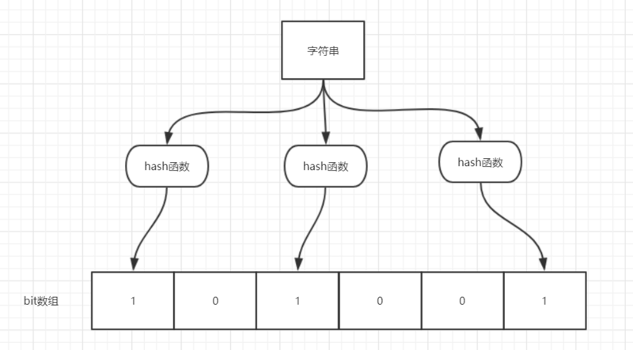

# 场景题

## 1. 超大数据排序

外部排序，一般是待排序数据量很大，在内存中放不下，不能使用内存排序算法。 

常见为多路归并排序算法

1. 分隔： (分治思想)分隔为多个外部子文件，单个子文件大小小于排序可用的内存大小，即子文件可以加载入内存。 
2. 内存排序： 对每个子文件进行内存排序。 
3. 归并:（多路）归并已有序的子文件，最终形成一个完整的有序文件。

归并的过程占用的内存只是2个元素的大小。如归并有序子文件X和有序子文件Y为文件Z的过程——从X读取最小元素x1入内存，从Y读取最小元素y1至内存。比较x1和y1，将两者中较小的写入文件Z。依次重复此过程，直至X、Y文件中元素都进入Z中。

## 2. 超大数据查重

### 布隆过滤器

布隆过滤器（Bloom Filter）是由一个位数组和多个不同的哈希函数组成的数据结构，主要用于大量数据的查重。

特点：优点，占用内存小，且高效；缺点，有一定的错误识别率并且删除困难。

#### 实现方式

1. 首先讲位数组全部初始化成 0 。
2. 每次都首先使用哈希函数对元素进行计算，得到哈希值（有几个哈希函数就得到几个哈希值），然后将对应哈希值的位置的小标设为 1。

#### 判断一个元素是否在集合中？

1. 对给定的元素进行相同的哈希计算。
2. 如果所有的哈希值对应的下标的 bit 都为 1，则表示该元素在集合内（有一定可能会误判，因为可能有别的元素的哈希值刚好也落在这个下标位置）
3. 但是如果有一个 下标处的 bit 为0的话，则表示这个元素一定不在集合中（没有误判率）

#### 使用场景

1. 判断给定数据是否存在：比如判断一个数字是否在于包含大量数字的数字集中（数字集很大，5亿以上！）、 防止缓存穿透（判断请求的数据是否有效避免直接绕过缓存请求数据库）等等、邮箱的垃圾邮件过滤、黑名单功能等等。
2. 去重：比如爬给定网址的时候对已经爬取过的 URL 去重。

参考博客：https://www.cnblogs.com/wuwuyong/p/12206287.html

# 智力题

