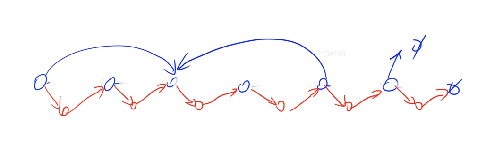

刷算法题的两点：

- 要明白算法题的思路，知其然，也知其所以然
- 写代码的熟练度

首先考虑时间复杂度，然后再保证空间复杂度。

## LC1 两数之和

https://leetcode-cn.com/problems/two-sum/

给定一个整数数组 `nums` 和一个整数目标值 `target`，请你在该数组中找出 **和为目标值** *`target`* 的那 **两个** 整数，并返回它们的数组下标。

```c++
输入：nums = [2,7,11,15], target = 9
输出：[0,1]
解释：因为 nums[0] + nums[1] == 9 ，返回 [0, 1] 。
```

方法一：哈希表 O(n) 的时间复杂度

```c++
class Solution {
public:
    vector<int> twoSum(vector<int>& nums, int target) {
        unordered_map<int, int> heap;
        for(int i = 0; i < nums.size(); i ++){
            int r = target - nums[i];
            if(heap.count(r)) return {heap[r], i};
            heap[nums[i]] = i;
        }
        return {};
    }
};
```

方法二：排序 + 双指针 O (nlongn)


## LC133 深度拷贝图

https://leetcode-cn.com/problems/clone-graph/

对象为一个 无向的连通图（从任一点开始都可以遍历整个图）

- 复制所有点
- 复制所有边


```
输入：adjList = [[2,4],[1,3],[2,4],[1,3]]
输出：[[2,4],[1,3],[2,4],[1,3]]
解释：
图中有 4 个节点。
节点 1 的值是 1，它有两个邻居：节点 2 和 4 。
节点 2 的值是 2，它有两个邻居：节点 1 和 3 。
节点 3 的值是 3，它有两个邻居：节点 2 和 4 。
节点 4 的值是 4，它有两个邻居：节点 1 和 3 。
```

图的遍历：DFS 或 BFS

图的遍历和树的遍历很像，区别在于树的遍历不会有重复，而图的遍历有可能有重复，所以要增加去重

```java
class Solution {
    HashMap<Node, Node> hash = new HashMap<>();
    public Node cloneGraph(Node node) {
        if( node == null ) return null;
        dfs(node);      // 复制所有点

        // 复制边
        for( Map.Entry<Node, Node> entry : hash.entrySet()){    // 遍历所有的点
            for( Node ver : entry.getKey().neighbors){          // 每个点的所有边
                // 将每个点对应的复制点的边复制
                entry.getValue().neighbors.add(hash.get(ver));
            }
        }
        return hash.get(node);
    }
    // 深度遍历注意避免重复
    public void dfs(Node node){
        hash.put(node, new Node(node.val));

        for(Node cur : node.neighbors){
            if(!hash.containsKey(cur)){
                dfs(cur);
            }
        }
    }
}
```

## LC 138 复杂链表的复制

https://leetcode-cn.com/problems/copy-list-with-random-pointer/

- 复制点
- 复制边


方法一：借助 HashMap 时间和空间复杂度都为 O(n)

```java
/*
// Definition for a Node.
class Node {
    int val;
    Node next;
    Node random;

    public Node(int val) {
        this.val = val;
        this.next = null;
        this.random = null;
    }
}
*/
class Solution {
    HashMap<Node, Node> hash = new HashMap<>();
    public Node copyRandomList(Node head) {
        if(head == null) return null;
        Node copy = new Node(-1);
        Node tmp = copy;
        for( Node p = head ; p != null; p = p.next){
            Node cur = new Node(p.val);
            hash.put(p, cur);
            tmp.next = cur;
            tmp = tmp.next;
        }
        tmp = copy.next;
        for(Node p = head; p != null; p = p.next, tmp = tmp.next){
            tmp.random = hash.get(p.random);
        }
        return copy.next;

    }
}
```

方法二：因为是单链表的特殊性，可以对于空间复杂度进行优化，哈希表的作用就是通过原值快速找到复制后的新值，可以采用加每个复制值加在原链表原值后面的方式，即可在不改变原来逻辑结构的情况下，O(1)的找到小弟。

ore.next = copy_ore;



过程：将复制节点加到原链表的后边，然后处理好random节点后，再将两个链表拆开。

```java
class Solution {
    public Node copyRandomList(Node head) {
        if(head == null) return null;
        // 将复制节点加在源节点后面
        for( Node p = head ; p != null; p = p.next.next){	// 复制一个小弟
            Node copy = new Node(p.val);
            copy.next = p.next;
            p.next = copy;
        }
        // 处理 random 指针
        for(Node p = head; p != null; p = p.next.next){
            if(p.random != null) p.next.random = p.random.next;
            else p.next.random = null;
        }
        // 将两个链表拆开，并恢复原链表的状态
        Node dummy = new Node(-1);
        for(Node p = head, q = dummy; p != null; p = p.next, q = q.next){
            q.next = p.next;
            p.next = p.next.next;
        }
        return dummy.next;

    }
}
```

