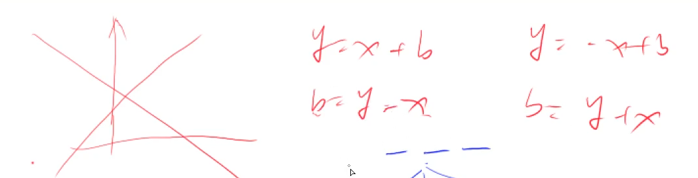
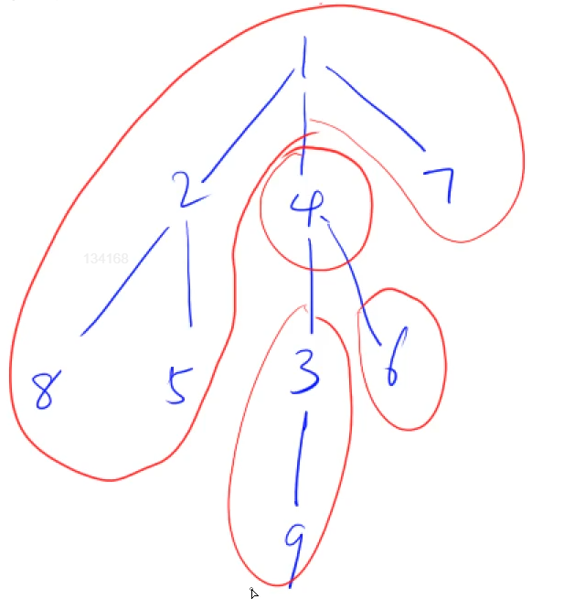

# 排序算法

## 快速排序算法模板

```c++
void quick_sort(int q[], int l, int r)
{
    if (l >= r) return;
    

int i = l - 1, j = r + 1, x = q[l];
while (i < j)
{
    do i ++ ; while (q[i] < x);
    do j -- ; while (q[j] > x);
    if (i < j) swap(q[i], q[j]);
    else break;
}
quick_sort(q, l, j), quick_sort(q, j + 1, r);

}
```

## 归并排序算法模板

```c++
void merge_sort(int q[], int l, int r)
{
    if (l >= r) return;
    

    int mid = l + r >> 1;
    merge_sort(q, l, mid);
    merge_sort(q, mid + 1, r);
    
    int k = 0, i = l, j = mid + 1;
    while (i <= mid && j <= r)
        if (q[i] < q[j]) tmp[k ++ ] = q[i ++ ];
        else tmp[k ++ ] = q[j ++ ];
    
    while (i <= mid) tmp[k ++ ] = q[i ++ ];
    while (j <= r) tmp[k ++ ] = q[j ++ ];
    
    for (i = l, j = 0; i <= r; i ++, j ++ ) q[i] = tmp[j];

}
```

整数二分算法模板

```c++
bool check(int x) {/* ... */} // 检查x是否满足某种性质

// 区间[l, r]被划分成[l, mid]和[mid + 1, r]时使用：
int bsearch_1(int l, int r)
{
    while (l < r)
    {
        int mid = l + r >> 1;
        if (check(mid)) r = mid;    // check()判断mid是否满足性质
        else l = mid + 1;
    }
    return l;
}

// 区间[l, r]被划分成[l, mid - 1]和[mid, r]时使用：
int bsearch_2(int l, int r)
{
    while (l < r)
    {
        int mid = l + r + 1 >> 1;
        if (check(mid)) l = mid;
        else r = mid - 1;
    }
    return l;
}
```

// 浮点数二分算法模板

```c++
bool check(double x) {/* ... */} // 检查x是否满足某种性质

double bsearch_3(double l, double r)
{
    const double eps = 1e-6;   // eps 表示精度，取决于题目对精度的要求
    while (r - l > eps)
    {
        double mid = (l + r) / 2;
        if (check(mid)) r = mid;
        else l = mid;
    }
    return l;
}
```

// 高精度加法
// C = A + B, A >= 0, B >= 0

```c++
vector<int> add(vector<int> &A, vector<int> &B)
{
    if (A.size() < B.size()) return add(B, A);
    

    vector<int> C;
    int t = 0;
    for (int i = 0; i < A.size(); i ++ )
    {
        t += A[i];
        if (i < B.size()) t += B[i];
        C.push_back(t % 10);
        t /= 10;
    }
    
    if (t) C.push_back(t);
    return C;

}
```

// 高精度减法

```c++
// C = A - B, 满足A >= B, A >= 0, B >= 0
vector<int> sub(vector<int> &A, vector<int> &B)
{
    vector<int> C;
    for (int i = 0, t = 0; i < A.size(); i ++ )
    {
        t = A[i] - t;
        if (i < B.size()) t -= B[i];
        C.push_back((t + 10) % 10);
        if (t < 0) t = 1;
        else t = 0;
    }

    while (C.size() > 1 && C.back() == 0) C.pop_back();
    return C;

}
```

// 高精度乘低精度

```c++
// C = A * b, A >= 0, b > 0
vector<int> mul(vector<int> &A, int b)
{
    vector<int> C;
    int t = 0;
    for (int i = 0; i < A.size() || t; i ++ )
    {
        if (i < A.size()) t += A[i] * b;
        C.push_back(t % 10);
        t /= 10;
    }
    

    return C;

}
```

// 高精度除以低精度

```c++
// A / b = C ... r, A >= 0, b > 0
vector<int> div(vector<int> &A, int b, int &r)
{
    vector<int> C;
    r = 0;
    for (int i = A.size() - 1; i >= 0; i -- )
    {
        r = r * 10 + A[i];
        C.push_back(r / b);
        r %= b;
    }
    reverse(C.begin(), C.end());
    while (C.size() > 1 && C.back() == 0) C.pop_back();
    return C;
}
```

// 一维前缀和
// S[i] = a[1] + a[2] + ... a[i]
// a[l] + ... + a[r] = S[r] - S[l - 1]
// 二维前缀和
// S[i, j] = 第i行j列格子左上部分所有元素的和
// 以(x1, y1)为左上角，(x2, y2)为右下角的子矩阵的和为 S[x2, y2] - S[x1 - 1, y2] - S[x2, y1 - 1] + S[x1 - 1, y1 - 1]

// 一维差分
// B[i] = a[i] - a[i - 1]
// 给区间[l, r]中的每个数加上c：B[l] += c, B[r + 1] -= c
// 二维差分
// 给以(x1, y1)为左上角，(x2, y2)为右下角的子矩阵中的所有元素加上c：
// S[x1, y1] += c, S[x2 + 1, y1] -= c, S[x1, y2 + 1] -= c, S[x2 + 1, y2 + 1] += c


# 图

深度优先搜索		DFS

广度优先搜索		BFS

树与图的存储

## 1. DFS & BFS

从数据结构看

DFS: 使用 stack

BFS: 使用 queue

从使用空间看

DFS: O( h )

BFS: O( 2^h )

虽然 DFS 在使用空间上有很大优势，但是BFS 搜到的点具有 “**最短路**” 的性质。

### 1. DFS

核心点：回溯 + 剪枝

注意点：

- 一定要想清楚顺序
- 回溯时一定要注意恢复现场。

DFS 一般可以对应到一个搜索树

#### 2. 八皇后问题

回溯 + 剪切

核心点：
使用bool col[N], dg[N], udg[N] 来标记是否重复
col[i] 表示第 i 行是否有皇后
采用斜率+截距的方式来定义对角线



y = x + b 和 y = -x + b;
等价替换, 并且为了避免出现负数加 n
b + n = y - x + n 和 b= y + x;
dg[u + i] 表示 y = -x + b 方向的对角线；u 表示 x, i 表示 y;
dg[n - u + i] 表示 y = x + b 方向的对角线；u 表示 x, i 表示 y;

```c++
#include <iostream>

using namespace std;

const int N = 20;

int n;
char g[N][N];
// 用来标记 行 对角线 和 反对角线
bool col[N], dg[N], udg[N];

void dfs(int u)
{
    if(u == n)
    {
        for(int i = 0; i < n; i ++) puts(g[i]);
        puts("");
        return;
    }
    
    for(int i = 0; i < n; i ++)
        if(!(col[i] || dg[u + i] || udg[n - u + i]))
        {
            g[u][i] = 'Q';
            col[i] = dg[u + i] = udg[n - u + i] = true;
            dfs(u + 1);
            col[i] = dg[u + i] = udg[n - u + i] = false;
            g[u][i] = '.';
        }
}

int main()
{
    cin >> n;
    for(int i = 0; i < n; i ++)
        for(int j = 0; j < n; j ++)
            g[i][j] = '.';
    
    dfs(0);
    
    return 0;
}
```

### 2. BFS

核心点：最短路

#### 1. 走迷宫

**输入格式**

第一行包含两个整数 n 和 m。

接下来 n 行，每行包含 m 个整数（0 或 1），表示完整的二维数组迷宫。0 表示可以走，1 表示是一堵墙，不能走。

```
5 5
0 1 0 0 0
0 1 0 1 0
0 0 0 0 0
0 1 1 1 0
0 0 0 1 0
```

**输出格式**

输出一个整数，表示从左上角移动至右下角的最少移动次数。

```
8
```
方法一：使用数组模拟队列

```c++
#include <cstring>
#include <iostream>
#include <algorithm>
#include <queue>

using namespace std;

typedef pair<int, int> PII;
const int N = 110;
int n,m;
// g 存的是图
// d[i][j] 表示的是 起点 到 (i, j) 的距离
int g[N][N];
int d[N][N];
PII q[N * N];   // 维护了一个队列

int bfs()
{
    // hh 表示队头 tt 表示队尾
    int hh = 0, tt = 0;
    q[0] = {0, 0};
    // 初始化 距离矩阵 d 全为 -1
    memset(d, -1, sizeof d);
    d[0][0] = 0;
    // 通过 for 循环 遍历上右下左四个方向
    int dx[4] = {-1, 0, 1, 0}, dy[4] = {0, 1, 0, -1};
    // 判断队列是否为空 hh <= tt 时表示不为空
    while(hh <= tt)
    {
        // 从队头弹出一个元素
        auto t = q[hh ++];
        for(int i = 0; i < 4; i ++)
        {
            int x = t.first + dx[i], y = t.second + dy[i];
            if(x >= 0 && x < n && y >= 0 && y < m && g[x][y] == 0 && d[x][y] == -1)
            {
                d[x][y] = d[t.first][t.second] + 1;
                q[ ++ tt] = {x, y};
            }
        }
    }
    return d[n - 1][m - 1];
}

int main()
{
    cin >> n >> m;
    for(int i = 0; i < n; i ++)
        for(int j = 0; j < m; j ++)
            cin >> g[i][j];
    
    cout << bfs() << endl;
    return 0;
}
```

## 2. 树和图的存储方式

树是一种特殊的图，树是无环连通图。

图分为两种

- 有向图  a - > b
- 无向图  a — b，所以无向图可以看成一种特殊的有向图 a --> b + a < -- b 

有向图的存储：

- 邻接矩阵：二维数组  g[a, b] 表示 a --> b，如果有权重 则 g[a,b]存储的就是 a 到 b的权重值；如果没有权值 则存储的是 bool 值，表示 a --> b 是否连通。空间复杂度比较大为 O(n^2)，适合稠密图。
- 邻接表 `常用` ：n 个节点，就有 n 个单链表来存储

#### 1. 树的重心

删除节点 4 时的剩余连通块情况：



```c++
#include <iostream>
#include <cstring>
#include <algorithm>

using namespace std;
// 因为此处为无向变，所以要插入 两条有向边
const int N = 100010, M = N * 2;
int n;
// 使用 数组模拟单链表 比 vector 效率更高
int h[N], e[M], ne[M], idx;
bool st[N];
int ans = N;

void add(int a, int b)
{
    e[idx] = b, ne[idx]= h[a], h[a] = idx ++;
}

// 以 u 为根的子树的 size
int dfs(int u)
{
    st[u] = true;
    // sum 表示这个以 u 为根的数的所有节点个数 = 本身 1 + 所有的子树的节点 dfs(j)
    // res 表示的是去掉 u 之后的各个连通块的最大值
    int sum = 1, res = 0;
    for(int i = h[u]; i != -1; i = ne[i])
    {
        int j = e[i];
        if(!st[j])
        {
            int s = dfs(j);
            res = max(res, s);
            sum += s;
        }
    }
    // 去掉 u 之后的连通块：所有的子树都是一个单独的连通块，以及加上 这个 u 之上的所有节点
    res = max(res, n - sum);
    
    ans = min(ans, res);
    
    return sum;
}

int main()
{
    scanf("%d", &n);
    memset(h, -1, sizeof h);
    for(int i = 0; i < n - 1; i ++)
    {
        int a, b;
        scanf("%d%d", &a, &b);
        add(a, b), add(b, a);
    }
    
    dfs(1);
    
    printf("%d\n", ans);
    
    return 0;
}
```

图的BFS的应用

**848.有向图的拓扑序列**

有向图才会有拓扑序列：（如果存在环的话就不存在拓扑序列了，有向无环图一定有拓扑序列，所以有向无环图也被称为拓扑图）

入度：有多少条边指向自己

出度：一个点有几条边出去

所以拓扑排序的起点就是入度为 0 的点
